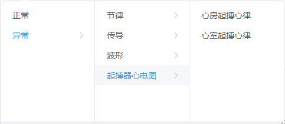

代码解释：
ROWS #行数
COLS #列数
CHANNELS #通道数
nb_classes #分类数
batch_size
nb_epoch #迭代轮数
img_dim = (ROWS,COLS,CHANNELS)
densenet_depth #深度
densenet_growth_rate #block增长率

输入：
输入数据的行列数和通道数自由截取，将相应的参数设置相符

输出：
输出分类数自由设定，与标签种类相同

格式：
支持python能读取的文件类型

模型解释：

预测函数在代码结束处

model = load_model('DenseNet.h5')
pred = model.predict(data)

加载模型，输出预测值

data需要与原始训练格式相同
可逐条预测，也可批量预测

#### 输入数据格式：12行*3640列，使用的是12导联的心电数据

#### 标签信息：[0]表示异常、[1]表示正常

#### 频率：500HZ

#### 标签结果示例：[[0.00854    0.99145997]]，前面表示异常，后面表示正常

#### 异常标签示例如下：

#### train_0.npy和train_1.npy为两个测试文件，其中train_0.npy表示异常的心电数据，里面总共有2条异常的心电数据、train_1.npy表示正常的心电数据，里面总共有2条正常的心电数据

