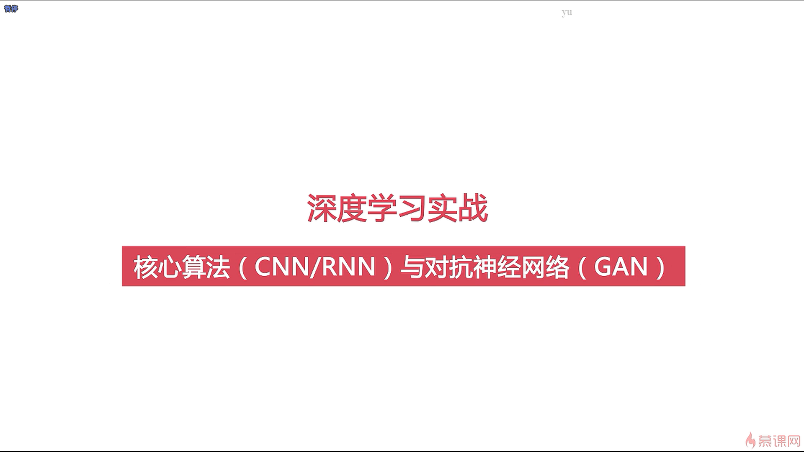

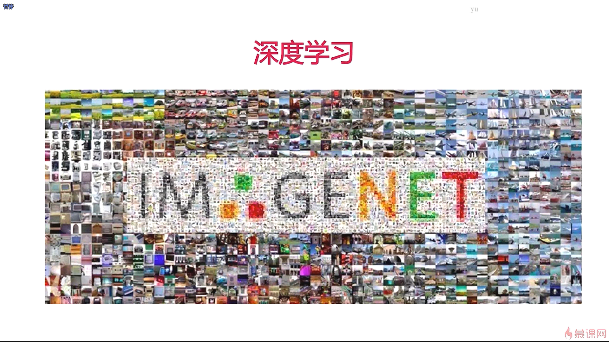

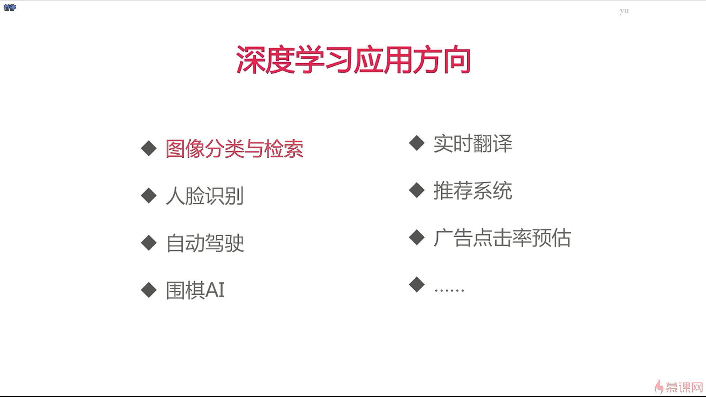

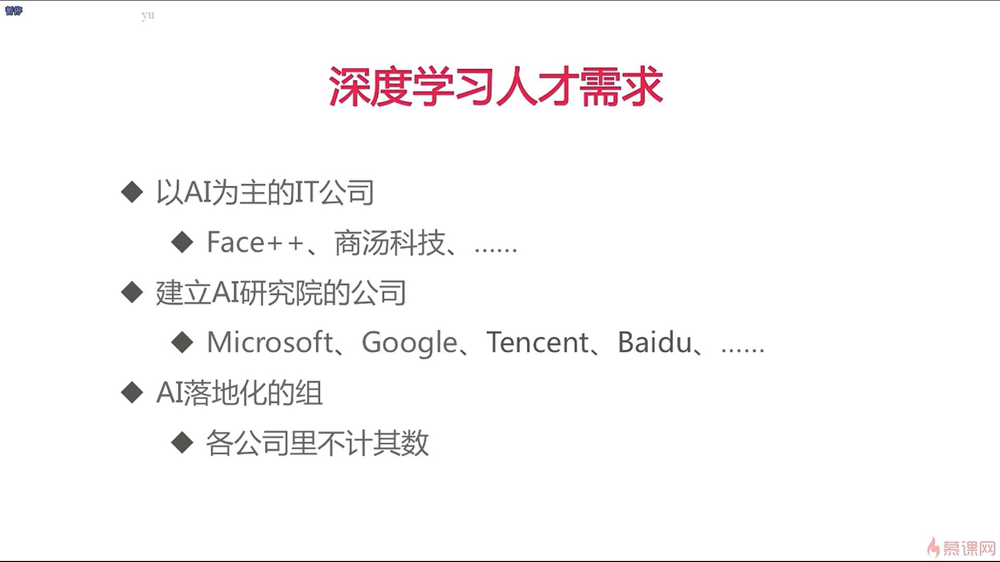

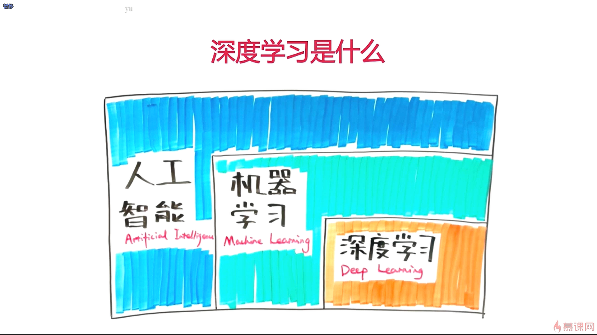

- 深度学习是机器学习的一个子方向，机器学习是人工智能的一个子方向

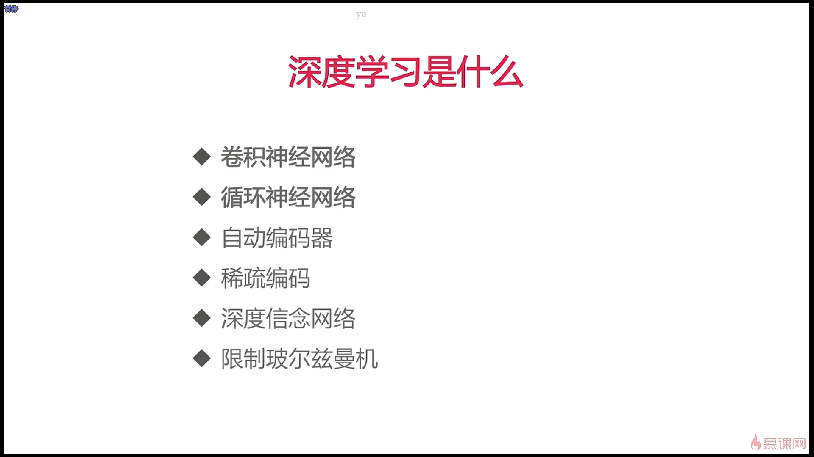

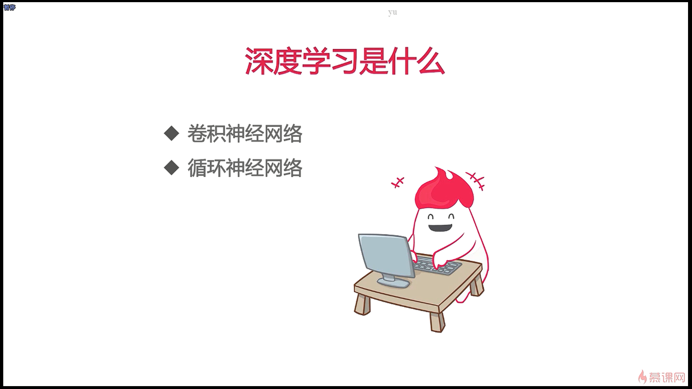

- 卷积神经网络和循环神经网络是深度学习中使用的最频繁的两种算法
- 在深度学习中还有一个比较重要的功夫叫做调参技巧，江湖人称“炼丹术”，掌握了炼丹术，我们可以更好更快的去训练神经网络

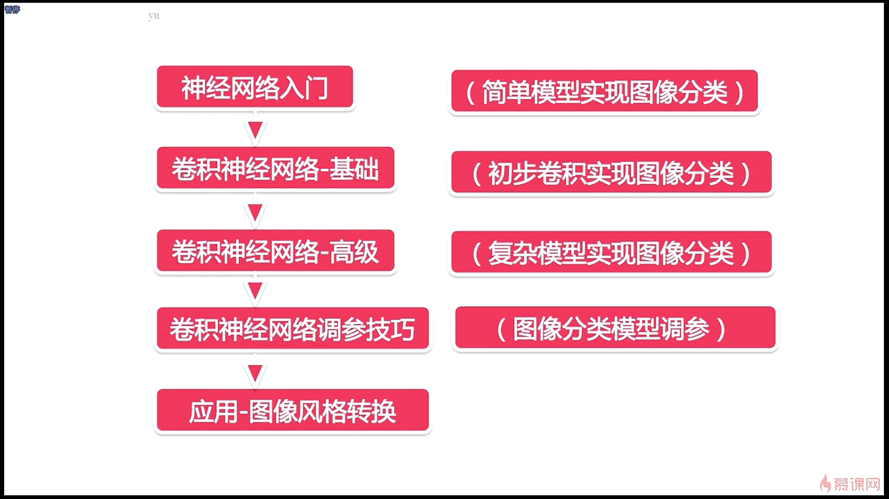

- 循环神经网络相对于卷积神经网络来说，它的知识点比较少

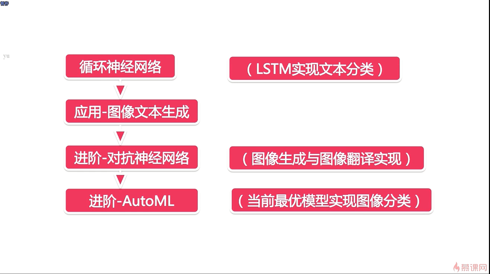

- 除了人手工地去调参之外，我们还可以让机器去帮我们调参

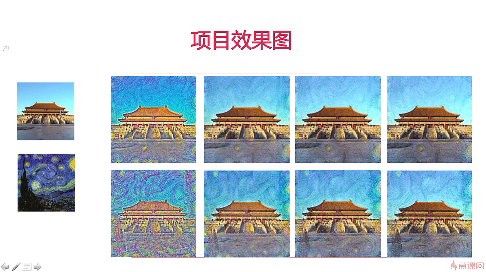

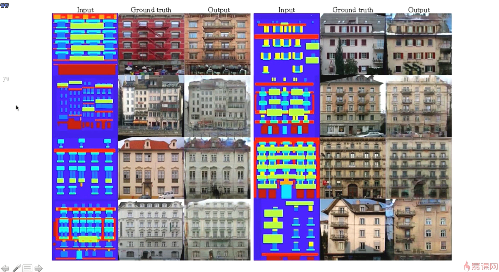

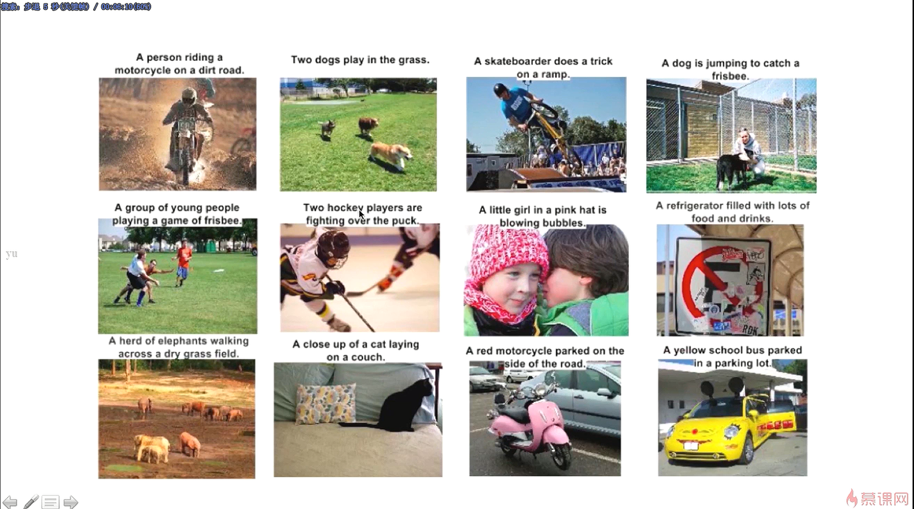

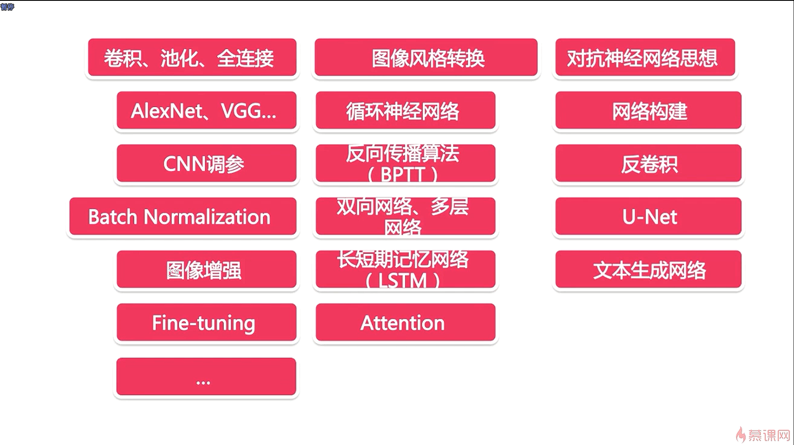

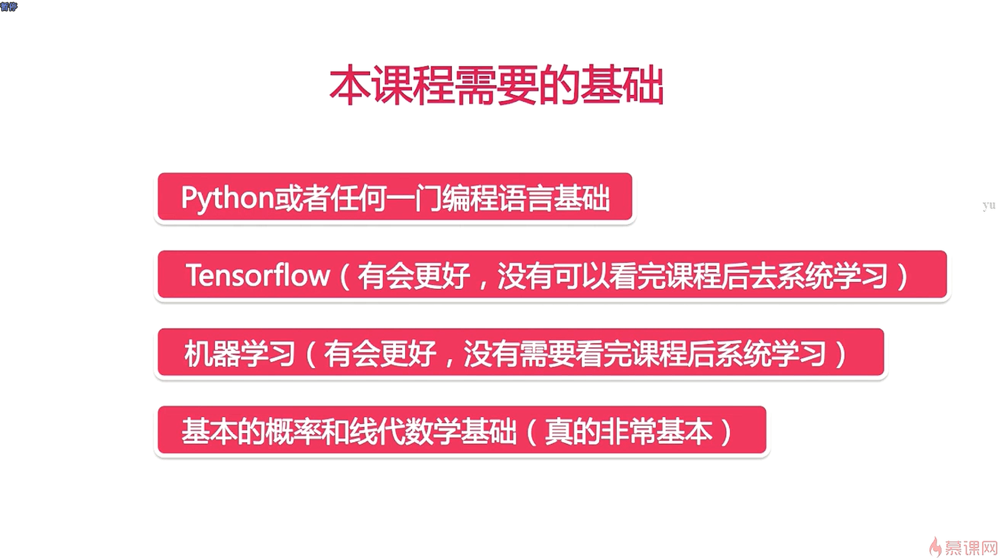

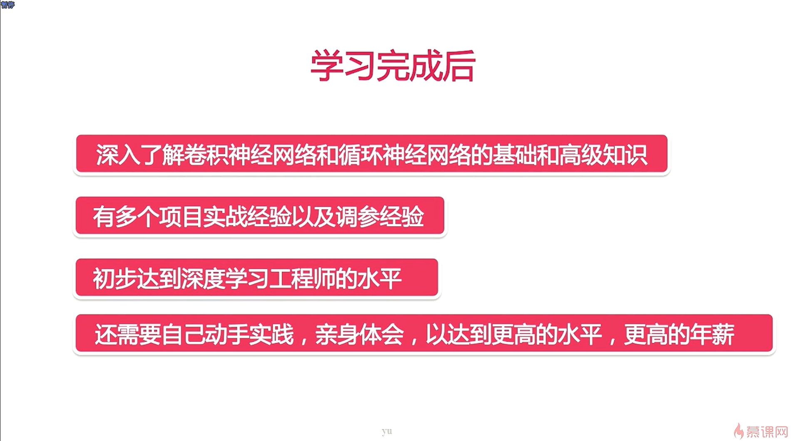

- 深度学习的学习曲线非常的陡峭