- 深度学习是以神经网络为基础的，神经网络是机器学习的一种算法

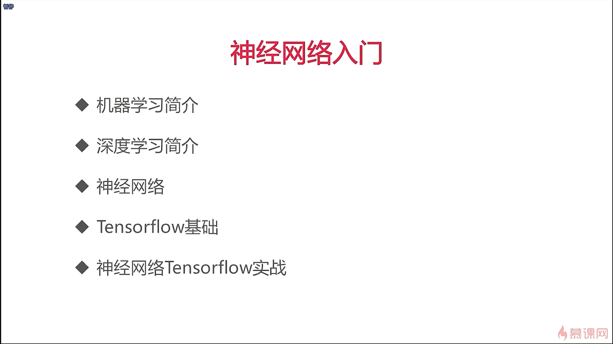

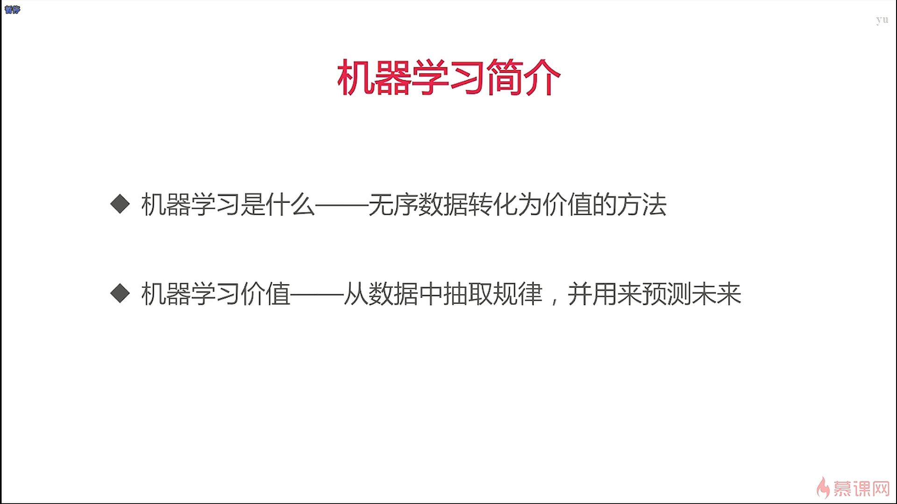

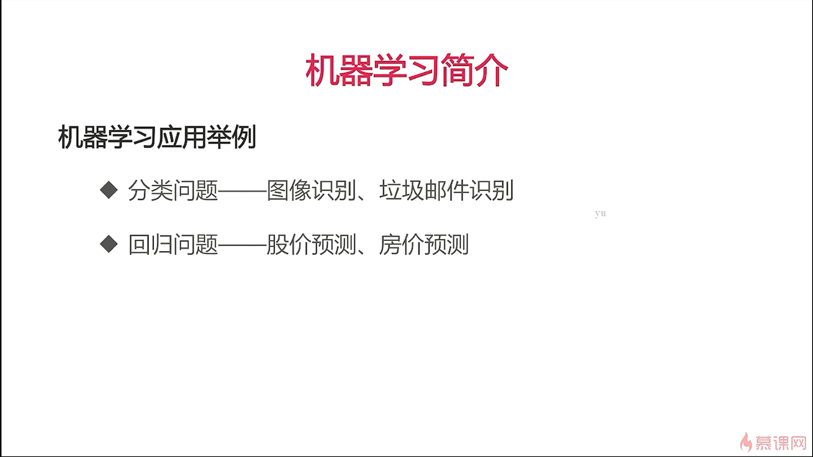

- 分类问题给出的结果是一个类别，而回归问题给出的结果是一个实数
- 点击预估其实就是搜索广告

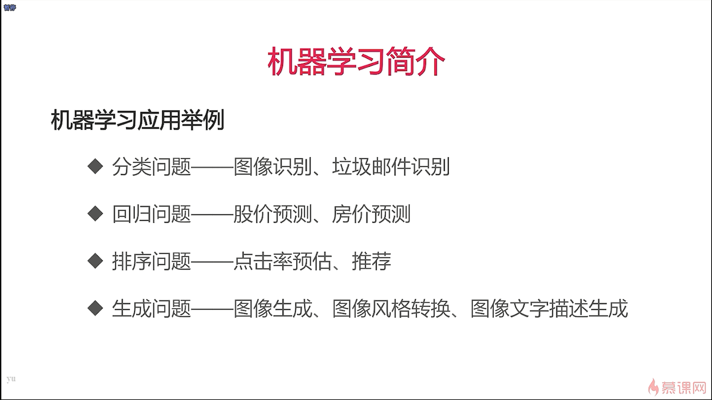

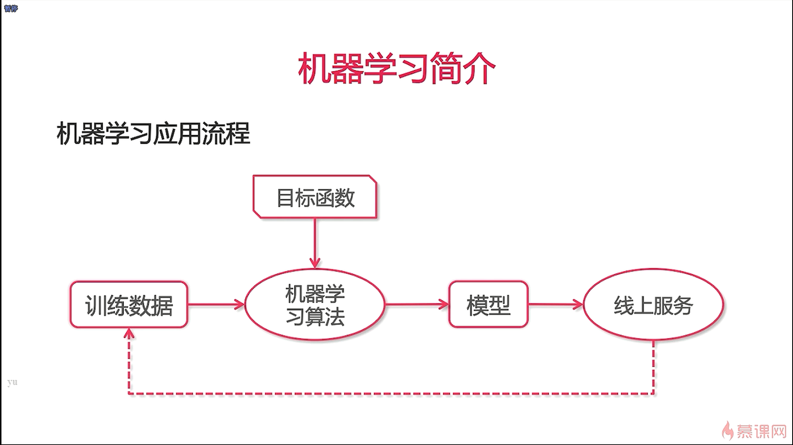

- A/B test就是指用新模型给一些随机的用户去使用，看是否效果要比旧模型的要好，原因是很多新模型在线下的训练数据集上是表现要比旧模型要好，但在实际的线上模型不一定要比旧模型要好

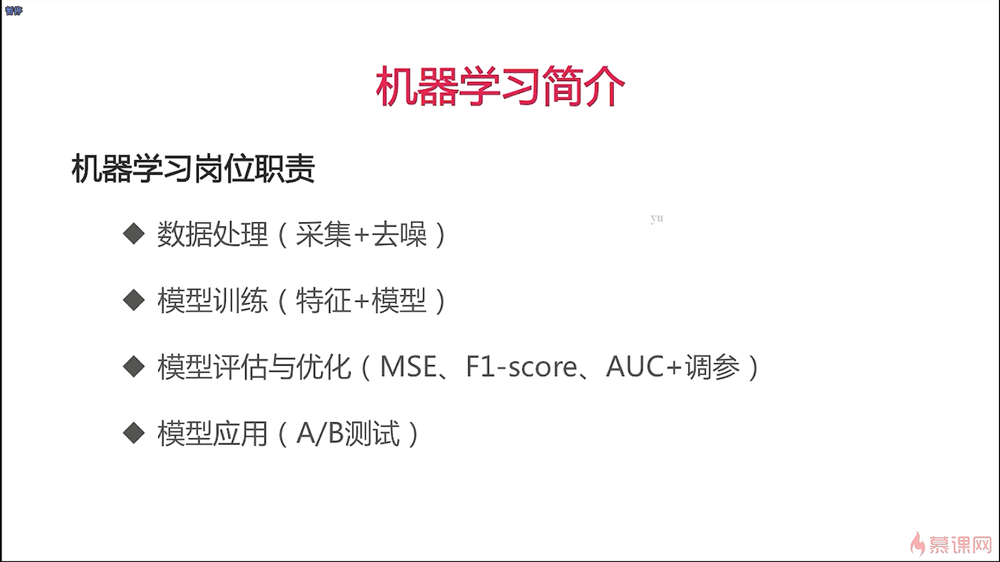

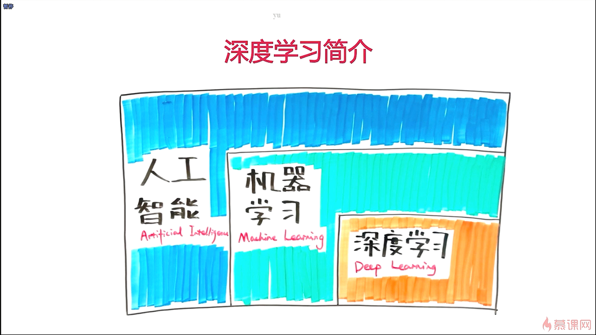

- 深度学习是机器学习的一个子方向，而机器学习是人工智能的一个字方向
- 一般来说，深度学习可以解决的问题都可以在机器学习中找到其它的算法进行解决，深度学习的优势在于我们现在这个大数据的条件下可以达到更好的效果，这是其它机器学习算法中所达不到的

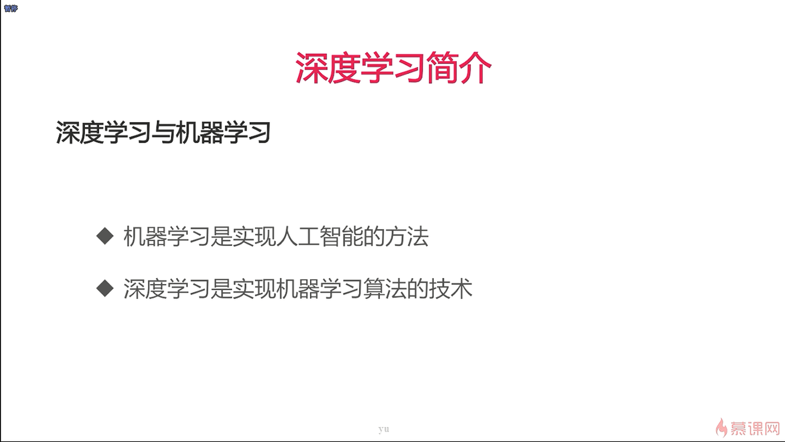

- 图像生成和图像分类都是通过卷积神经网络来实现的，循环神经网络是用来处理不定长数据的，不定长数据就是指的是你输入的长度是不一样的，比如说文本数据的分类问题
- 循环神经网络在NLP领域使用的比较广泛，而卷积神经网络在CV领域运用的比较广泛

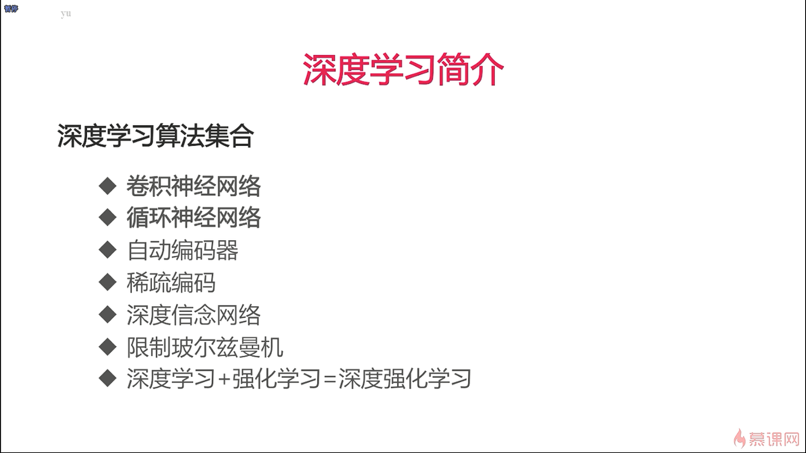

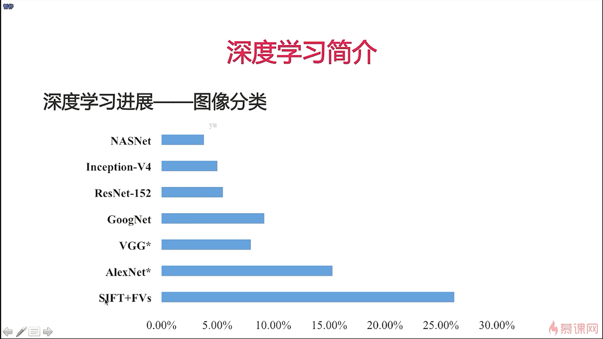

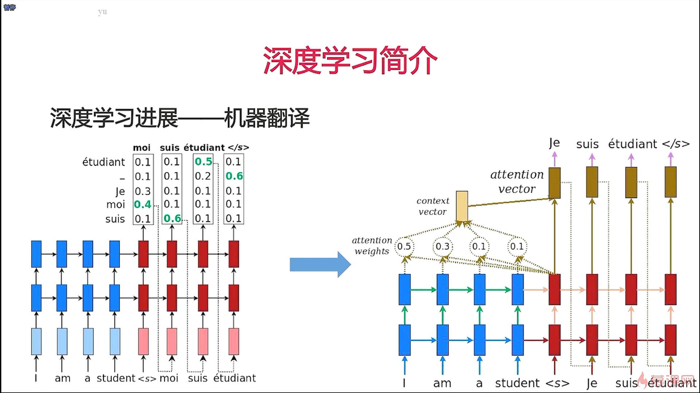

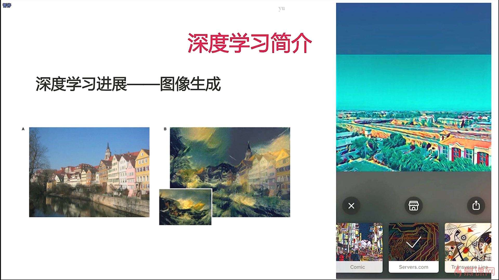

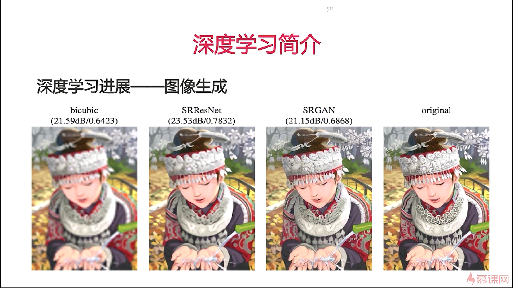

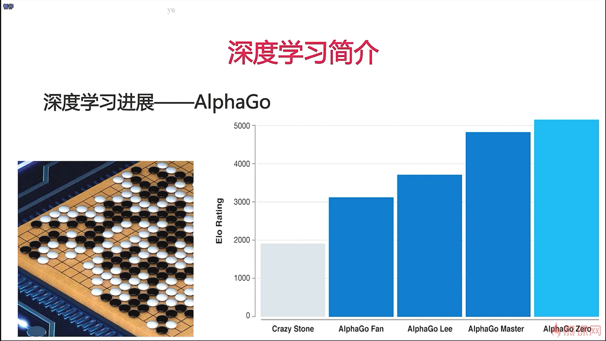

- 深度学习的发展使得图像超清化技术变得越来越好，AlphaGo是一个深度强化学习的模型