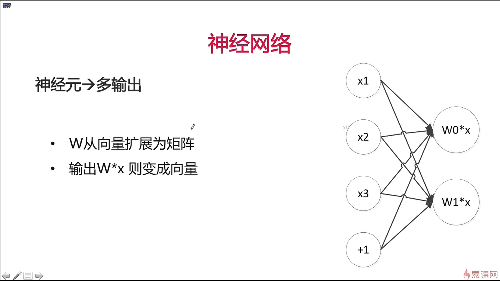
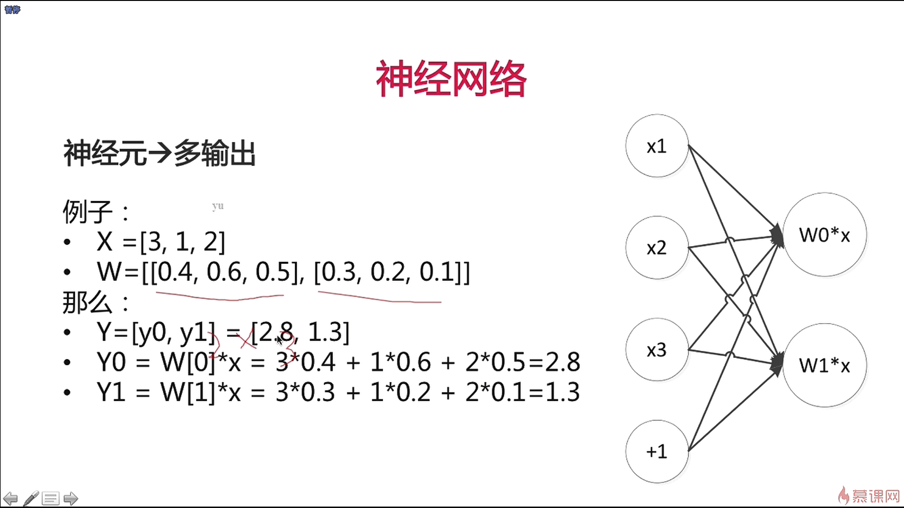
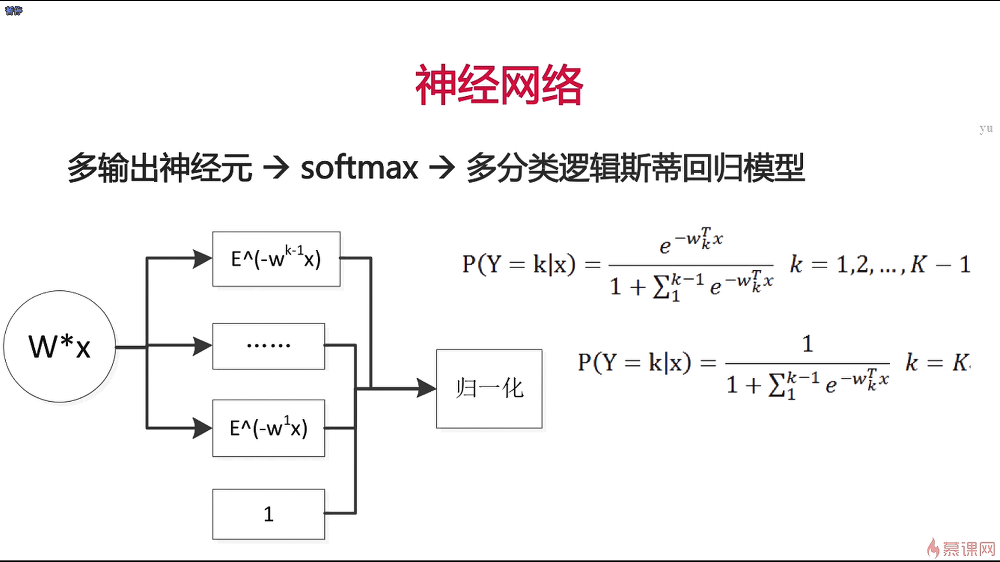
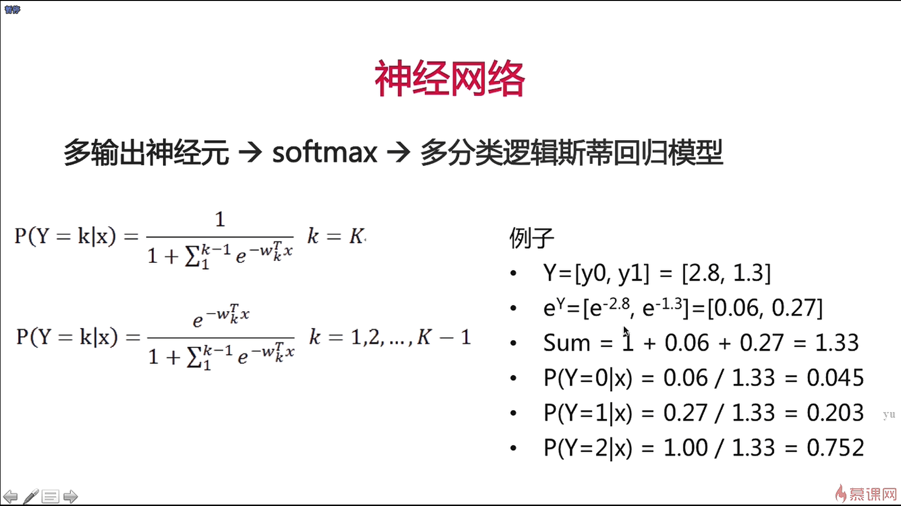
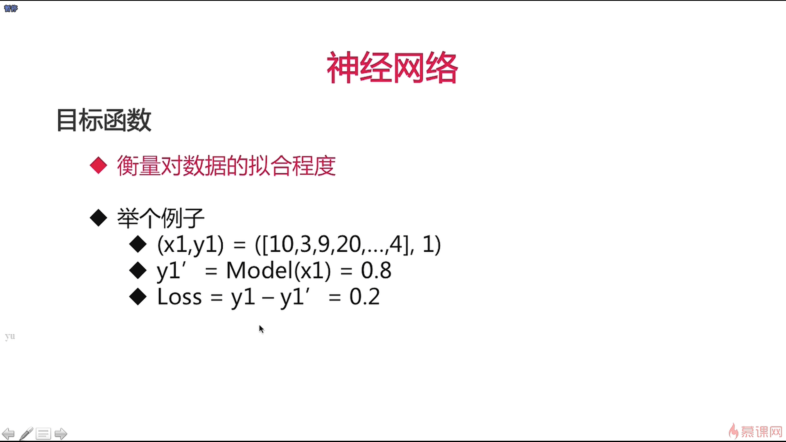
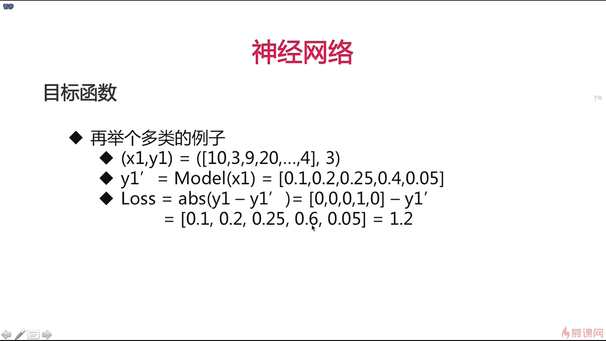

- 我们在有一个神经元的时候，可以做二分类的逻辑斯蒂回归模型，想要多分类的话，只需要加神经元就好了，如上图所示，由之前的1个输出变成了2个输出，也就可以去做3分类的逻辑斯蒂回归模型

- 二分类其实在现实世界中应用的比较少，一般我们在现实世界中都是使用的多分类的模型

- 目标函数在机器学习领域通常也被称作是损失函数

- one-hot编码在分类问题上是一个相当重要的技术手段，abs是绝对值的意思

- 交叉熵函数更加适合于去求多分类的损失的

