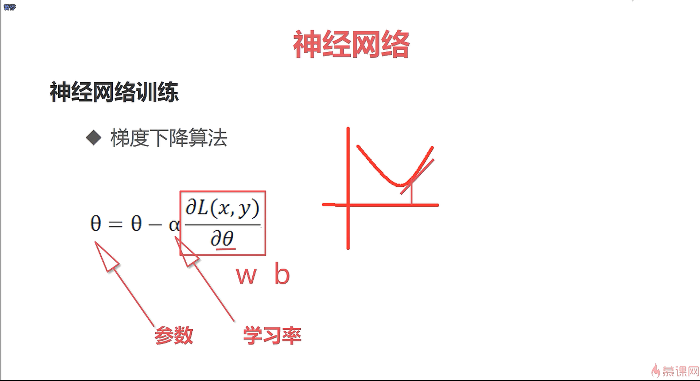
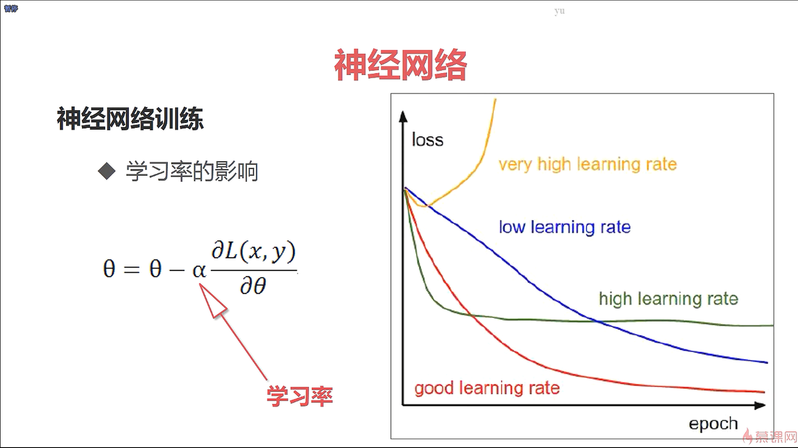
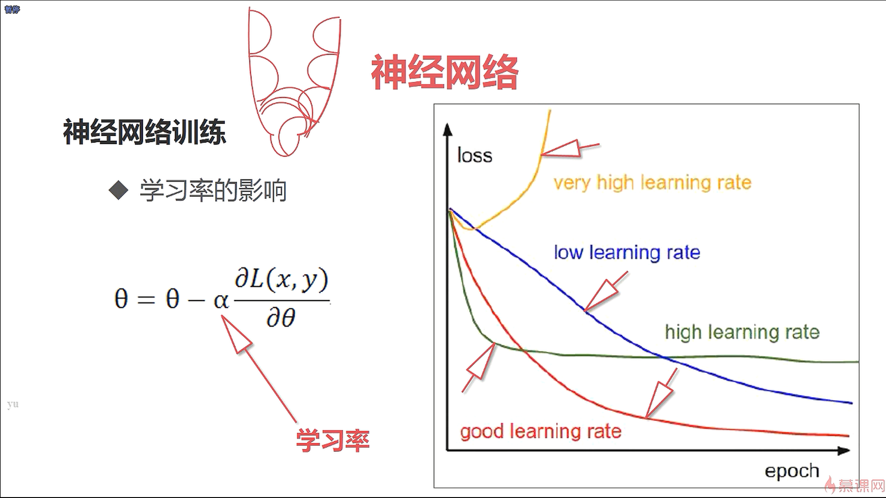
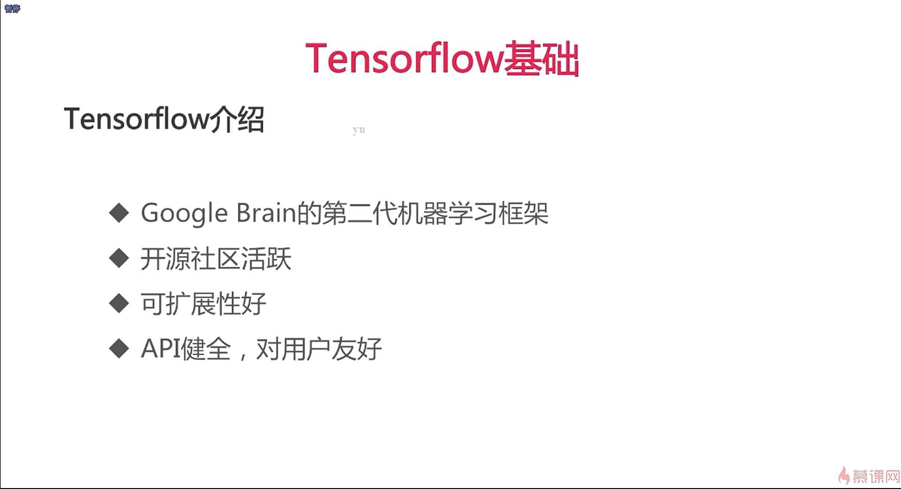
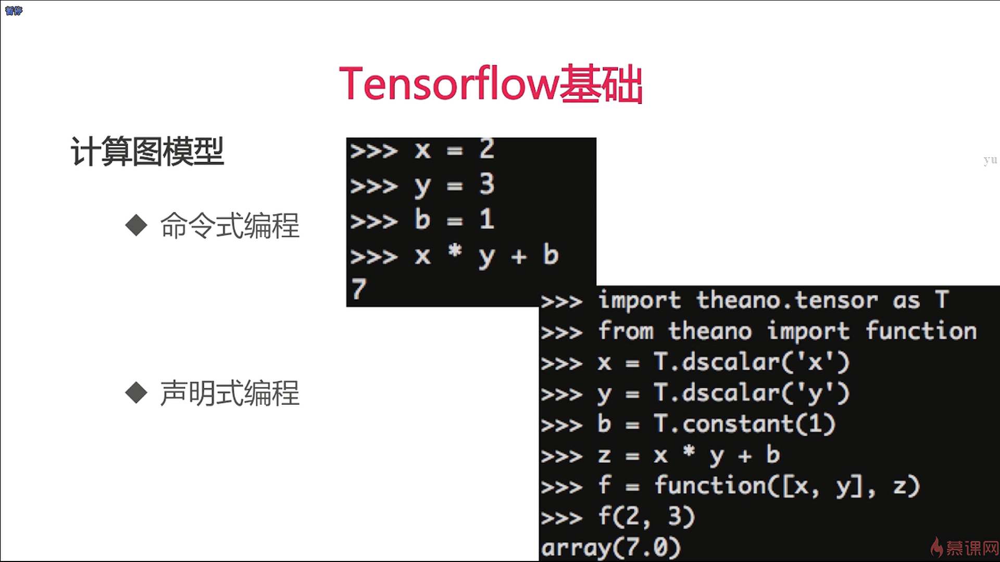
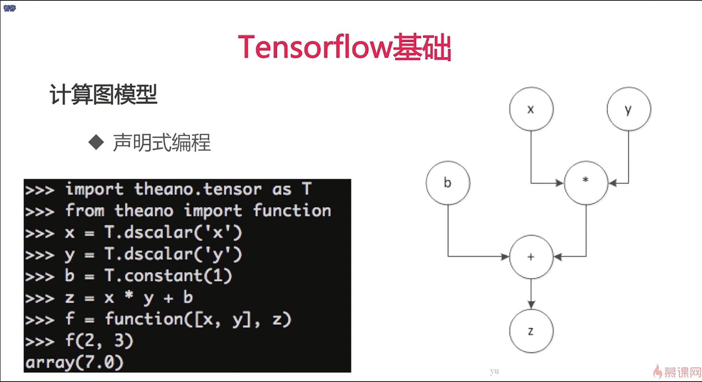
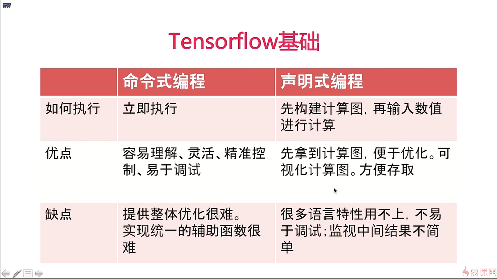

- 神经网络的参数众多，求解起来会非常的耗时

- 对于一个复杂的多输入的损失函数来说，找到它的方向就是去计算每一个参数的偏导

- 逻辑斯蒂回归模型也算是一种比较简单的神经网络算法

- dscalar是表示的是标量的意思，constant是常量的意思

- 声明式编程就是我们的计算图模型

- 为什么需要计算图模型，因为我们神经网络的结构是定义好的，但是它的输入 x 是由用户自己去产生的