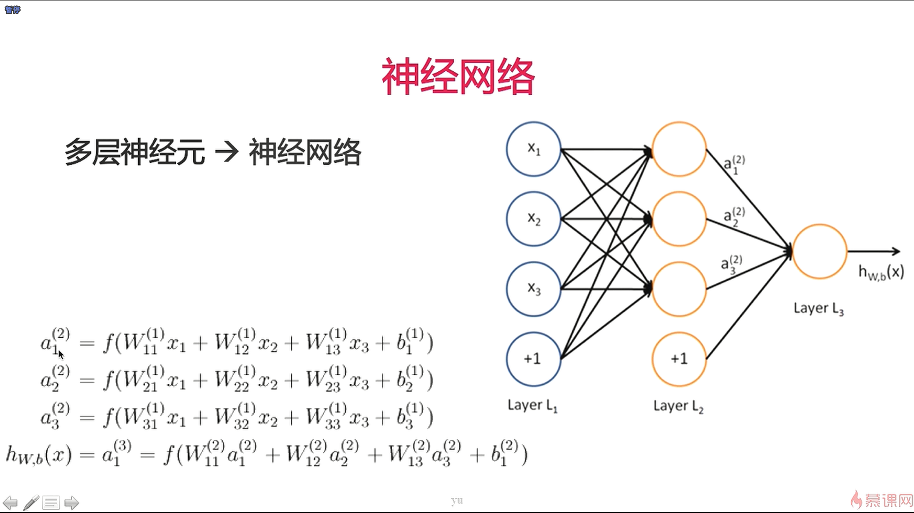
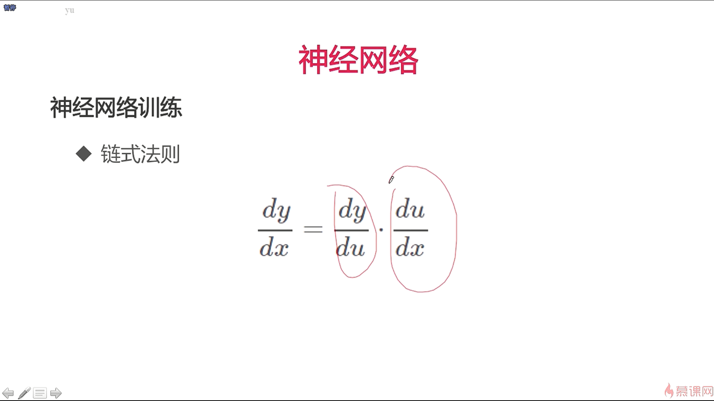

- 卷积神经网络主要是应用在图像上，比如说图像分类、图像检测、人脸检测等算法中

- 正向传播是为了给一个数据，从这个数据中计算出它的预测值；反向传播是为了求解参数，是梯度下降算法在神经网络上的一个具体的计算过程

- 将多个神经元组合在一起，就可以形成一个神经网络

- 上图叫做具有一个隐含层的神经网络

- 神经网络的训练是采用梯度下降的方式，用损失函数对每一个参数求偏导

 

- 对于复合函数的求导需要用到链式法则，W1和W2都是以复合函数的形式参与到损失函数的计算中来

- 神经网络的结构越大，它的计算图越大

- 一般大家在进行神经网络的训练的时候都会采用 Mini-Batch 这一个训练方法
- 如果是使用随机梯度下降的方法，每次只使用一个样本，那样可能会出现的情况是一个样本并不能反应整个数据集的梯度的方向，就会导致训练的收敛速度会比较慢
- 模型的训练一开始是非常快的，到后来会比较慢，然后会达到一个比较稳定的值，当达到一个比较稳定的值，我们就称之为收敛
- 为了避免只使用一个样本并不能反映整个数据集的梯度的问题，我们有一个折中的办法，就是使用Mini-Batch梯度下降法，这一小部分数据是随机采样出来的，因此可以代表整个数据集的梯度方向

- 对于只有一个样本的情况下其实是很容易造成震荡的问题，因为一个样本是不能反映出整个数据集的梯度的方向的，表现为 Mini-Batch的size越大，这个现象就越不明显

- 凸函数就是只有一个局部极值的函数，比如 y = x^2，它只有一个最优解

- 目标函数可能如右图所示，具有多个最优解，learning rate是一个比较重要的参数，如果太小，可能导致所有的参数停留在局部极值点的位置

- 还有一个问题是鞍点，鞍点的意思是在这个地方，它的导数是0，所有的参数都得不到更新，梯度下降就会停在这里

