- 卷积、池化、全连接构成了卷积神经网络中3个基本的层次结构

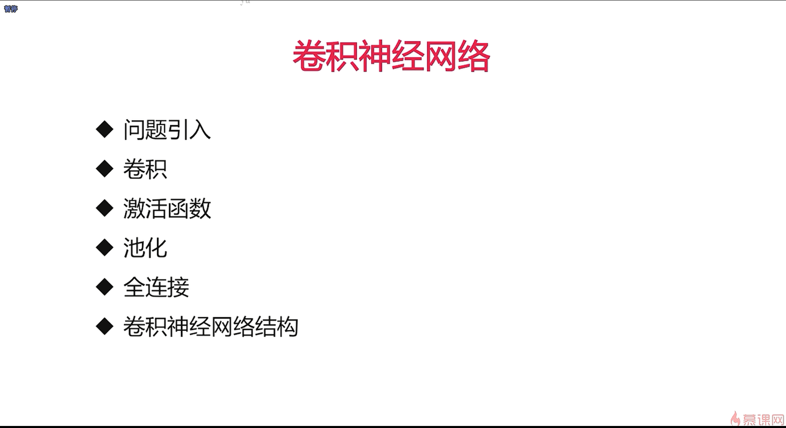

- 在神经网络中，多个神经元可以组成一层，然后这一层的神经元需要和之前层次的输出进行一个全连接，就是说下一层的神经元需要和上一层的所有的输出相连接
- 对于图像来说，图像中的每一个像素都可以看作是一个特征值

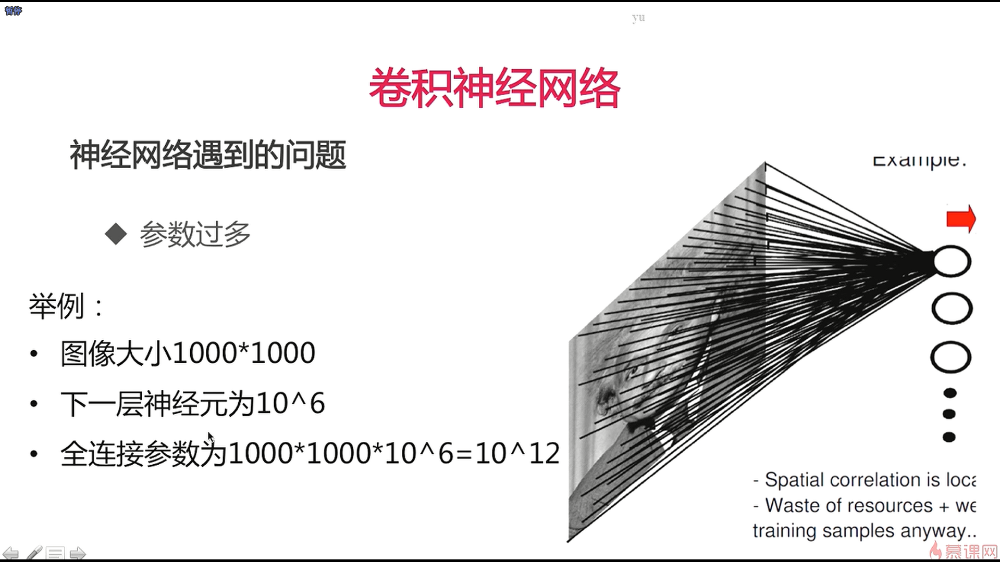

- 10^6是一百万，10^9是一亿，10^12是一百亿

- 过拟合的意思是模型在训练集上面表现得非常好，对于训练集中的每个数据都能获得一个比较准确的预测值，但是对于测试集上面的数据，它并不能给出特别好的预测值出来

- 造成过拟合的原因就是模型的表达能力过强，模型的表达能力过强和模型的参数有很大的关系，基本上是成正比的，当模型的参数比较多的时候，模型的表达能力就会非常强，过拟合这个现象的机器学习术语叫做模型的泛化能力非常差

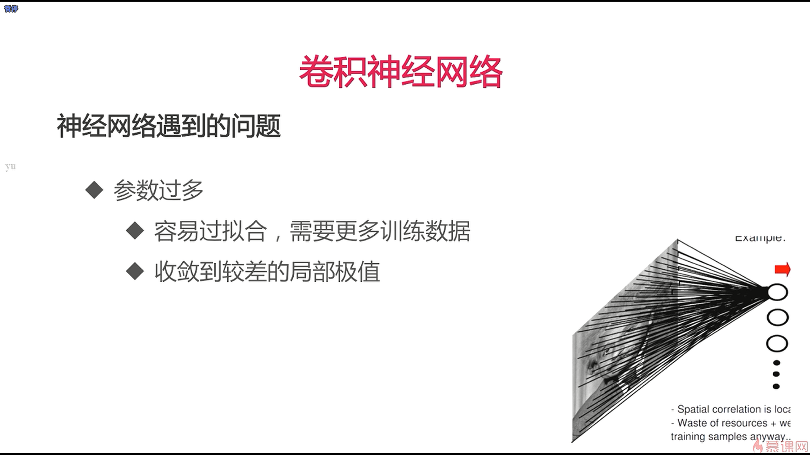

- 对于图像数据来说，某个像素点和它周围的像素点的关系会比较大，而和它离得比较远的像素点的关系会比较小，所以对于一个图像数据来说，它具有非常强的区域性，基于图像的这个性质，我们可以将全连接变为局部连接，从而去降低它的参数量

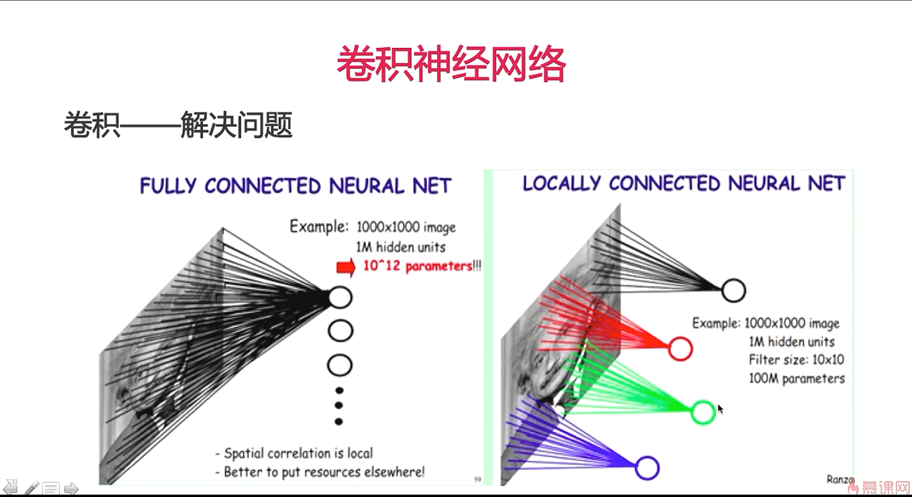

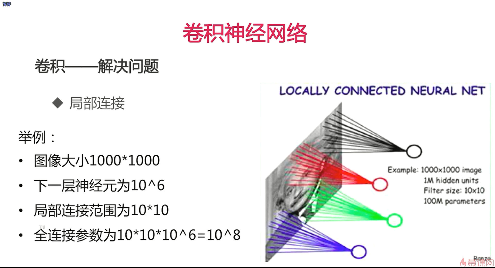

- 图像还有另外一个相当重要的性质，它的特征和它的位置是无关的

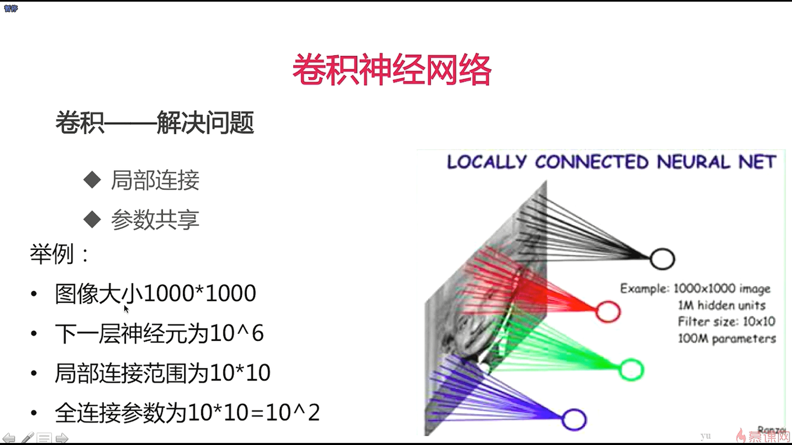

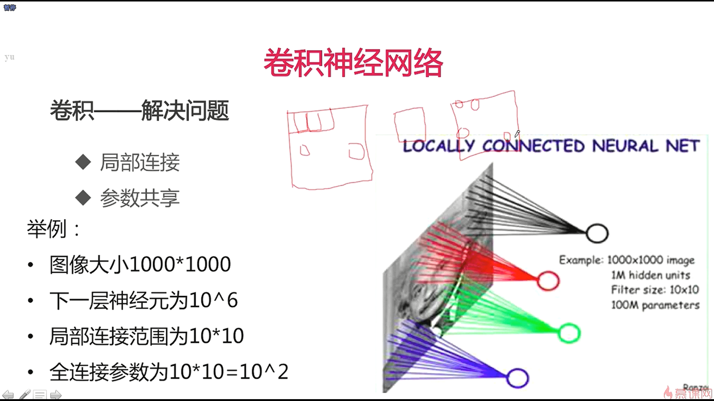

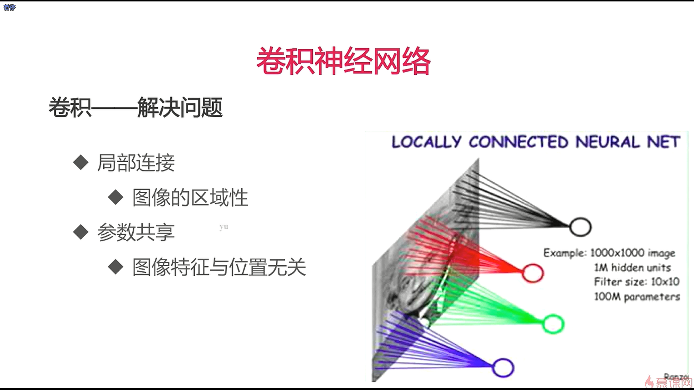

- 卷积操作的参数就叫做卷积核，卷积核就是局部连接的参数，这些参数在各个位置上面都是共享的，卷积操作相当于是卷积核在输入图像上面从左到右，从上到下的去进行滑动

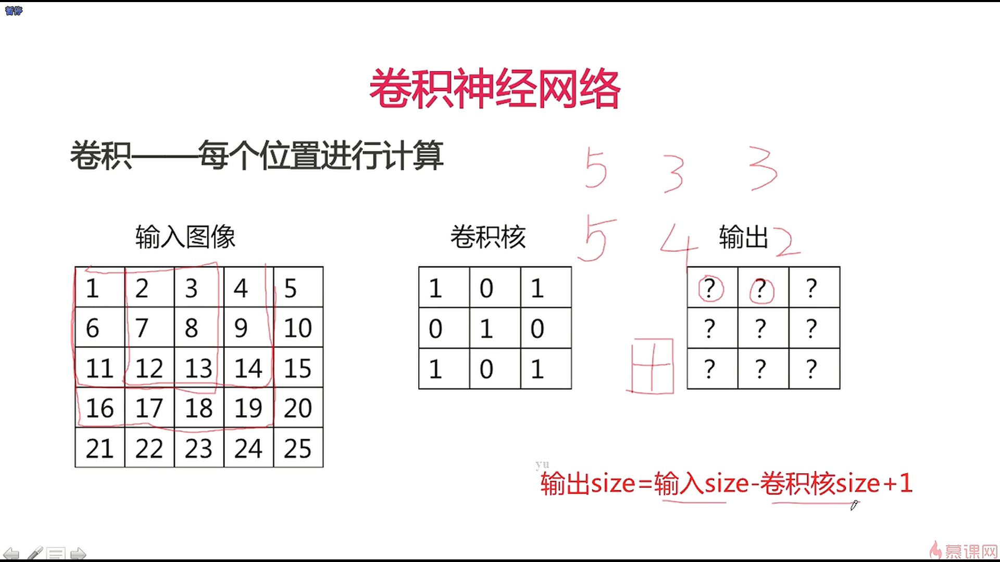

- 卷积核和输入图像之间的计算就是去计算参数和输入之间的内积

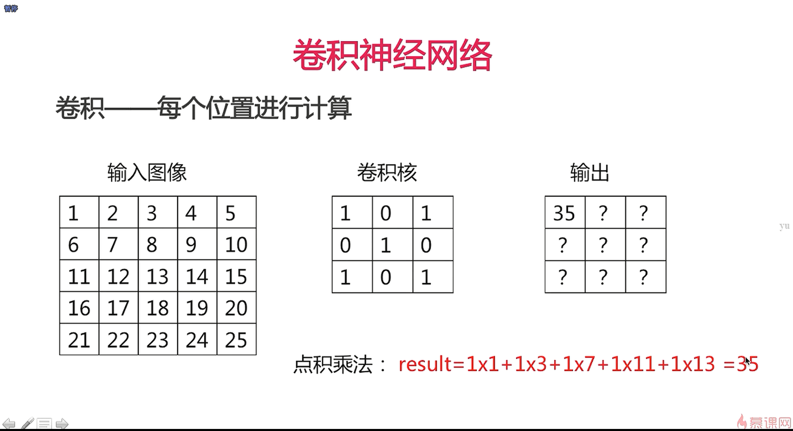

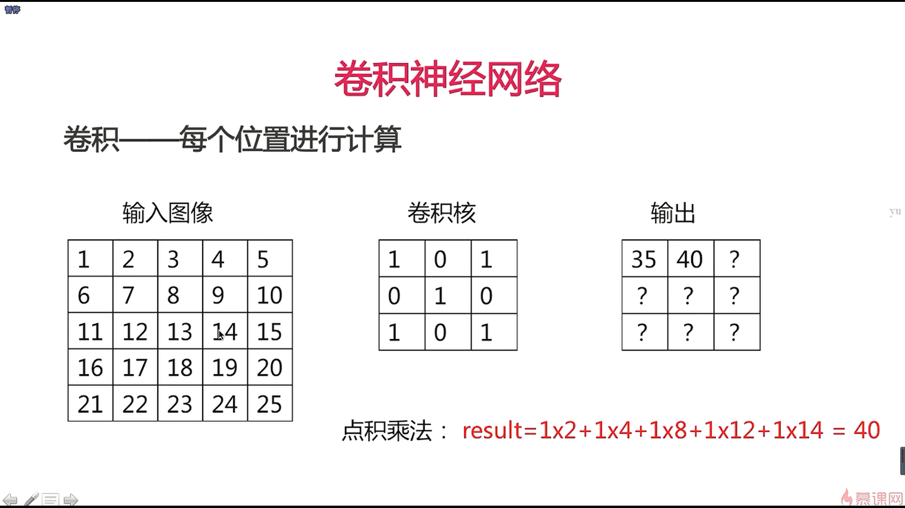

- 步长指的是卷积核在输入图像的滑动过程中，每一次滑动在图像上面间隔的位置是多少

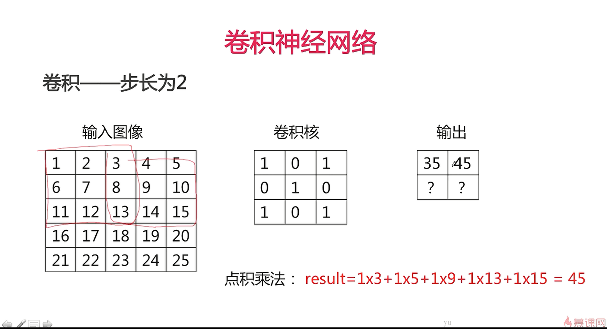

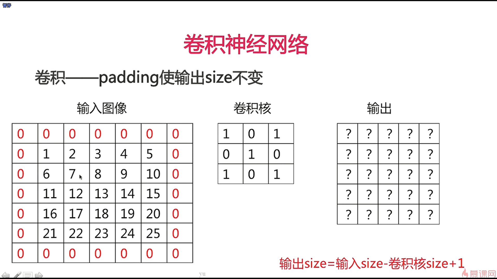

- 根据上图中的公式，我们可以得知padding的size和卷积核的size是有关系的

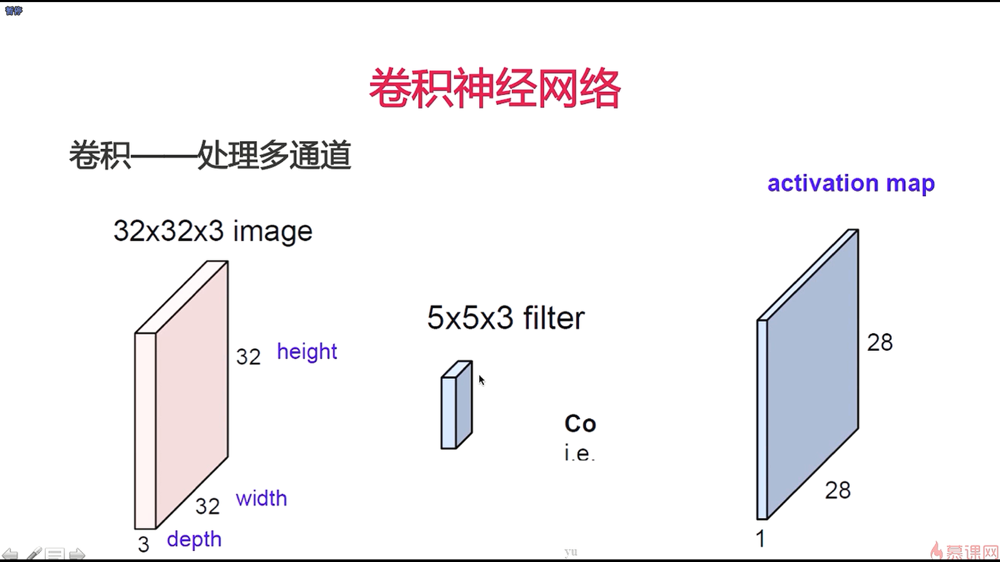

- 对于一个多通道的图像来说，我们可以把卷积也变成多通道的，然后每一个通道上面的卷积的参数是不共享的，然后每一个通道上面的卷积的参数去和相应通道上图像的输入去做内积，将这3个通道上面同样位置的内积的结果相加起来作为输出神经元的值
- 在上图所示的例子中，我们可以看到每一个卷积核都可以产生出一个单通道的输出神经元的图出来，那么如何产生一个多通道的输出神经元的图呢？其实很简单，只需要使用多个卷积核即可，当然这些卷积核之间的参数是不共享的
- 我们可以认为卷积核是用来提取某一种特征的，当这个区域是有这个特征的时候，我们的卷积核捕捉到这个特征，会使得输出神经元的值就会比较大；当这个区域没有这个特征的时候，输出的神经元的值就会比较小
- 加入多个卷积核就是提取输入图像的多种特征
- 输入是三通道表明这可能是一个RGB图像，输出是192通道，表明它有192个卷积核，去提取192个特征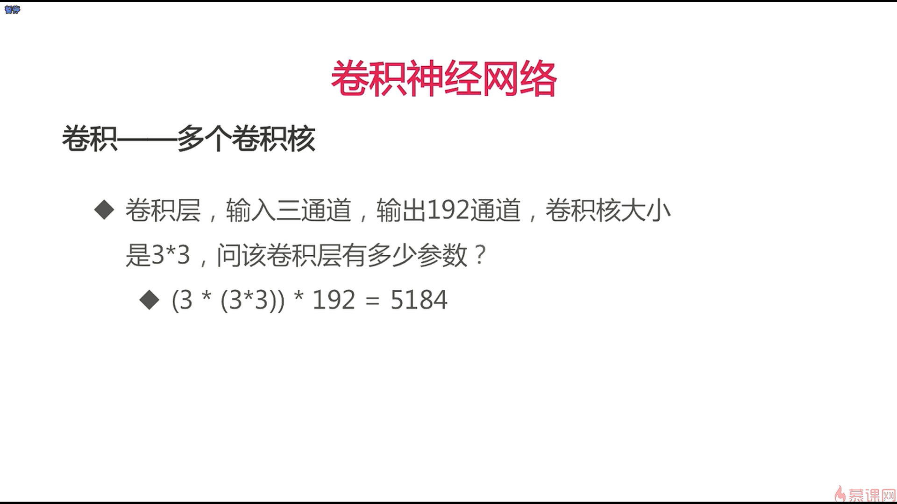
- 3乘以3的结果是卷积核中某个通道的参数数目，因为卷积核是一个三通道的，那么3*(3乘以3)的结果就是一个卷积核的参数数目
- 在卷积神经网络中，一个比较常用的激活函数是ReLU，因为它的计算非常的高效
- 激活函数的性质之一是它们都具有单调性，即它们的输入越大，它们的输出也就会越大；其二，它们都是非线性函数（线性函数其实就是二维上面的一条直线）
- 为什么激活函数需要使用非线性函数而不是线性函数？
  - 神经网络的结构都是层次的，然后高级的层次和低级的层次是用全连接来联系到一起的，然后这个全连接就相当于是一个矩阵W，如果没有使用非线性激活函数的时候，那么多个神经网络的层次相当于每一层之间都进行了一次矩阵的操作，而矩阵的操作是具有合并性的，这就意味着即使是很深层次的神经网络，也只相当于一个单层的神经网络，但是加了非线性激活函数之后，这个情况就不会存在了

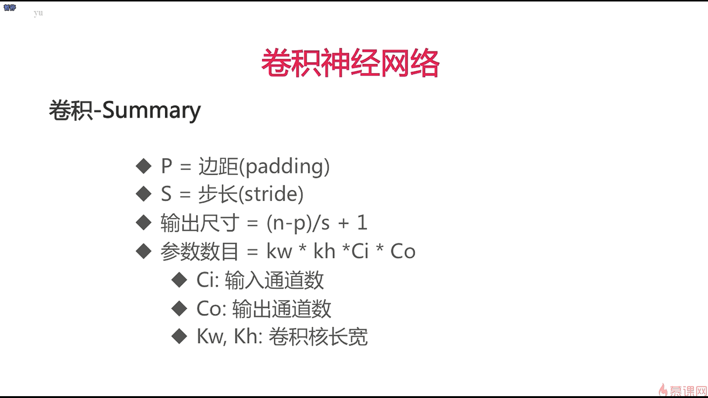

- padding是填充的意思，stride是大步走的意思，上图中的n是输入图像尺寸的大小
- 池化操作相对于卷积操作来说非常的简单，池化操作也有一个核的概念，但是池化的核里面是没有参数的
- 我们在做卷积的时候，默认它的步长是1，而在做池化操作的时候，默认的步长是和Kernel_size是相等的，在做池化操作的时候，对于多一点的边，有2种方法，一种是忽略，而另外一种就是上述提到的padding方式

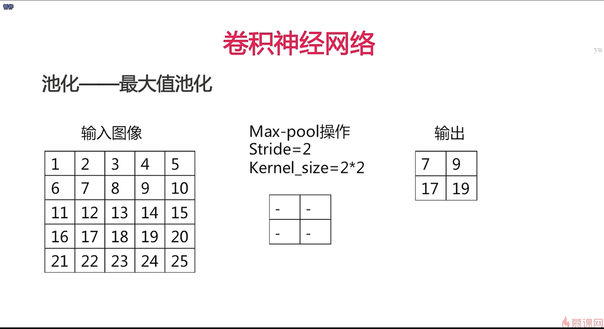

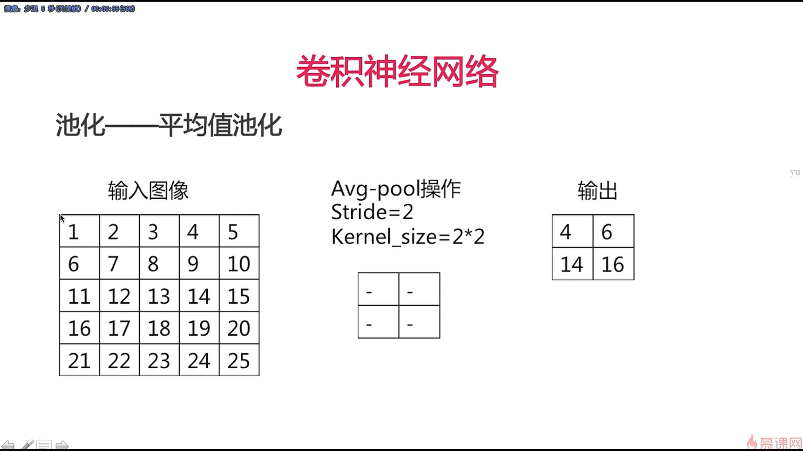

- 不重叠的含义就是我们设置池化操作的步长是和Kernel_size是一样的，不补零的意思就是我们不使用padding方法，也就是说我们把多余的边会直接丢掉
- 一般情况下，我们是把池化操作的步长和池化核的大小设置为相等的，以此来达到不重叠的效果，但是在一些特殊情况下，你可以将这两个值设置为不一样的
- 池化操作在一定程度上是计算量和空间位置精度的一个交换（trick off），减少了计算量的同时损失了一定的空间位置精度

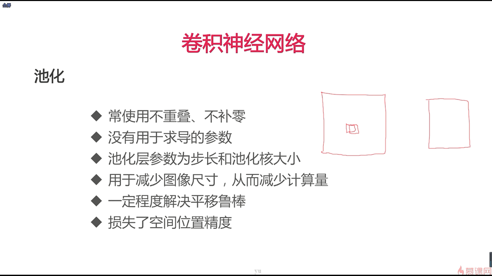

- 全连接层其实和普通的神经网络结构是一样的，在卷积神经网络中，一旦加入了全连接层，后面就再也不能加入卷积层和池化层了，在卷积神经网络中，之前卷积的输入和输出都是一个二维多通道的图像的形式，所以它的神经元并不是按照向量去排列的
- 全连接层的参数就是输入神经元的参数和输出神经元的参数的乘积
- 在卷积神经网络中，全连接层的参数占比大概可以占到总参数的60% - 80%

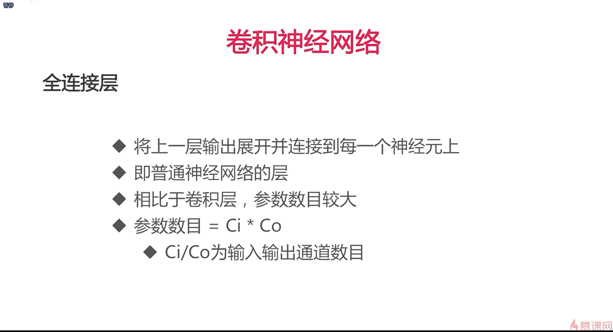

- 由于全连接层之后不能再接入卷积层和池化层，所以全连接层一定是在最后的

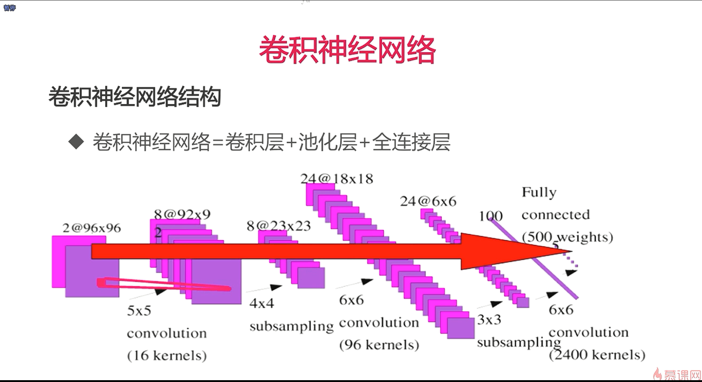

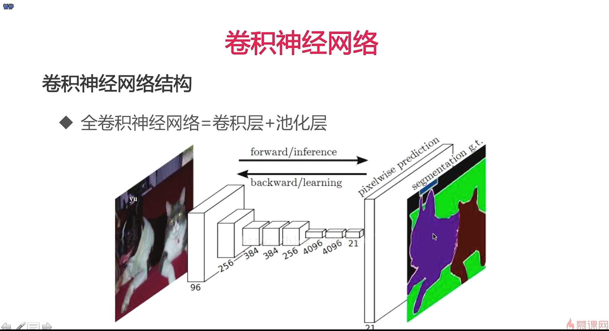

- 因为全连接层的输出是一维的而不是二维的，所以全连接层是没办法去生成图像的，当我们把全连接层去掉之后，我们就可以使得卷积神经网络以图像的形式去输出我们的东西，比如说可以应用在图像分割问题上
- 反卷积层的操作，卷积层把步长设置为大于1的时候可以使得图像变小，但是把步长设置为小于1的小数的时候，就可以使得一个比较小的二维的特征图变成一个大的二维的特征图
- 这里的重点是去掉全连接层之后，我们可以只使用卷积层和池化层去做一个图像到图像的输出操作

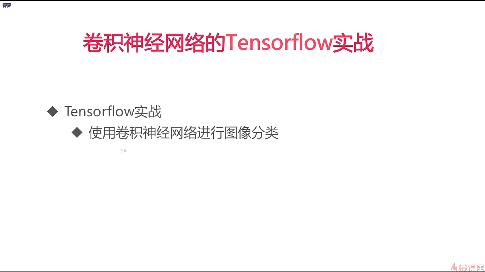

