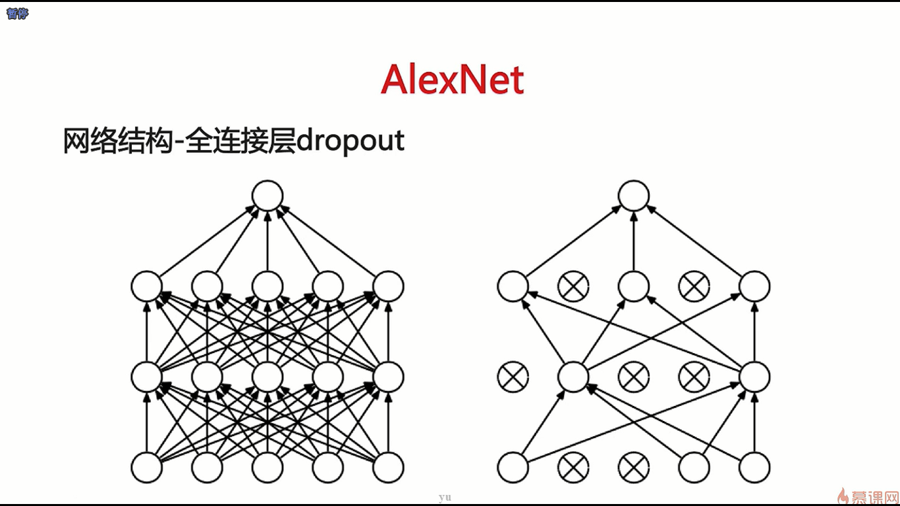

- 在讲完这些模型结构之后，我们将会对模型做一个最后的对比，让大家可以合理地去选择模型，以及了解如何去选择模型，选择模型的一些衡量标准是什么
- 不同的网络结构使用的技巧是不一样的，不同的网络结构使用的很多优化的子手段可以被借鉴用到其它网络模型上，比如说像ResNet中使用的残差连接的子结构就可以被用到循环神经网络上
- 不同的网络结构应用的场景是不一样的，比如说一个最直观的例子就是在服务器端和在手机端，因为在手机端的运行环境是有限的，所以我们要将网络结构优之再优，缩之再缩，使它成为一个运行得比较快的一个网络，这样才能适合在移动端上的应用，而在服务器端，我们就没有这样的要求

- 在卷积神经网络刚出现的时候，是以AlexNet这个网络打头阵的，在ImageNet这个图片分类比赛上夺得了第一名，远超传统的图像分类方法，使得深度学习一战成名
- 从基本的卷积神经网络到更宽更深的卷积神经网络，在这里一个典型的代表就是从AlexNet到VGGNet。把基本的卷积神经网络加深加宽到一定程度后，我们会发现它并不能继续带来精度上的提升，在这个时候出现了另外一种方向就是我们会尝试不同的网络结构，包括InceptionNet和ResNet

- AlexNet是在2012年出的一款模型

- 在卷积神经网络中，除了输入层和输出层之外，中间我们都可以称之为隐含层，所以全连接层也可以叫做隐含层

- 步长（Stride）就是卷积核在图像上从上到下从左到右去滑动的时候，相邻两个卷积的计算区域之间的间隔

- Relu这个激活函数就是在AlexNet中首次提出来的，它的训练速度会非常的快

- 并不一定所有的卷积层后面都要跟着pooling层，也可以使用步长不等于1的方式（比如说等于2或者是等于3）使得网络结构也能够在经过一层后，输出的神经元图比原来的size小一半

- 普通的全连接层是每一个神经元都和之前的所有神经元相连接，dropout是指某一个神经元作输入的时候，把它的上一层神经元的输出随机地加一个mask，也就是一个面具，这个面具使得随机地把其中的一些值给置成0，置成0之后就相当于这个神经元对它上一层的神经元没有贡献，每一次dropout的位置是完全随机的
- 当参数过多而样本数据过少的时候，所有的参数容量过大，使得这个参数会记住训练集中的所有样本，从而使得它在训练集上表现非常的好，但是在测试集上的表现没有那么好，这种情况就是过拟合，也就是说这个模型的泛化能力不是那么好
- 对于一个卷积神经网络，既然它的参数绝大部分集中在它的全连接层上，我们有理由认为如果这个网络过拟合了，问题一定出在这个全连接层上的参数太多了，所以dropout就是这么一种技术，使得全连接层过拟合的这种风险大大变小了

- 在机器学习中，模型的组合一般是能提升最后的模型效果的，所以在很多数据挖掘和AI的比赛中，各种比赛的团队都会使用组合的方式在最后的问题中去做处理
- 过拟合是指神经元记住了所有的数据，而一个神经元是记不住所有数据的，肯定是需要多个神经元之间去配合，而dropout每次随机地去删掉一些神经元，所以就使得神经元之间去组合记忆的这种环境不存在了

- 比如说dropout之前有6个神经单元，这6个神经单元的输出是（1,2,3,4,5,6），作dropout之后变成了（1,0,3,4,0,6），它认为这个（1,0,3,4,0,6）总能代表一个新的样本，这个新的样本的输出就恰恰是（1,0,3,4,0,6），所以作dropout就相当于增加了数据，加入了新的数据之后，总会使得这个模型的泛化能力变强，也就是相当于进行了数据增强

- 随机采样表示每一次的输入只是这个图像的某一部分，而不是整张图像，在[256,256]的尺度上用[224,224]去随机的采，这就相当于对一张图像从很多种角度去看它，对它进行分类，从而使得网络会更准，也就是一张图像可能会被采样成很多种输入图像的一种方式
- 训练多个模型，然后多个模型得到的结果去投票