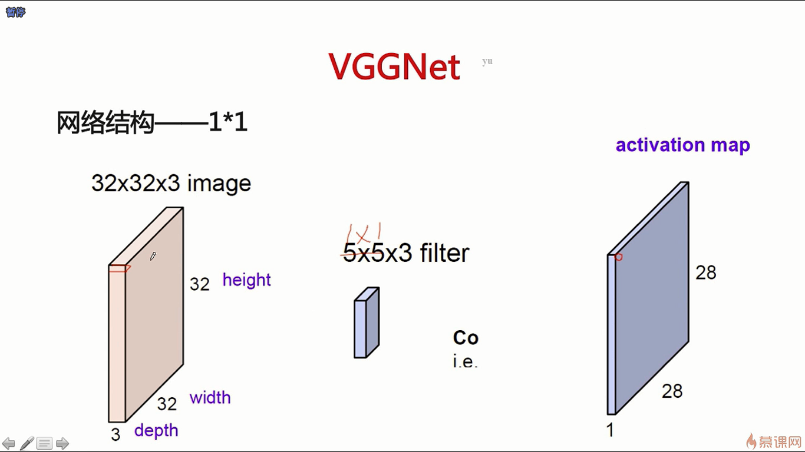

- VGGNet是2014年的一个比较好的一个网络，它充分代表了2012年-2014年大家在卷积神经网络结构调整上的一个进展，基于此框架，我们可以配置出来各种各样的网络结构
- 池化层通常不把它算作是一层神经网络，因为它的操作确实比较简单
- 每经过一个pooling层，通道数目翻倍。这样可以防止信息瓶颈，因为经过一个pooling层之后，相当于是某些信息是丢失了，所以需要提取更多的特征出来，从而使得它的信息丢失的没有那么多
- 非线性变换会使得整个模型的拟合能力会变好

- 1*1的卷积核相当于是通道间的一次非线性变换，可以通过 1 * 1的卷积核去做一个降维的操作

- LRN是一种局部归一化的操作，这种方法已经快过时了，归一化就是把均值设成0，把方差设成1

- 神经网络中最最主要的参数是在FC（即全连接层）这一块

- VGGNet是把网络加深到一定层次，但是它加深到一定层次之后，它就不能再继续加深了，因为再继续加深也不能提升效果，ResNet正是解决了这样一个问题，可以使网络加深到更深更深的层次，最深的ResNet可以到1000多层
- ResNet的作者是何恺明，何恺明是深度学习领域的一个学术明星

- 参数数目这个东西可以一定程度上去反应模型的容量，参数数目越多，也就意味着这个模型可以学到更多的东西，所以说对于一个更深的卷积神经网络来说，它的卷积层已经有了很多的参数，所以说为了使得这个模型的容量是一定的，因为太多的容量会导致过拟合，ResNet就强调了卷积层而弱化了全连接层

- 残差其实就可以认为是图像的信息，因为图像的信息是可以直接再传递过来，所以它在卷积层上学习到的东西就会比较少，它只是学到一个更特殊的一个表达而已，而这种全部的信息是可以由残差的另一个恒等式给保存下来，所以说残差结构使得网络需要学习的知识变少，所以说它比较容易去学习
- 数据分布对神经网络的一个影响