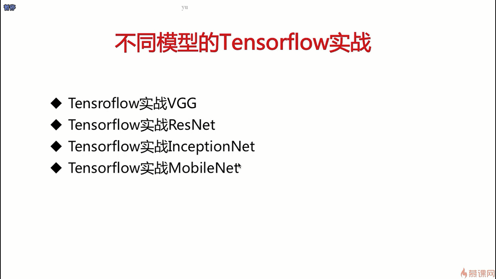
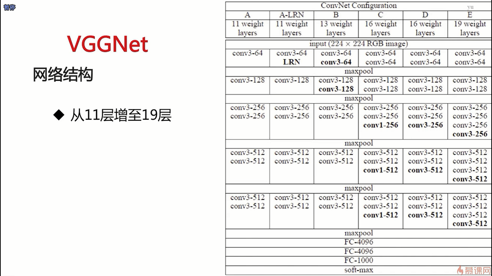
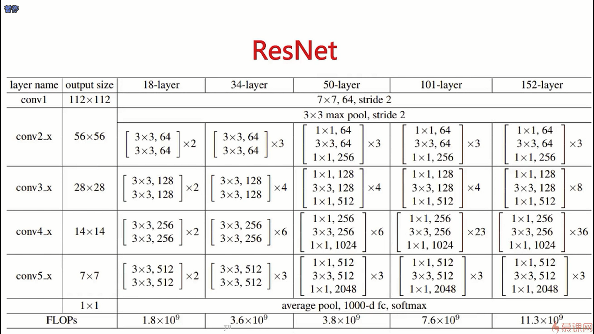
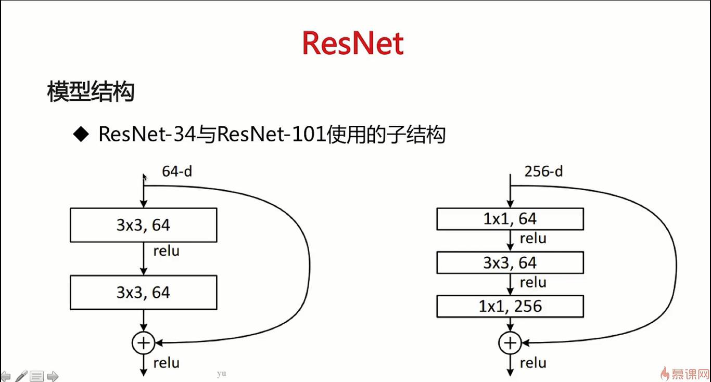

- VGGNet可以从普通的卷积神经网络中脱胎变换过来，VGGNet就是通过3*3的卷积或者是1 * 1的卷积对层次进行加深，所以VGGNet可以从普通的卷积神经网络中通过添加层次来达到

- 在ResNet中，经过一个残差连接块，可能会有一个降采样的操作，之前讲卷积时提到的maxpooling其实就相当于是一种降采样的工作，让卷积层的步长等于2也是可以达到一个降采样的效果

- 我们的输入经过卷积层之后可能会做一个降采样的工作，使得它的输入变为原来的二分之一，但是我们的恒等变换是不会去做变化的，所以在做加法时，加法两端的矩阵的size是不一样的，在这个时候这个加法就会出问题，解决方法就是恒等变换时我们会做一个maxpooling操作达到降采样的效果