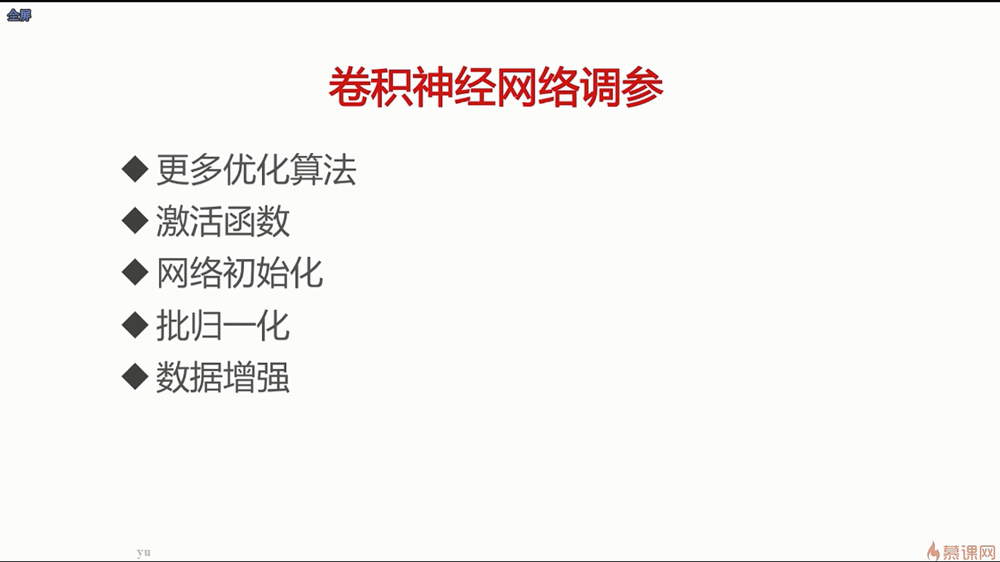
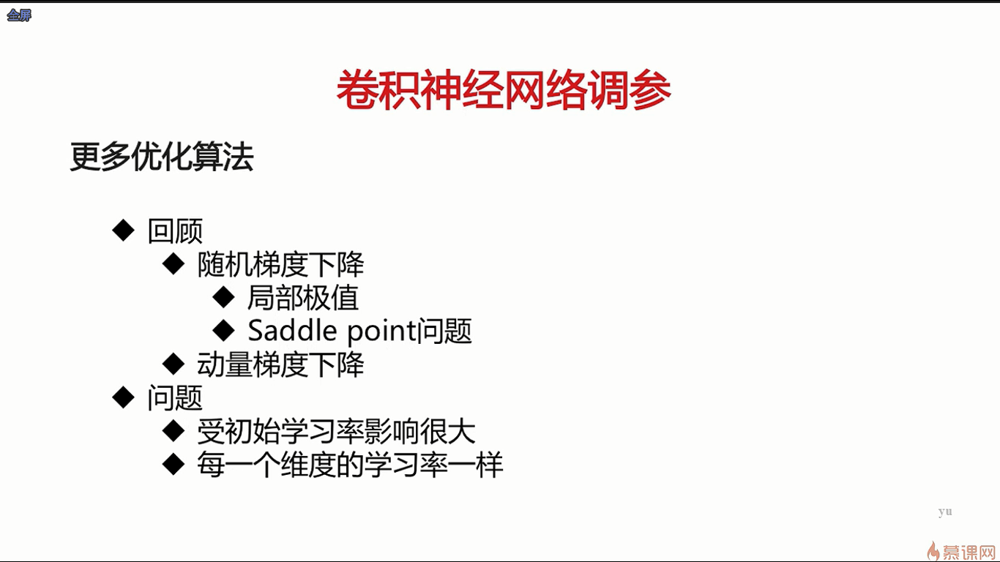
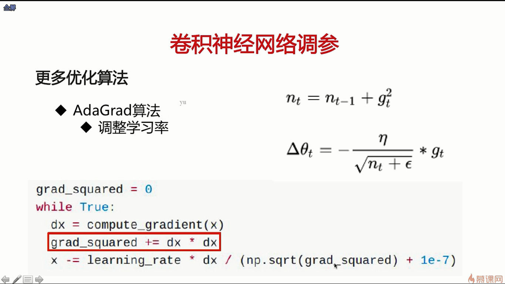
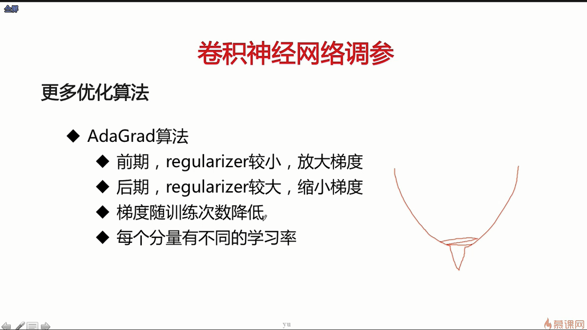
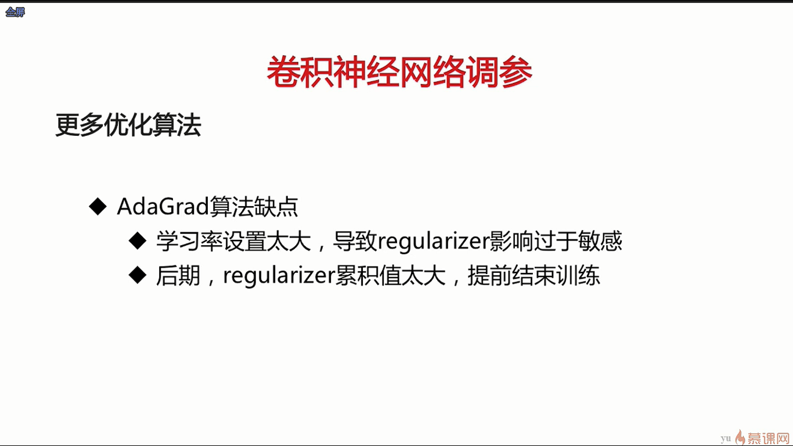
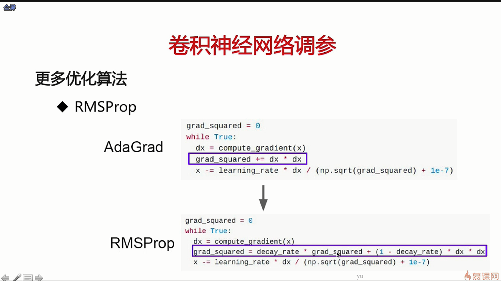
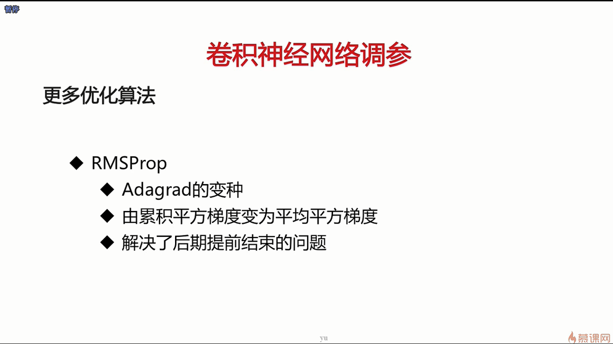
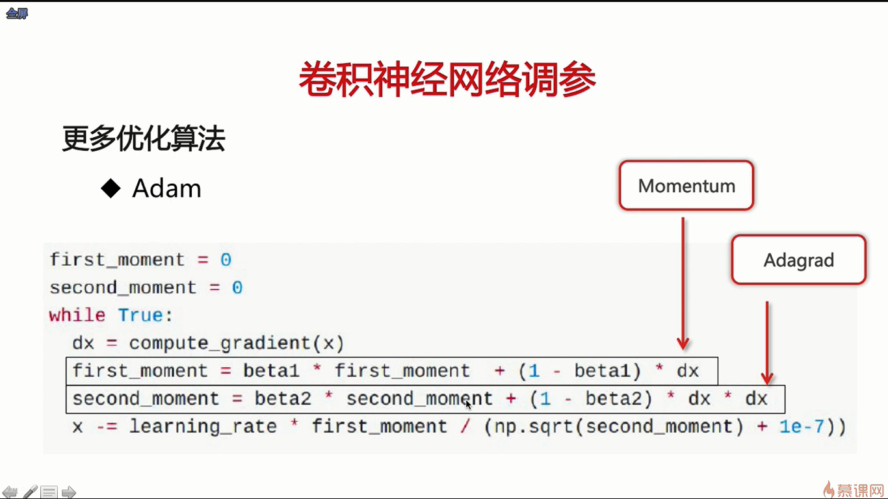
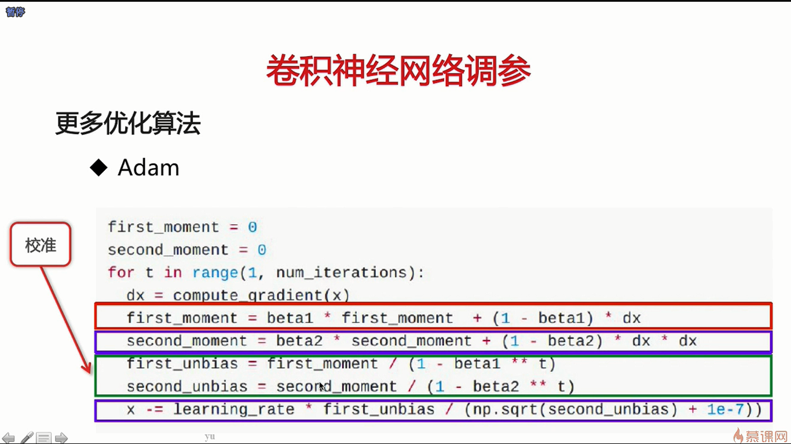
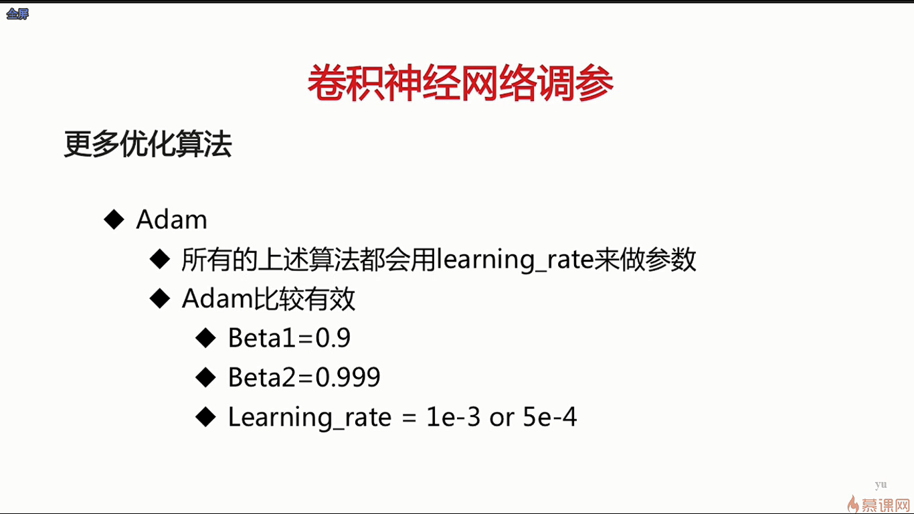

- 我们之前介绍的很多卷积神经网络，它们有众多的参数，包括网络结构参数，比如说有多少层，每一层有多少个卷积核，然后还有一些训练相关的参数，比如说你的学习率有多大，网络参数是如何随机初始化等等
- 对于一个深层次的网络结构来说，它的初始化非常的重要，如果没有初始化好的话，就会使得这个模型在训练的时候根本不会收敛；当然如果初始化好的话，可以使这个模型以更早的时间达到更好的效果
- 批归一化是使得深层次的模型训练稳定的一种重要的手段
- 数据增强是从数据层面上的一种调参方法，可以使得模型在最后的结果上达到一定量的提升

- 如上图所示，如果初始学习率很大的话，无论是采用随机梯度下降还是动量梯度下降，都是导致整个模型最后梯度爆炸，使得它不收敛。第二个问题是学习率的值是针对全局来设的，并不是针对每一个参数做个性化定制的，最好的情况是给每一个维度设置一个不一样的学习率，使得它能够个性化的去更新参数

- 放大梯度本质上也是在放大学习率
- 如果刚开始时学习率比较大，梯度太大会导致整个模型在初始的时候梯度爆炸，导致整个模型会不收敛

- Adam是集众家之长的一种算法，所以在真实训练中，我们一般会采用Adam算法