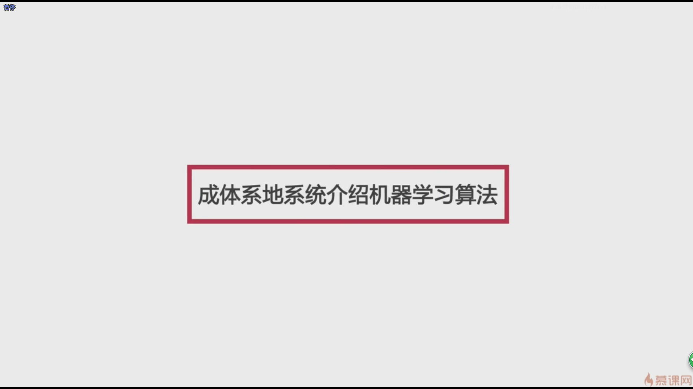
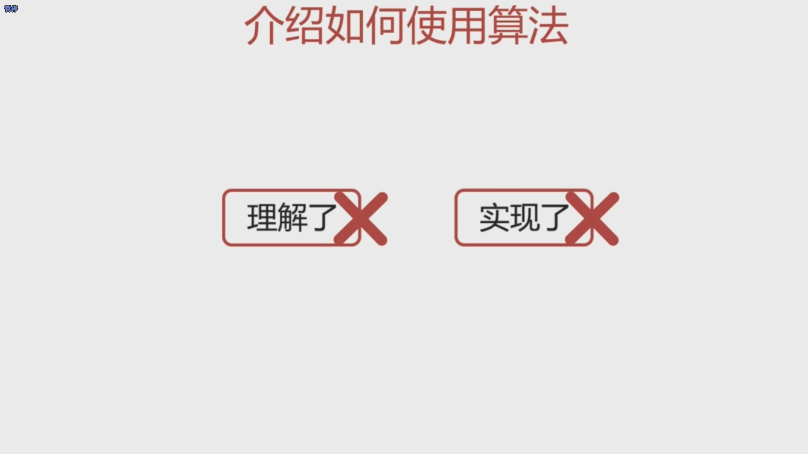

- #### 到底什么是机器学习，其实简单来说就是我们要让机器去学习，关键词是‘学习’这两个字

- 在我们传统的学习算法的过程中，我们真正要做的事情其实是让机器去执行，也就是说设计一个算法让机器去具体的完成一个任务，而不是学习一个任务怎么去做

- 图像识别领域需要大量地使用机器学习的方法来解决问题

- 数字识别使我们整个的邮政系统的效率得到极大的提升

- 在真正的生产环境中，无论是出于对效益的考虑还是出于对稳定性的追求，调库本身是没有问题的

- 很多机器学习工程师其实就是不断地在调参