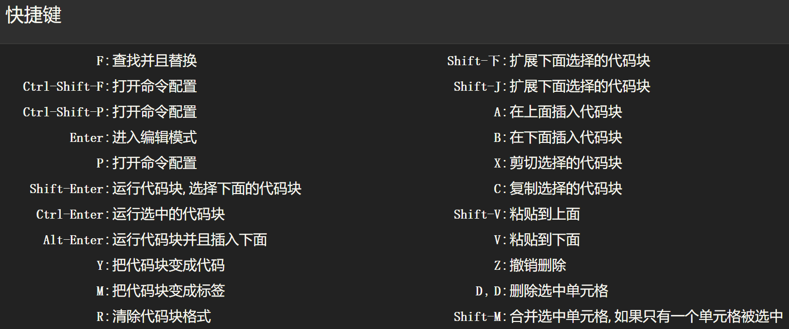

- A和B这两个快捷键就是添加新的单元格，A是在当前选中的单元格的上面添加新的单元格，而B是在当前选中的单元格的下面添加新的单元格 

- 新添加的单元格都是默认让我们写code的，但如果是想写文档和写文本的话，我们可以使用M键，M就是Markdown的首字母，想重新变回code格式的话，就可以使用Y

- 简洁一点来记忆就是 Y：to code ；M ：to markdown

#### 为什么要使用 Jupyter Notebook

- 它能够帮助我们存储之前的代码所写的变量，之后以交互的形式完成我们的整个的编程过程
- Jupyter Notebook不像IDE（如Pycharm）一样，每添加一点代码都需要重新运行一次 

