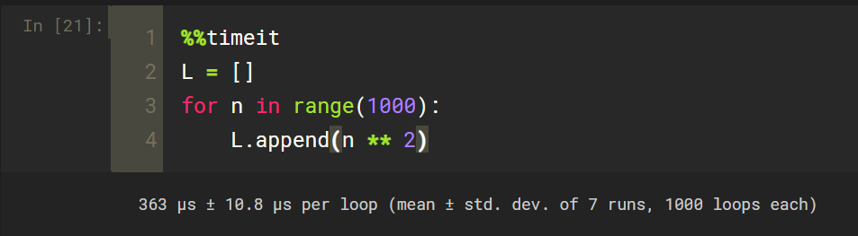

- 在课程中主要使用的魔法命令只有2个
- 在Jupyter Notebook中调用我们的python代码应该如何去调用

- 采用如上图所示的方式就可以执行我们所写好的python代码了，run后面接的是我们脚本所在的地址，这个地址只需要是一个相对地址就可以了
- 为了让一个文件夹下面所有的python脚本形成一个模块，可以在文件夹下面创建一个__init__.py的文件，这是最简单的让一个文件夹下面的所有python脚本成为一个模块的方式
- 第2个魔法命令叫作%timeit，这个是用来帮助我们测试代码的性能的魔法命令 

-  ' ** 2 ' 表示的是求平方 

- 在 Jupyter Notebook 的in中有一个短暂的*的过程，表示我们程序正在运行

- 自动为我们运行了1000次，平均每次运行的时间为363us左右
- 这里的有多少次循环是有Jupyter Notebook自动决定的

- 当range变成1000000时，就会只执行1次了

- 1微秒等于百万分之一秒（10的负6次方秒），1毫秒等于千分之一秒（10的负3次方秒）

- 如果使用%timeit那么后面只能接一句话，如果想测试一整段代码的性能，就可以使用%%timeit，有时候我们也把%%叫做区域命令符

- 上面的两段代码完成的是一样的是事情，但下面的代码的速度会慢一些，因为上面是使用Python中list生成表达式来完成的逻辑，而下面的是使用的for循环，那么在Python中用for循环会慢很多，这是Python中语法的问题

- 当我们只希望程序只执行一次的时候，我们此时是可以使用%time和%%time

- Wall time是我们人类真正感知到的时间

- 对于Python语言来说，对sort()这个排序函数是有一定的优化的，对于一个已经排好序的数组，sort()可以非常快的完成排序的动作，而对于一个乱序的排序数组，相应的就需要更复杂的操作来完成这样的排序

