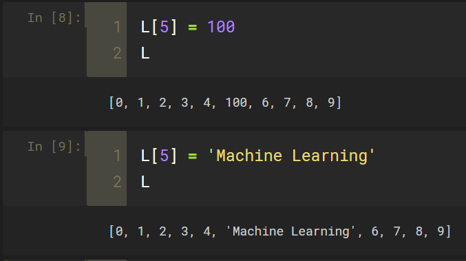
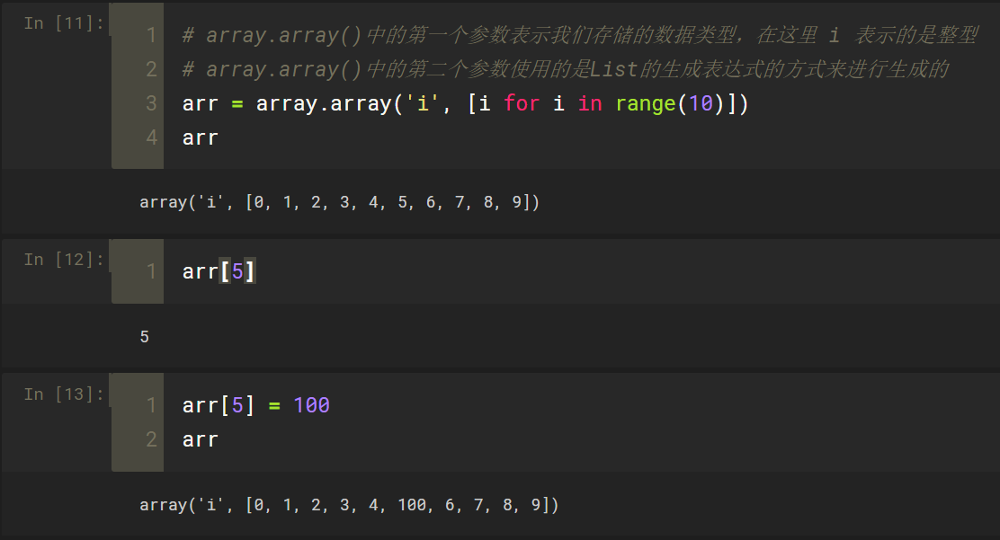
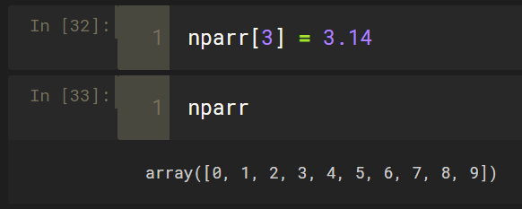

- NumPy下面最最核心的数据结构就是数组，即array，只不过NumPy可以方便地将这一个数组看作是多维的数组（如二维或者三维或者更多维）来存储二维或者三维的数据，进而将这些数组看作是矩阵，来快速方便的进行矩阵相关的介绍

#### 为什么要使用NumPy数组

- Python List也可以表示一维、二维数组甚至是多维数组，它的缺点在哪里
- Python的List其实是对类型不做具体限定的List，与此同时，List的每一个元素的类型还可以是不一样的

- 这样的一种存储结构使得Pyhton的List非常灵活的，与此同时也带了一个缺点，使得Python的List的效率相对来说是比较低的，因为它需要检查每一个元素具体是什么类型
- 在Python中也有限定只能存储一种类型的数组，这种数组叫做array

- array这样的一个数组它是限定类型的，里面只能存储一种类型，这样的一种限定虽然降低了灵活性，但它的优点就是效率相对来说比较高，array本身还有一个缺点，就是它只是将存储在其中的数据当作一个数组来看，或者是当作一个二维数组来看，无论是基于数组或者是二维数组，它并没有将这些数据看作是一个矩阵或者是向量，相应的也没有为这些数据配备和向量或者矩阵相关的运算
- 对于一个numpy.array，它的基本操作和list、array是一样的
- numpy.array也是只可以存储一种类型
- 对于整型的numpy.array来说，传入一个浮点数，会自动的进行截位

