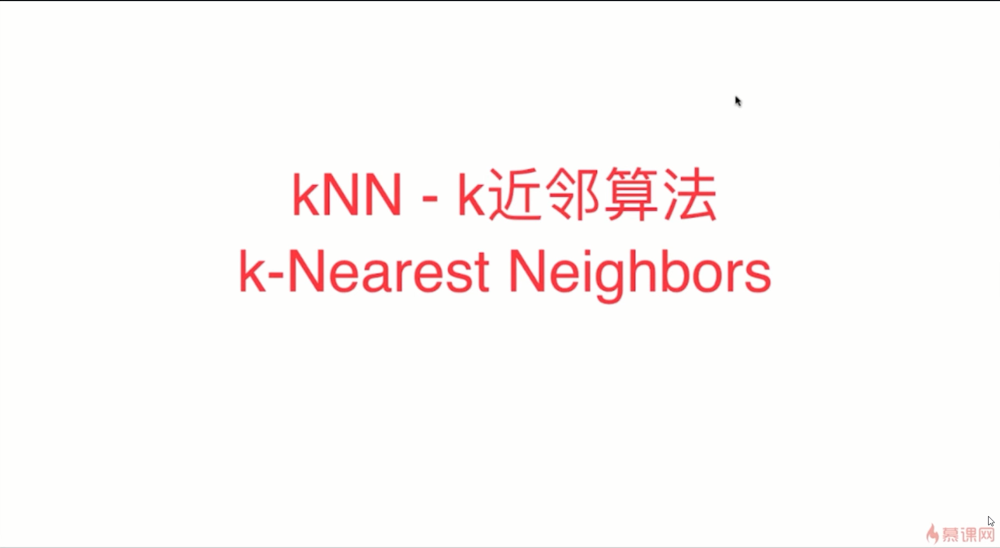
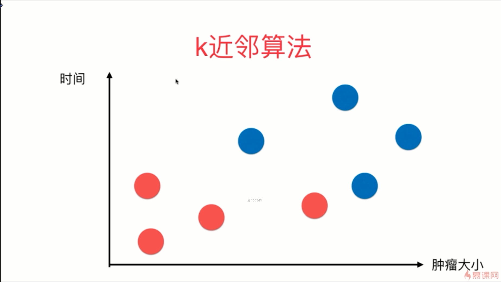
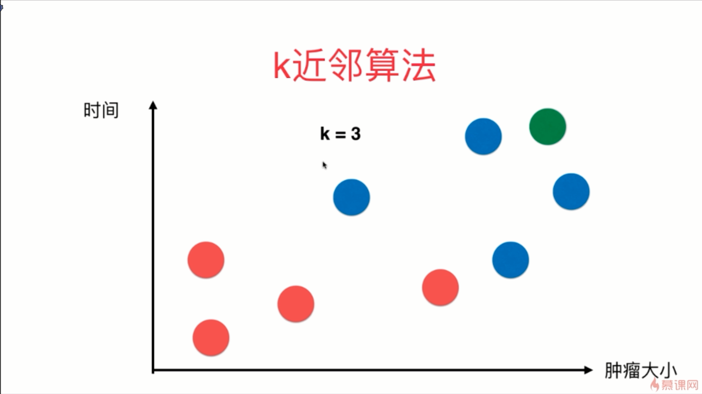
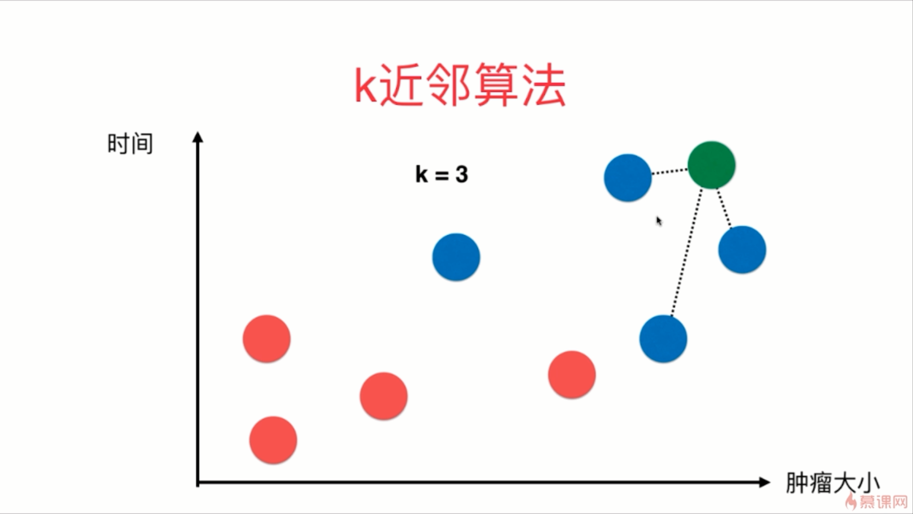
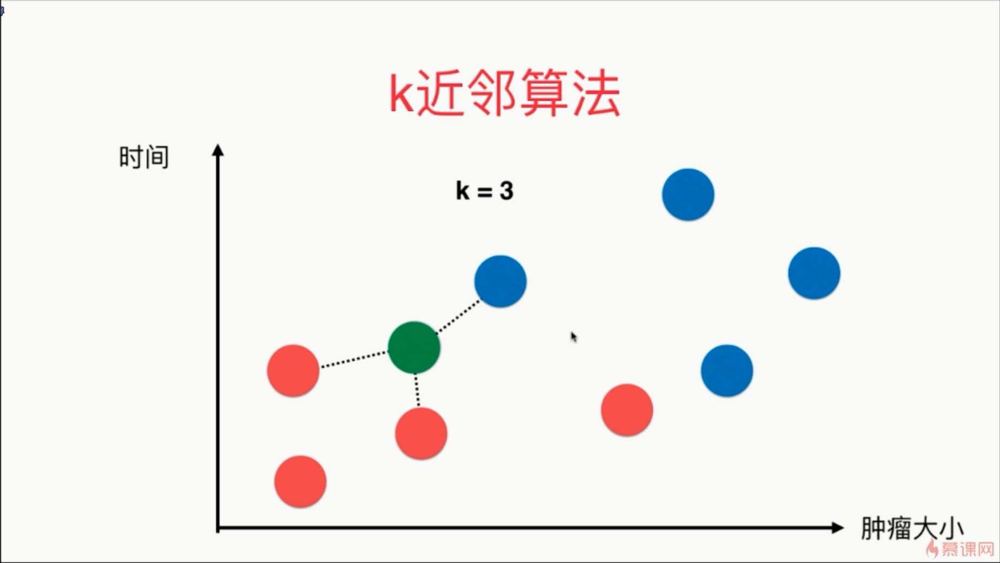
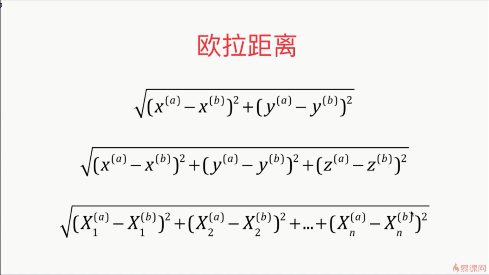
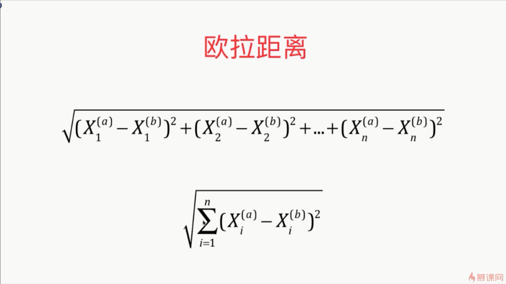

- 如果 k = 3，对于每一个新的数据点，k 近邻算法所做的是寻找所有的点当中离新的数据点最近的3个点，然后最近的3个点以它们自己的 label 进行投票，然后如上图所示，蓝色：红色的比例为 3 : 0，所以就有很大的比例是蓝色，即恶性肿瘤
-  k 近邻算法的本质是认为如果两个样本是足够的相似的话，它们就有更高的概率属于同一个类别 。当然如果只看离它最近的那一个样本是不靠谱的，所以在这里我们多看几个样本，一共看 k 个样本，看和它最相似的 k 个样本中哪个类别最多，我们就说它属于哪个类别
-  在这里描述两个样本是否相似，相似性就是靠两个样本在这个特征空间中的距离进行描述的

-   k 近邻算法其实也可以解决回归问题
- 欧拉距离其实就是两个点对应的维度的坐标相减，再平方，再将平方和开一个根号就行了

