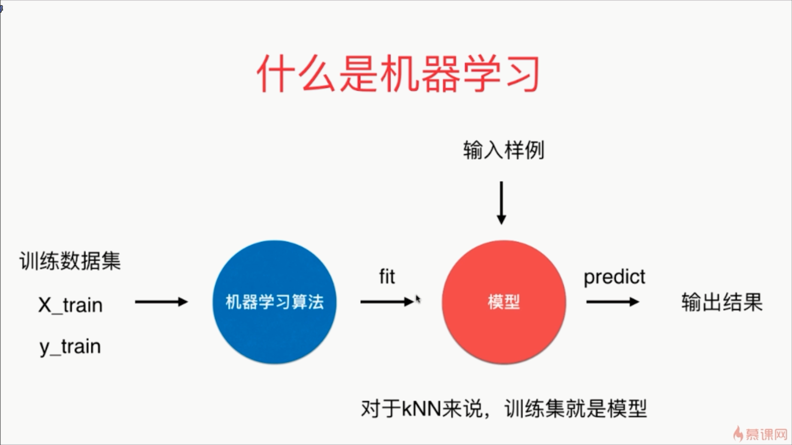

- cannot mix stdin and regular files：不能混合标准输入和常规文件

- 机器学习训练模型的这个过程我们在英文上面通常叫做 fit ,也翻译叫做拟合，也就是说机器学习算法要得到一个模型，这个模型可以拟合训练数据集
- 输入样例送给训练好的模型之后，模型获得输出结果的这个过程叫做 predict，也就是预测

- kNN 可以说是机器学习算法中唯一一个不需要训练过程的算法

