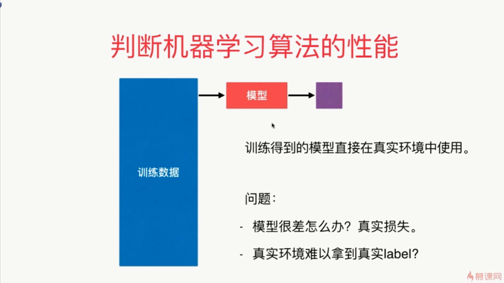
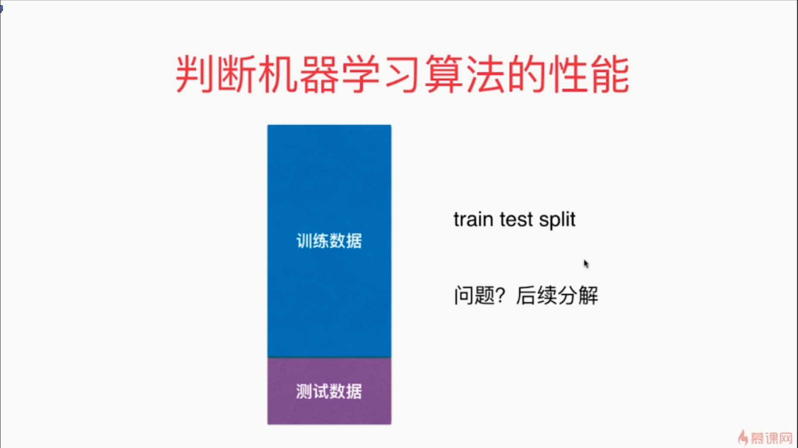

- 拿所有的原始数据全部当成训练数据集来训练出一个模型直接放到生产环境中，这样的做法是不恰当的，改进这个问题的最简单的方法是将训练数据集和测试数据集分离
- 通常是抽出原始数据集的70%-80%当作训练数据集

- 这种方式叫做训练数据集和测试数据集的切分
- 测试机器学习性能的一个最简单的方法就是将原始的数据集进行 train_test_split，然后用train的数据集进行训练，再接着用test的数据集进行测试

