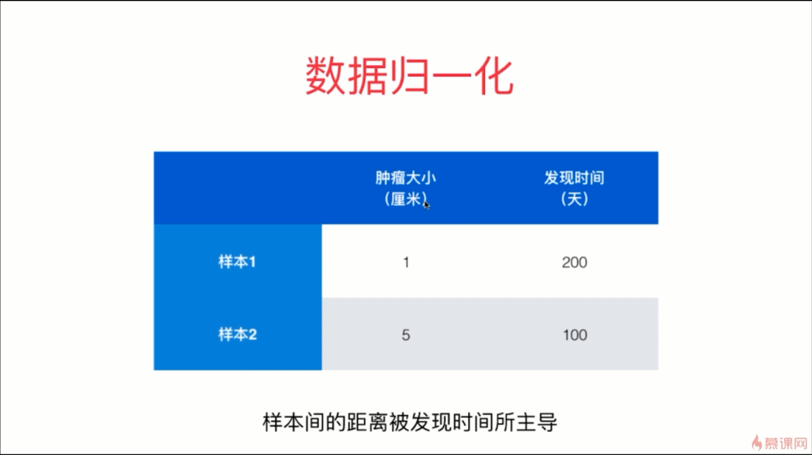
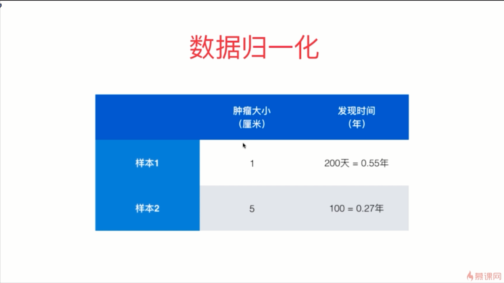
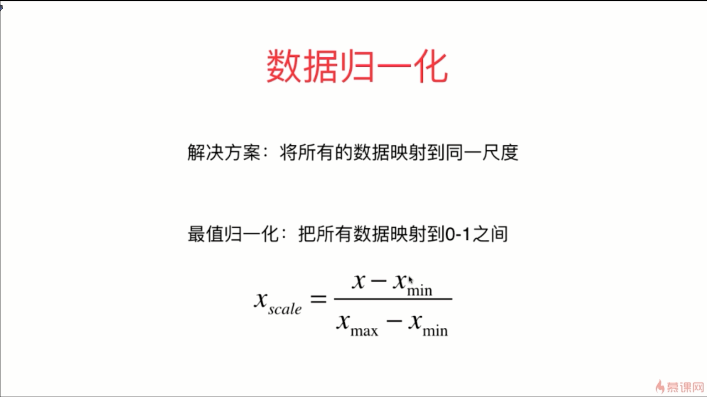
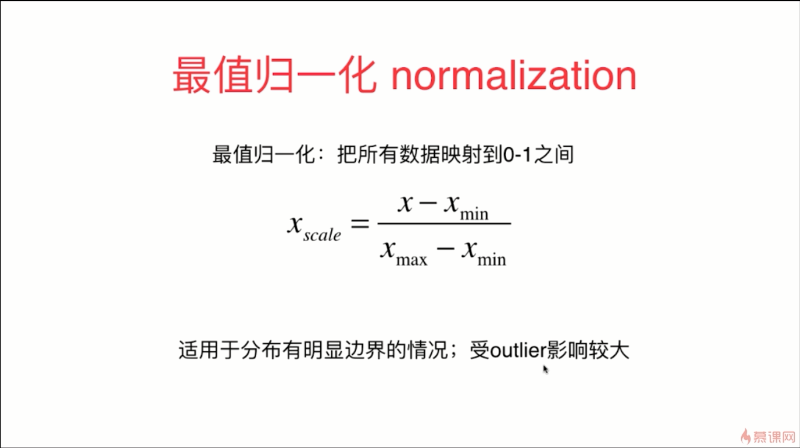
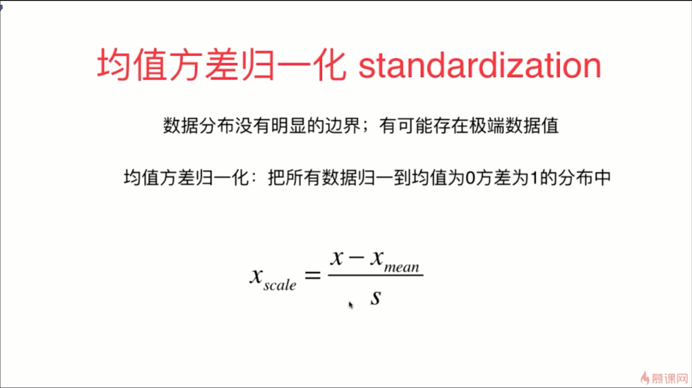

- 按照上图来看的话，样本间的距离又被肿瘤大小所主导

- 对于图像的像素的每一个像素点，对于每一个像素点的颜色来说，这也是有明显的边界范围的，通常是 0 ~ 255 之间

- 如果我们的数据没有明显的边界范围的话，最典型的就是收入的分布情况
- 如果我们的数据分布有明显的边界情况的话，使用均值方差归一化也是非常好的
- 除非是像学生的考试分数、或者是图像的像素这种非常明确的，特征分布是具有边界的数据分布情况，一般情况下都可以使用均值方差归一化来进行数据的处理

