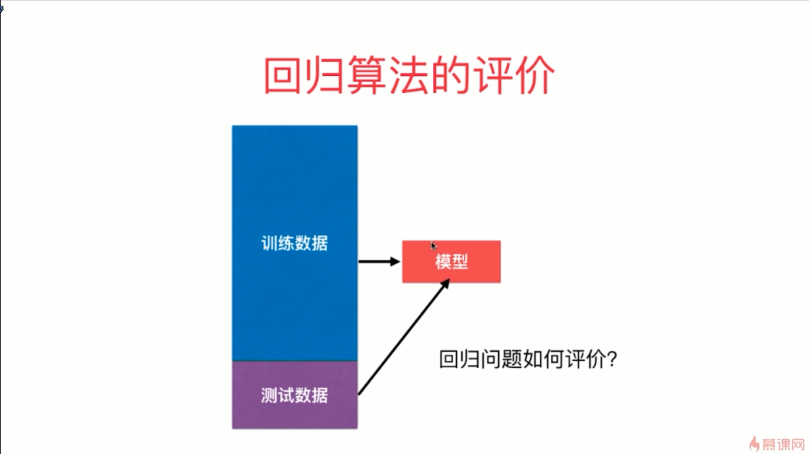
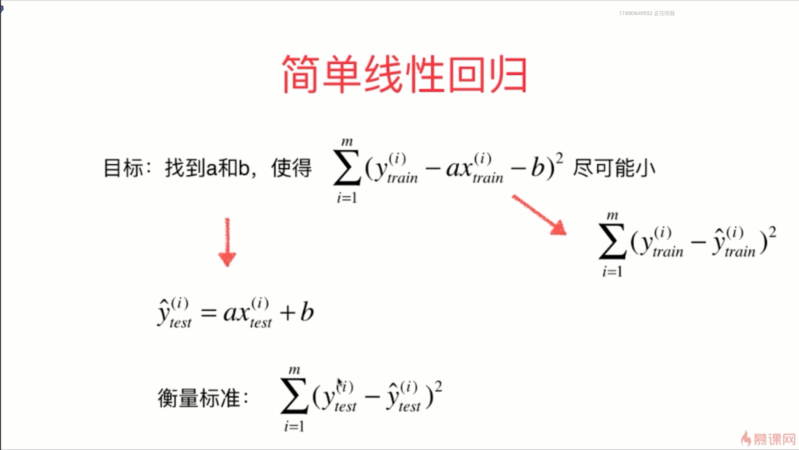
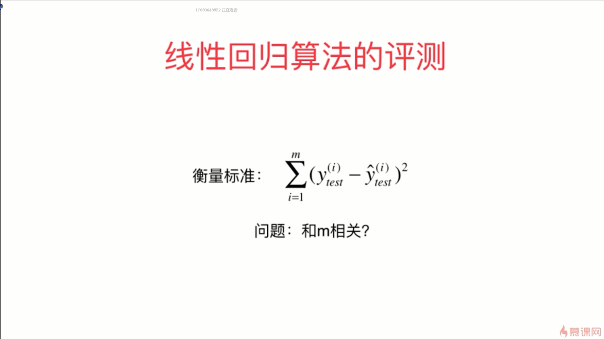
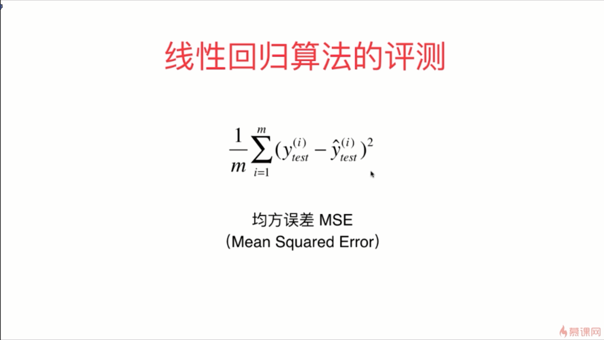
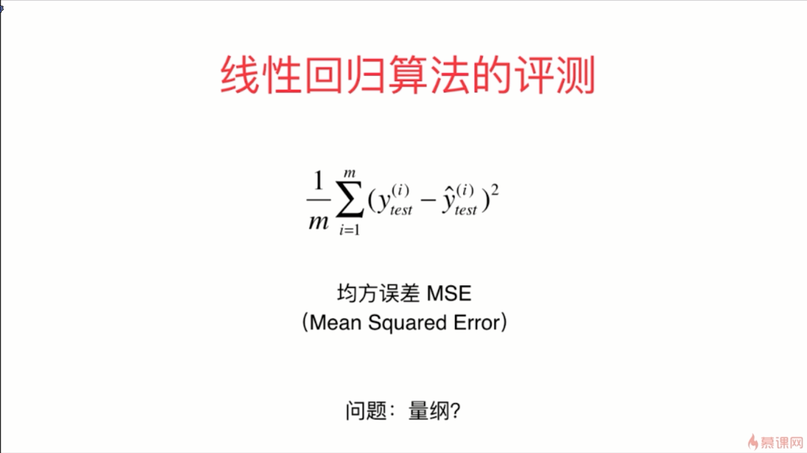
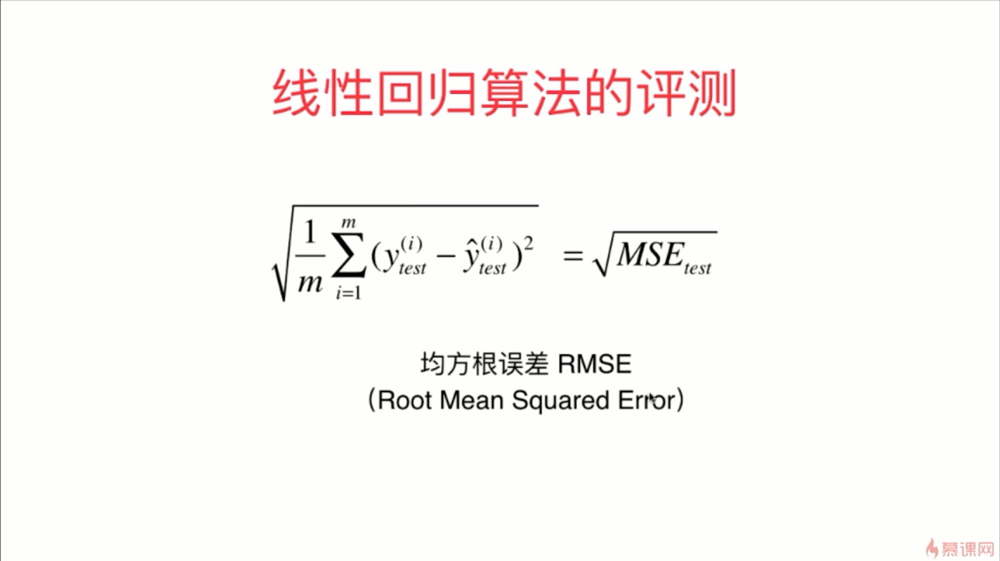
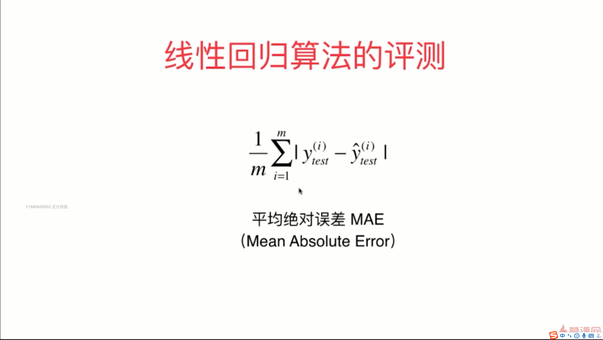

- MSE得出的结果就是万元的平方

- RMSE比MSE更加具有意义
- 绝对值函数并不是一个处处可导的函数，所以它不方便求极值
- 评价算法用的函数和训练时的目标函数是可以完全不一致的

- 通常求出来的结果会发现 RMSE 比 MAE 要大一些，RMSE是将这些错误值平方后累加再开根号，RMSE有放大我们预测结果与真实结果之间较大差距的趋势，我们尽量让RMSE这个值更加小这个的意义更大一些，因为这背后意味着我们的整个样本的错误中那个最大的错误值相应的比较小