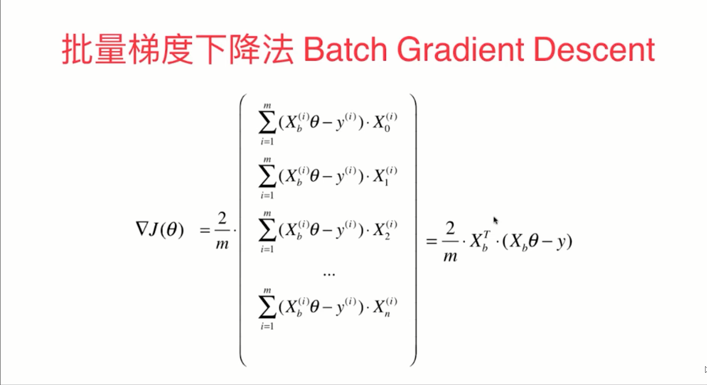
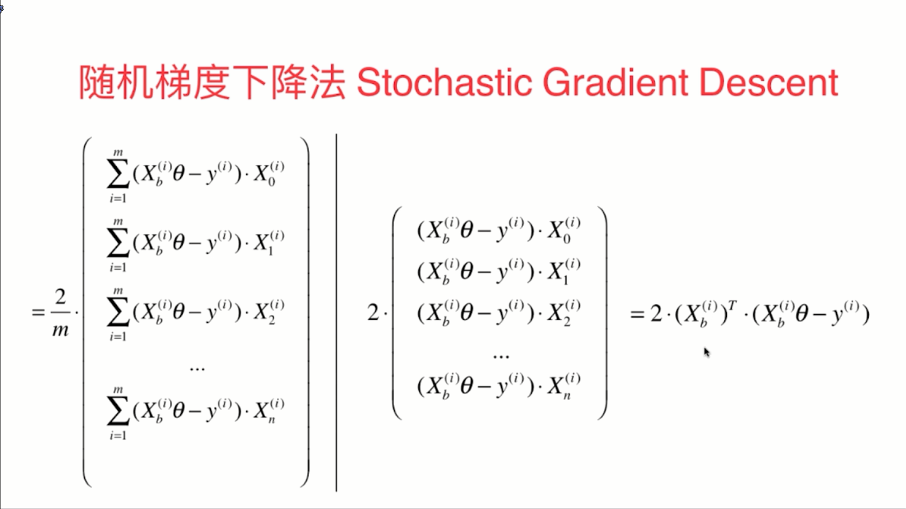
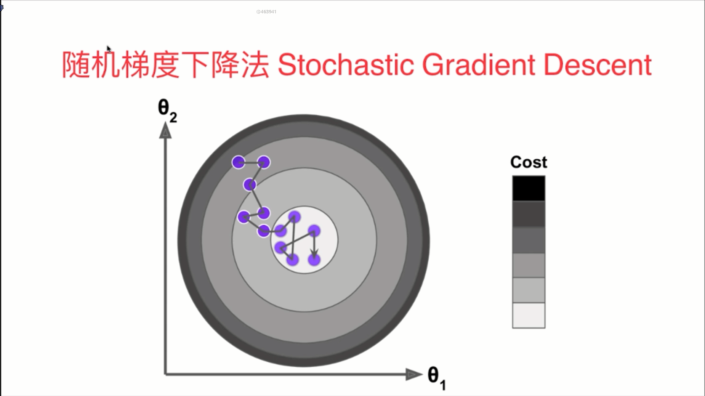
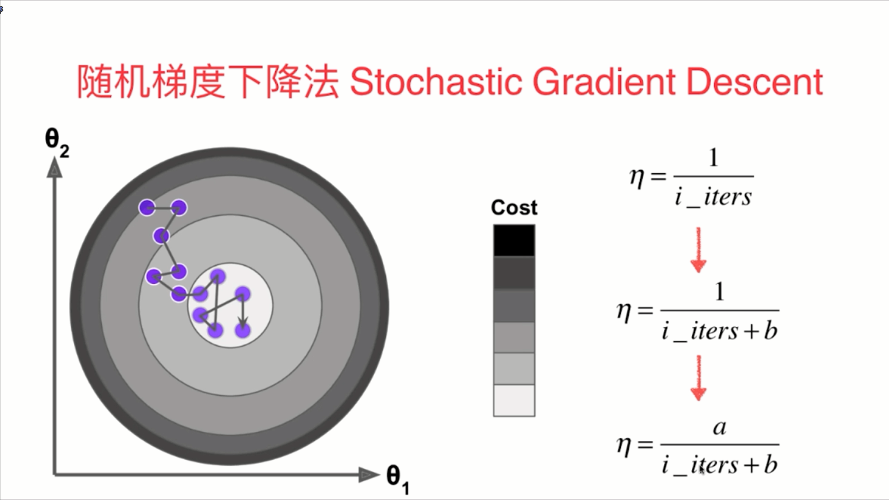
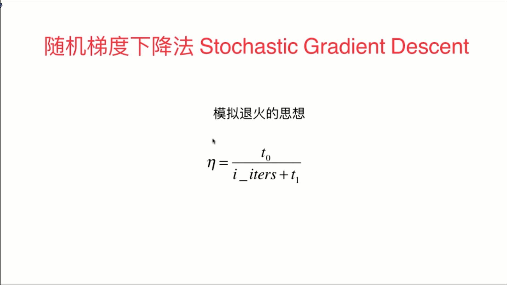
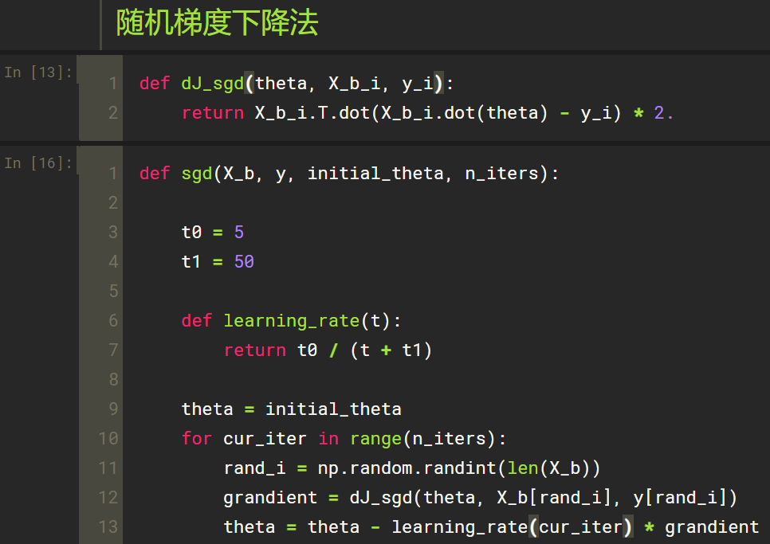

   

-  随机的特点就是具有一定的不可预知性，实验结论告诉我们，通过随机梯度下降法依然可以差不多的来到整个函数的最小值的附近，但是当 m 非常大的时候，我们愿意用一定的精度来换取一定的时间

- 在随机梯度下降法的过程中，学习率的取值变得很重要

  

- 在随机梯度下降法中，为了得到比较好的收敛的结果，我们的学习率应该随着我们循环次数的增加而逐渐递减的，这种逐渐递减的思想就是模拟在搜索领域一个非常重要的思想，就是模拟退火的思想

