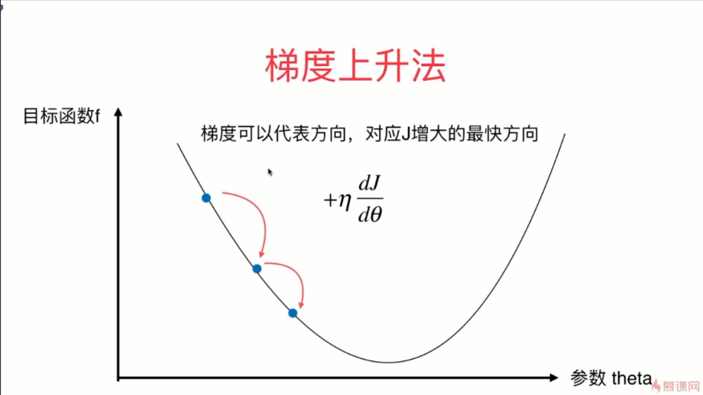

- 批量梯度下降法在每一次都要对所有的样本看一遍才能求出梯度，而随机梯度下降法在每一次只看一个样本就求出那个梯度，相对来讲，批量梯度下降法每一次的求解的速度就会比较慢，但它的优点是稳定，一定可以向着我们的损失函数下降的最快的那一个方向前进；而对于随机梯度下降法，它虽然计算的非常快，但是它的缺点就是不稳定，每一次的方向是不确定的，甚至有可能是向着反方向前进的
- 小批量就是我们每一次不要看所有的样本那么多，但是也不要看只有一个样本那么少

- 在随机的过程中，运算速度是更快的

