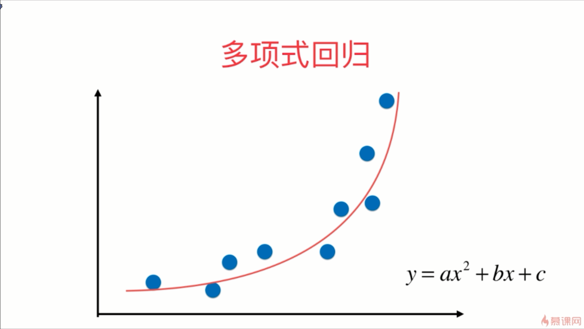

- 之前我们的线性回归法有一个很大的局限性，它假设我们的数据背后是存在线性关系的

- 相当于我们为我们的样本多添加了一些特征，这些多加进去的特征是我们原来样本的多项式项

- 多项式回归在机器学习算法上面并没有新的地方，完全是使用线性回归的思路，它的关键在于我们为原来的数据样本添加新的特征，而我们得到的新的特征是我们原来的特征的多项式组合
- PCA是在对数据进行降维处理，而我们的多项式回归是在对数据进行升维处理