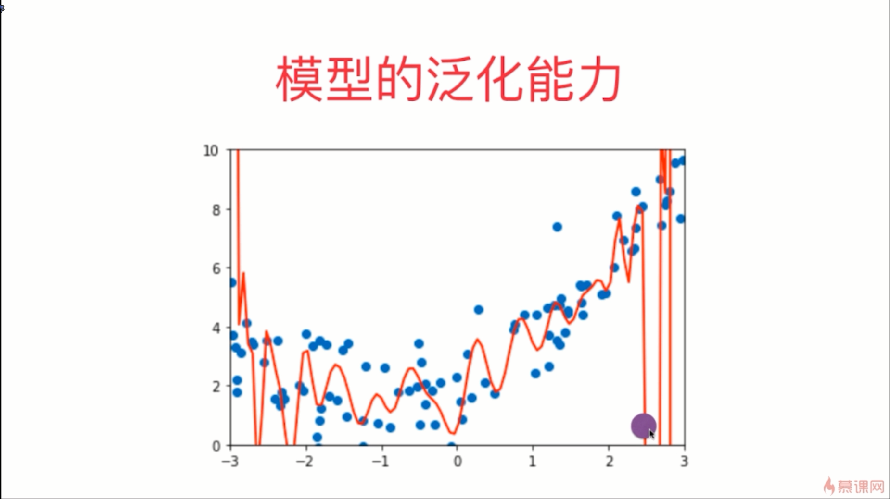
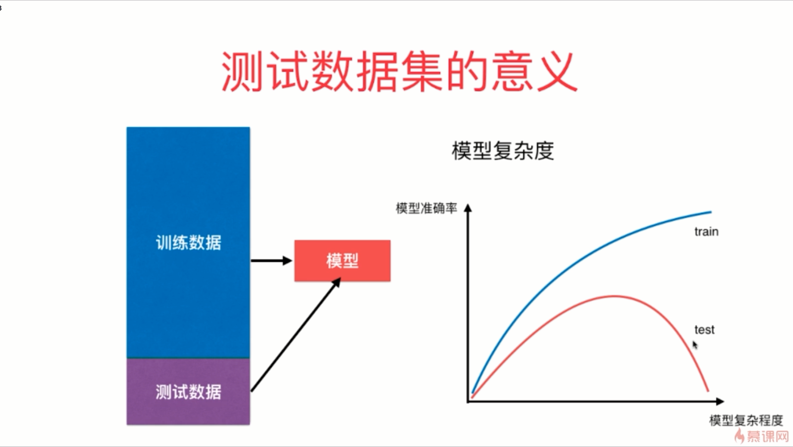
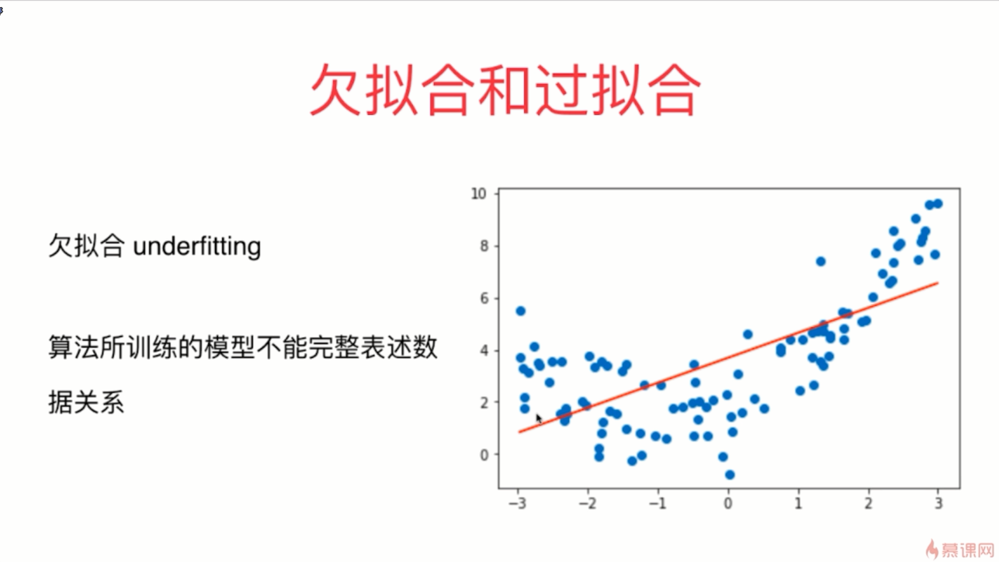
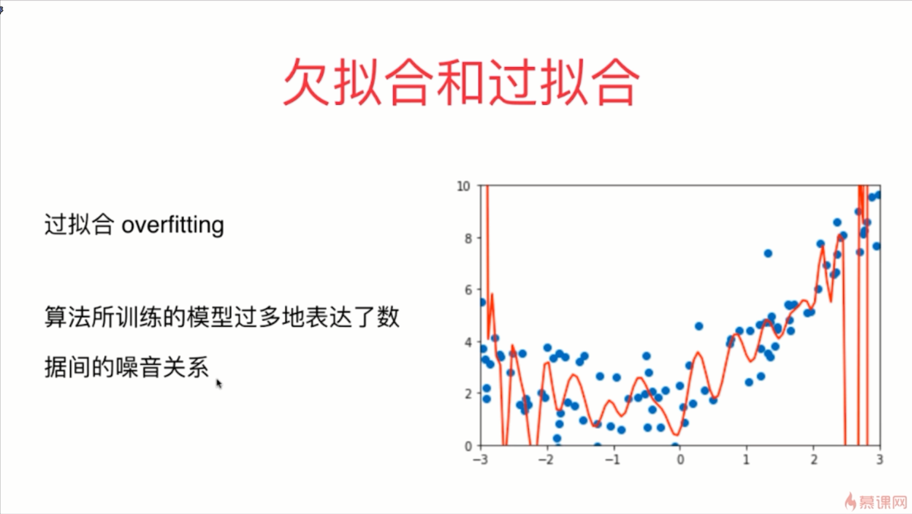
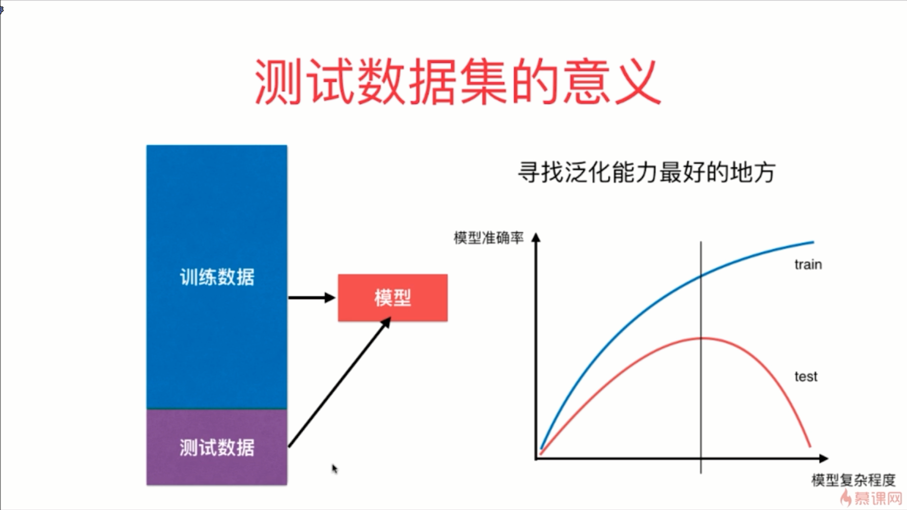

- 机器学习主要解决的问题其实是过拟合的问题

- 在过拟合这种场景下，虽然上图这条曲线将原来的样本点拟合的非常好，总体的误差非常小，但是一旦来了新的样本点，它就不能进行很好的预测了
- 上图这个模型的泛化能力是非常弱的，在这里所谓的泛化能力就是”由此及彼“的能力
- 我们真正需要的是模型的泛化能力好
- 如果我们通过训练数据获得的模型在面对测试数据时也能获得很好的预测结果时，我们就说我们的模型的泛化能力是很强的；如果模型在面对测试数据时效果很差的话，那么我们多半是遭遇了过拟合
- 我们的每一个模型都可以通过对参数的调整，让模型从简单变复杂
- 随着模型复杂程度的增加，对于测试数据集的准确率来说，一般模型会经历一个从欠拟合到正好到过拟合的曲线变化

- 我们真实采集到的数据通常都是有噪音的，并不是非常纯的数据

- 机器学习一直要解决的就是过拟合的问题

 