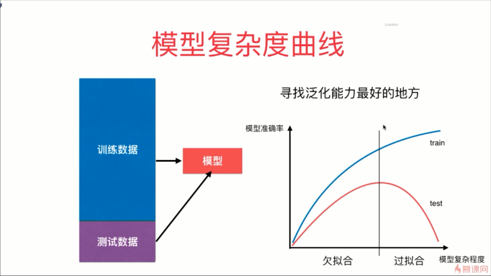
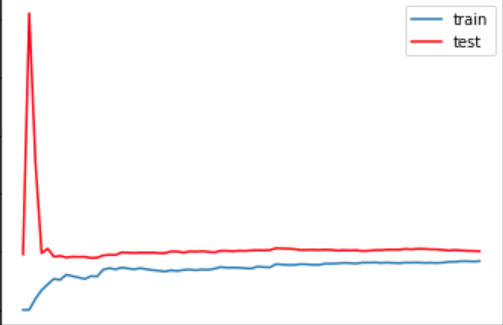
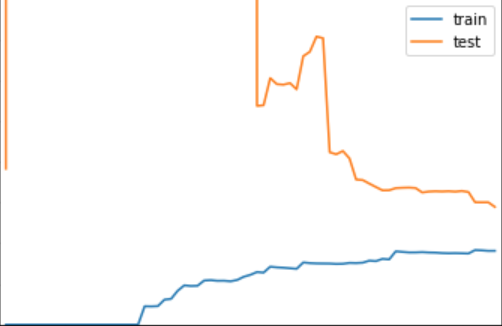
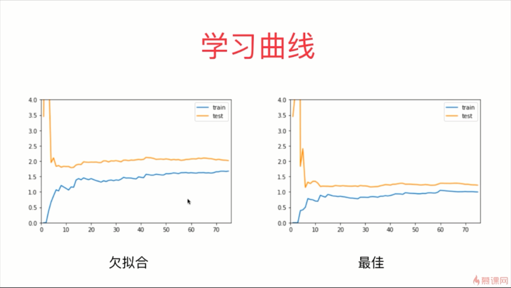
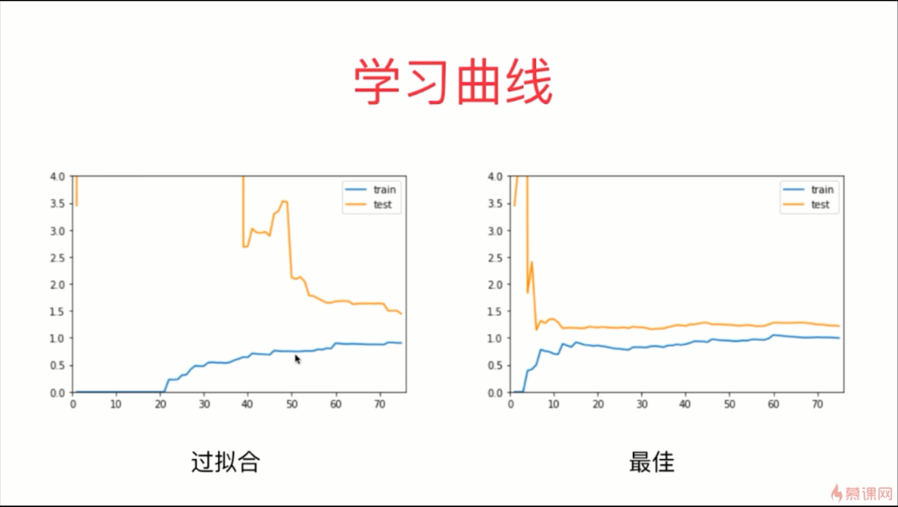

 

- 在训练数据集上面，误差是逐渐升高的，数据点越多，我们越难拟合住所有的数据，误差在刚开始是上升的比较快的，到后面就会上升的比较小了

- 上图中，train 和 test 相对趋于稳定的时候，两条曲线之间的间距依然还是比较大的，这说明了我们的模型虽然在训练数据集上已经拟合的非常好了，但是在测试数据集上面的误差依然还是很大的，上图的这种情况通常就是过拟合的情况

 

- 欠拟合的这种情况，train 和 test 趋于稳定的位置比最佳拟合的位置要高一些，说明无论对于训练数据集还是测试数据集来说，相应的误差都比较大

- 过拟合和最佳的区别在于：过拟合的训练数据集和最佳的训练数据集的误差是差别不大的，但是过拟合的测试数据集的误差比最佳拟合的测试数据集的误差要更大一点，这就说明模型的泛化能力不够好

