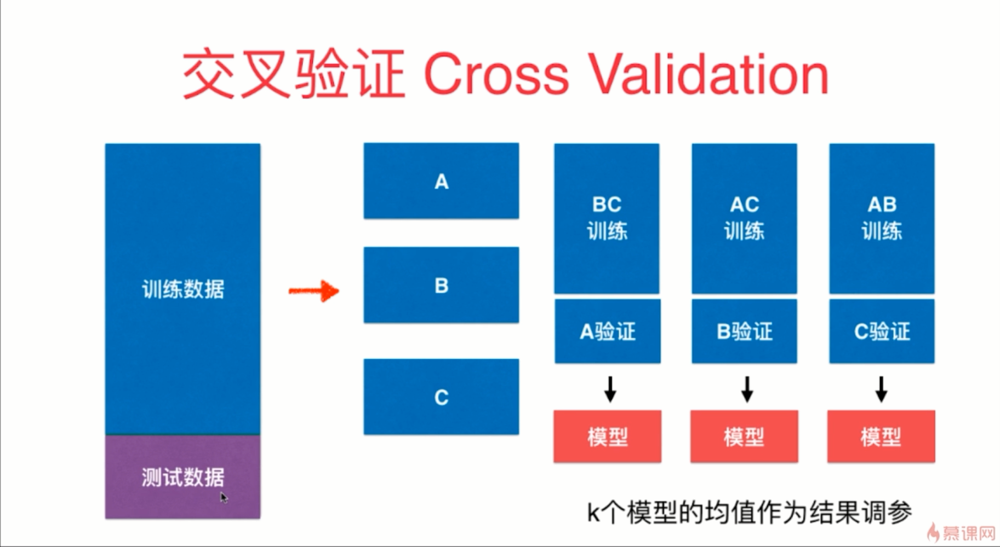

- 上图这个模型在一定程度上在围绕着测试数据集打转，这个过程是我们在想办法找到一组参数，·这组参数想让我们用训练数据集训练出来的模型在测试数据集上面效果最好


- 测试数据集是不参与模型的创建的，训练数据集用来训练，验证数据集用来评判


- 通常在调参的过程当中是要使用交叉验证这种验证方式的，即 Cross Validation



- 交叉验证的过程就是为了拿到最好的超参数

```python
Fitting 3 folds for each of 45 candidates, totalling 135 fits
```

- 上述代码的意思是使用交叉验证的方式将我们的训练数据集分成 3 份，总共有 45 组参数


- 在很多学术研究中，为了最终结果的严谨性，可能会采用这种留一法来进行验证模型的最终结果