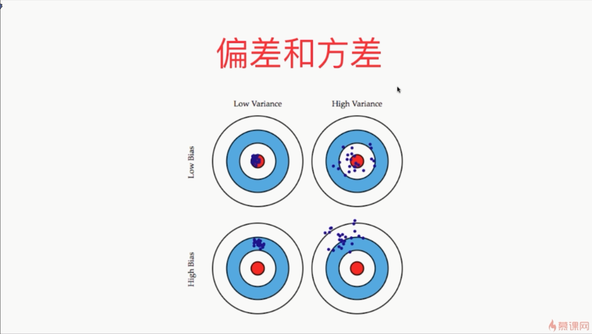
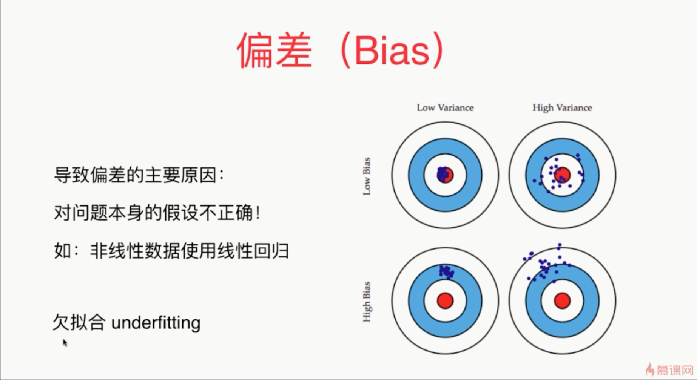
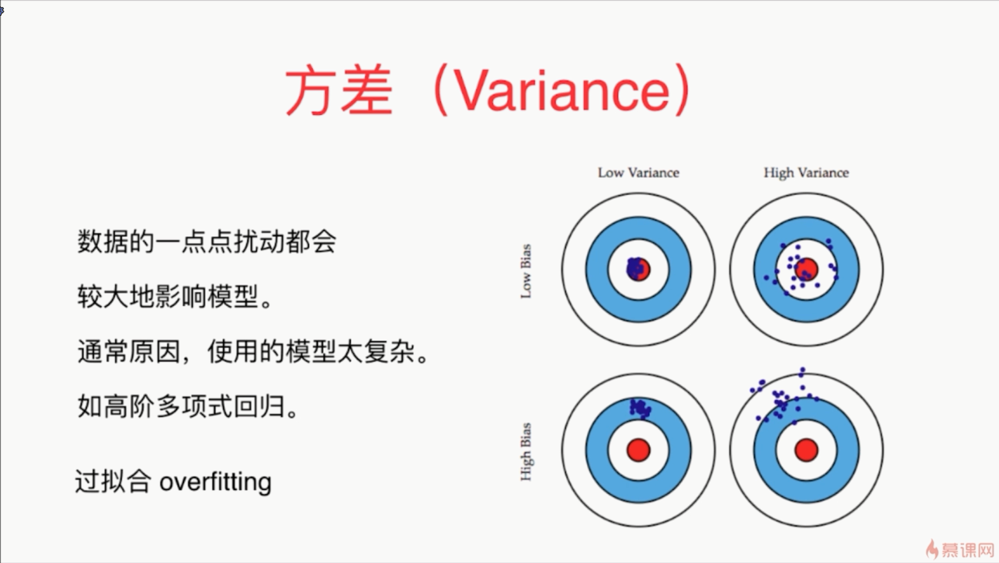
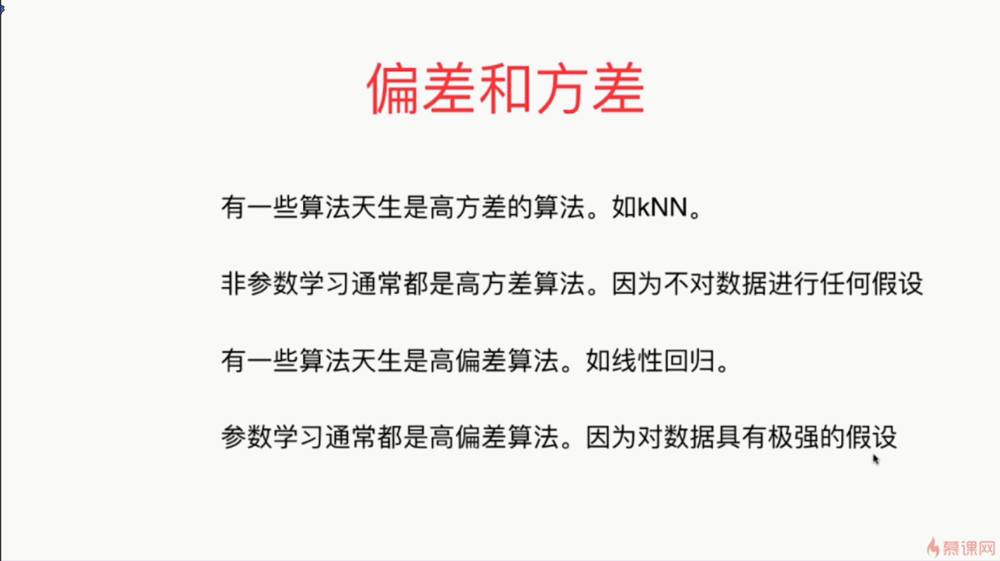
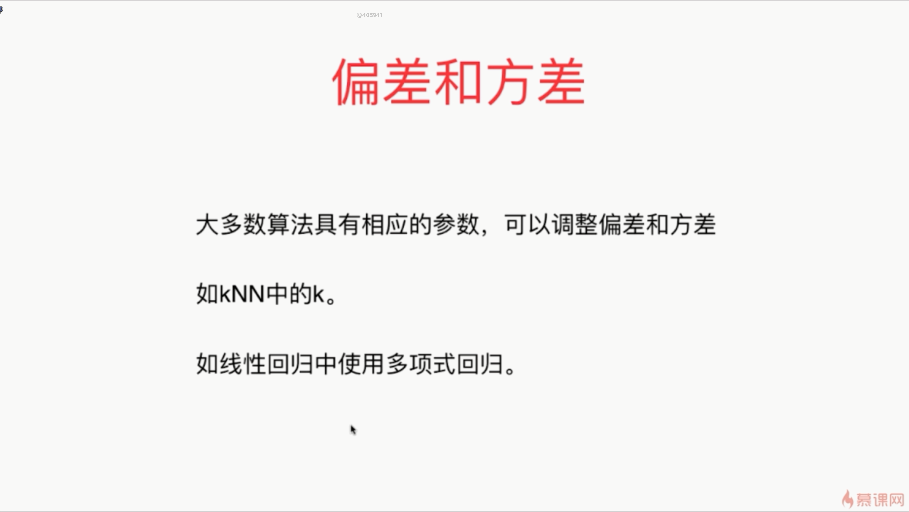

- 不可避免的误差包括：例如我们采集的数据本身就是有噪音的
- 带来高偏差还有其它的可能性：如你训练数据所采用的特征与这个问题本身完全没有关系

- 不要特别高的方差，因为那样模型的泛化能力太差了，也不要特别高的偏差，因为那样模型太偏离原来的问题了
- 解决过拟合问题是很多机器学习算法工程师都要面临的问题
- 过拟合就是模型具有高方差
- 使用深度学习的一个前提条件是你的数据规模要足够的大
- 有一些时候我们的模型具有较高的方差是因为我们的模型太过复杂，模型中的参数非常非常多，而我们的样本数量不足以支撑计算出这么多复杂的参数

