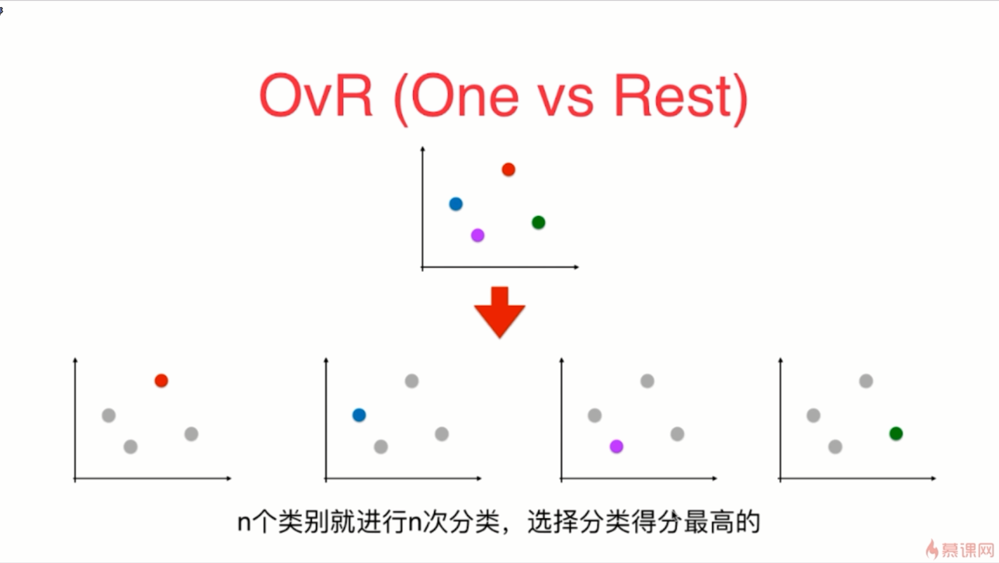

- 逻辑回归是在用回归的方式在解决分类的问题

- One vs Rest，是指的是一对剩余的所有， 选取红色的类别作为一类，而将剩下的其它3个类别融合在一起作为其它类别，进而进行判断给定的点是红色的概率是多少，是非红色的概率是多少

- OvO，其实就是一对一的进行比较，在OvO这种情况下，我们每次就直接挑选出两个类别，然后进行二分类任务，比如说先挑选出红色和蓝色这样的两个类别，看对于新来的样本点，是属于红色的类别还是蓝色的类别

- 很显然，这种OvO的方式比OvR消耗的时间是要多的，但OvO这种方式的分类结果是更加准确的

- 使用 OvO 的方式比使用 OvR 的方式是更加准确的
- 使用OvR和OvO这两种方式就可以对所有的二分类器进行多分类的任务

