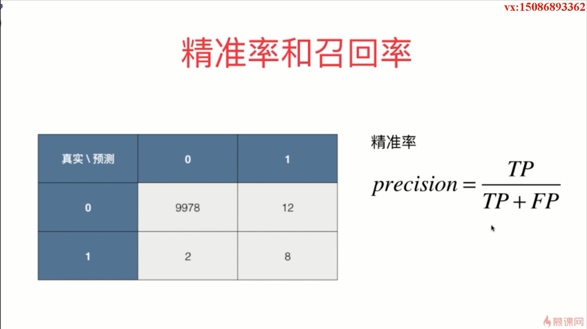
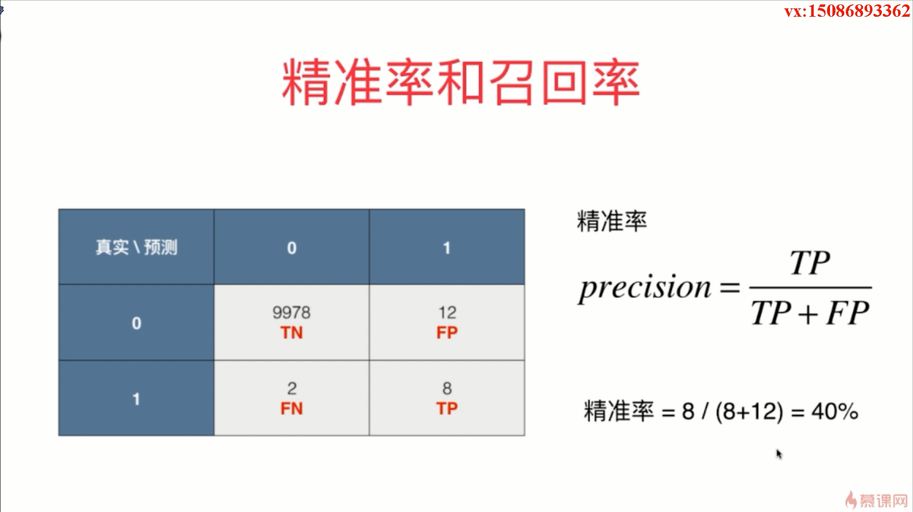
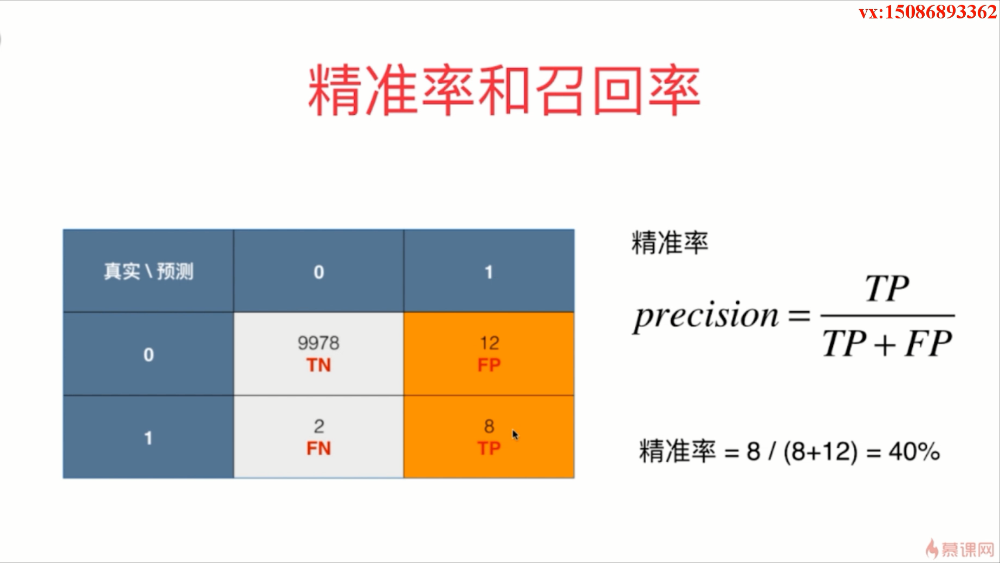
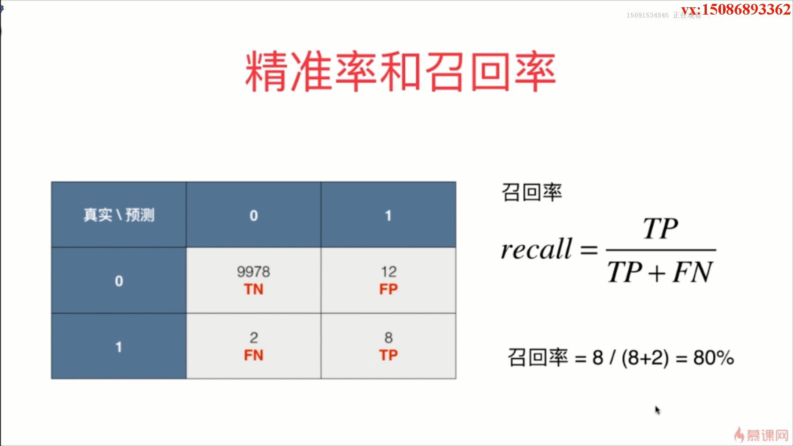
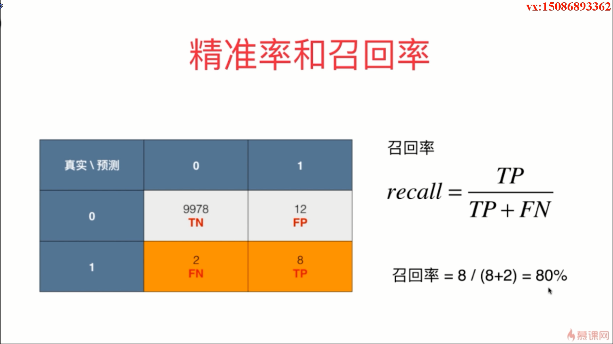
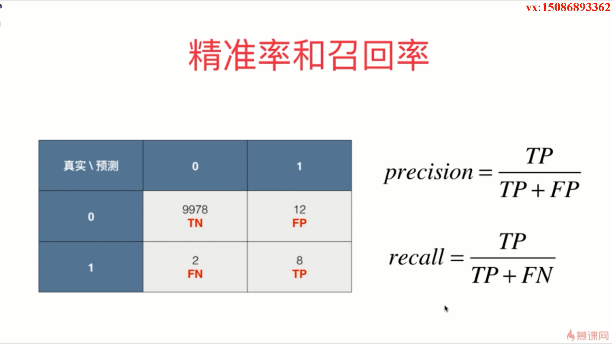
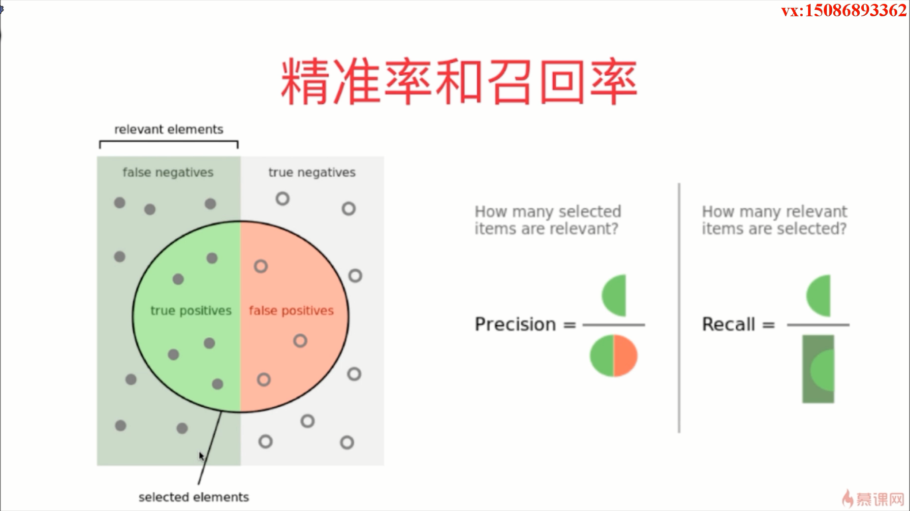
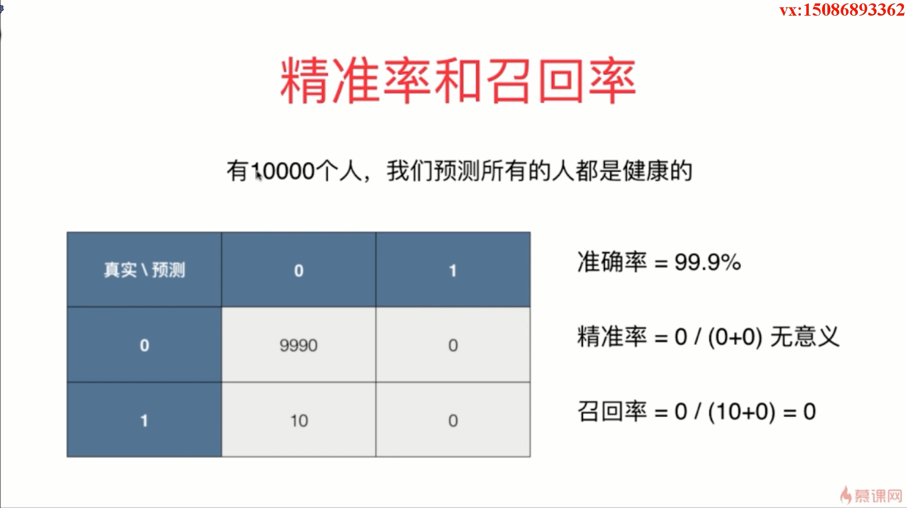

- 精准率和召回率是两个通过混淆矩阵才可以得到的指标

- 精准率就是预测数据为1相应的预测对了的概率是多少，就是预测我们关注的那个事件相应的有多准
- 我们将分类 1 作为我们真正关注的对象，例如在医疗中，我们将 1 作为患病

- 召回率就是我们关注的那个事件真实的发生了，真实发生了的数据中，我们成功预测的有多少

- 在极其有偏的数据中，我们不看准确率，而是更加看重精准率和召回率

