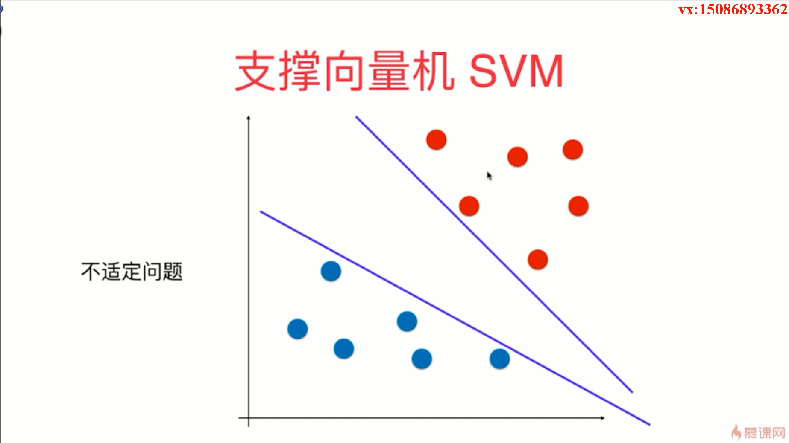
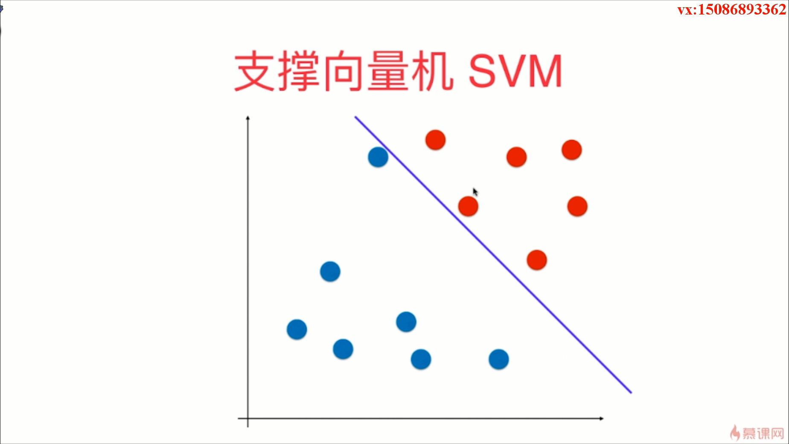
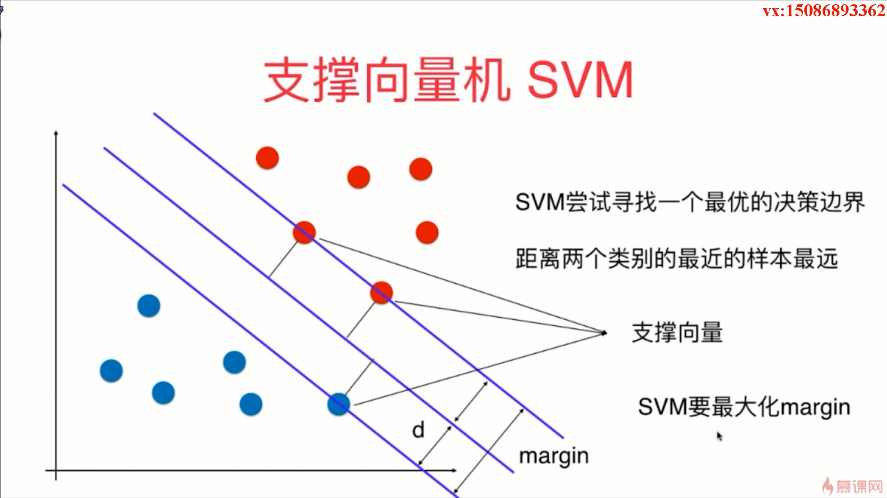
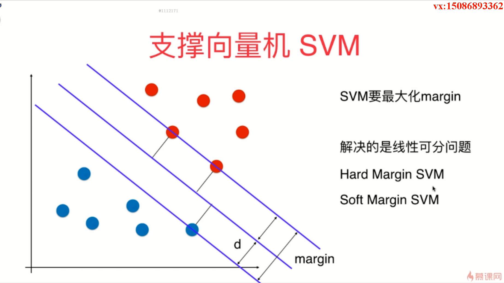
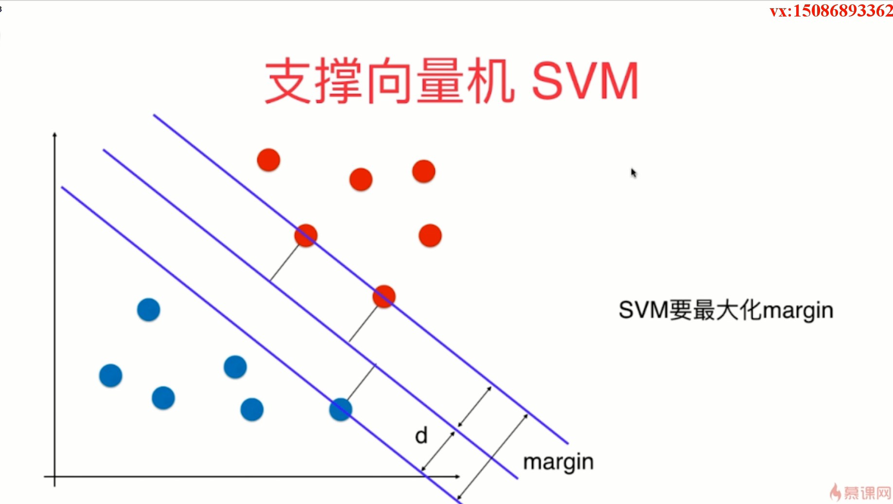

- 使用支持向量机的思想既可以解决分类问题又可以解决回归问题

- 逻辑回归就是在特征平面中找到了一个决策边界，在这个决策边界中的一侧就属于某一类别，在另一侧就属于另外一种类别
- 对于决策边界不唯一的问题，我们有一个专门的术语，叫做不适定问题

- 这条决策边界离红色的点离的太近了，可能导致泛化能力不太好
- 如下图所示，我们期望我们的决策边界既离红色的点尽可能的远，又离蓝色的点尽可能远，同时又能很好的分辨红色和蓝色的点
- SVM 本身也是统计学习中一种非常重要的方法，它的背后是有极强的统计理论的支撑
- SVM 最终找到的最优的决策边界是由我们的支持向量定义的

- Hard Margin SVM 指的是非常严格的 Margin SVM 问题

