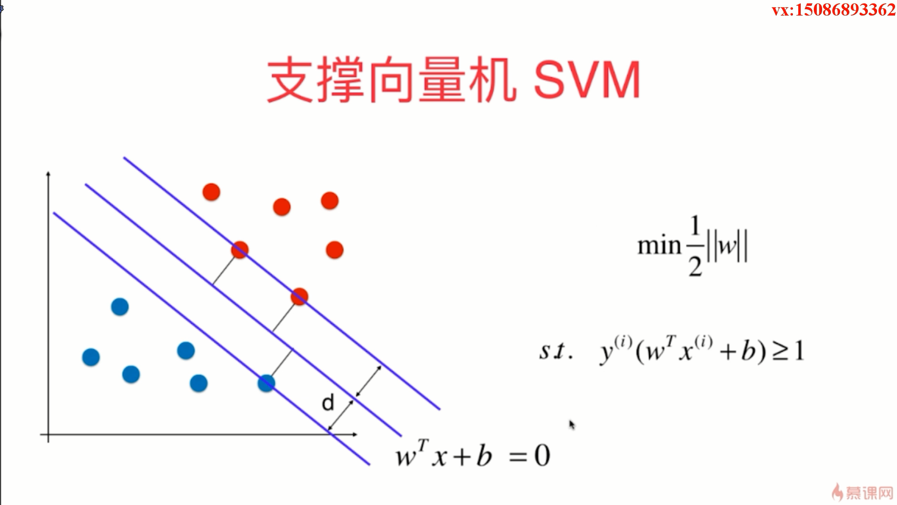
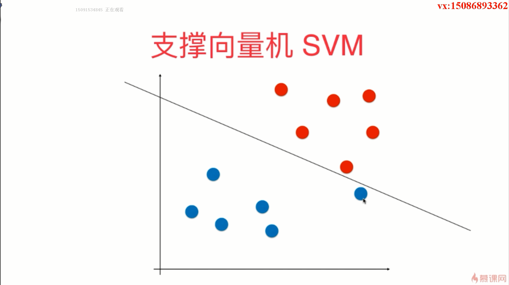
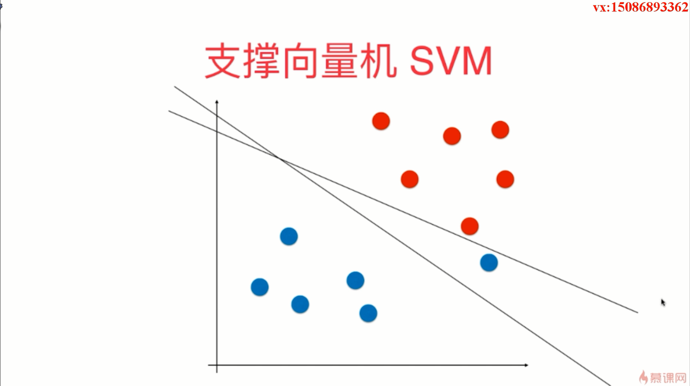
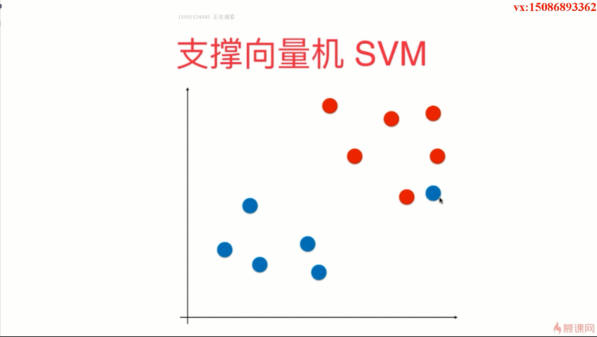
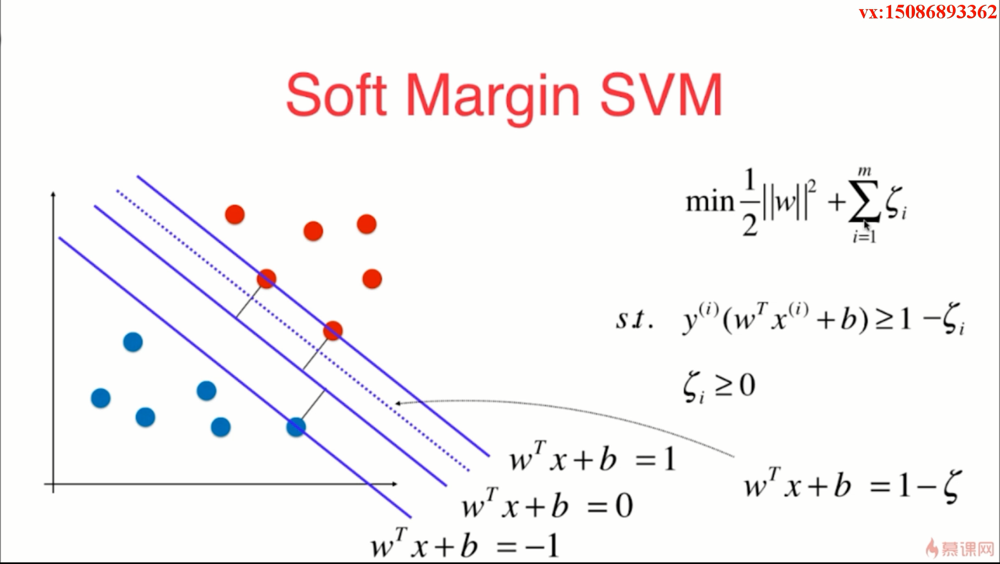
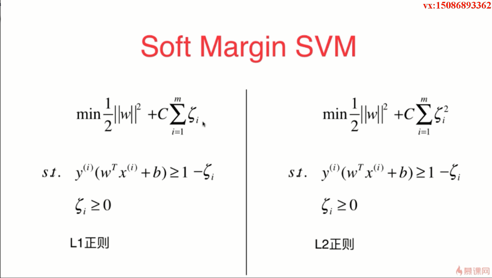

- SVM 的决策边界要有一定的容错能力

- 针对上面这张图，我们很有必要做出一个具有容错能力的SVM，这种SVM就叫做 Soft Margin SVM

- 正则化项的作用是避免我们的模型向一个极端化方向发展，把这个模型往回拉一拉；无论是对于线性回归算法还是逻辑回归算法，加入正则化项的本质都是让我们的模型针对我们的训练数据集有更高的容错能力

- C越大，容错空间越小；如果 C 取正无穷，也就意味着我们逼迫着后面一项的所有参数都等于0，那么此时就是我们的 Soft Margin SVM 变成了 Hard Margin SVM；而 C 越小，也就意味着我们可以有更大的容错空间  

