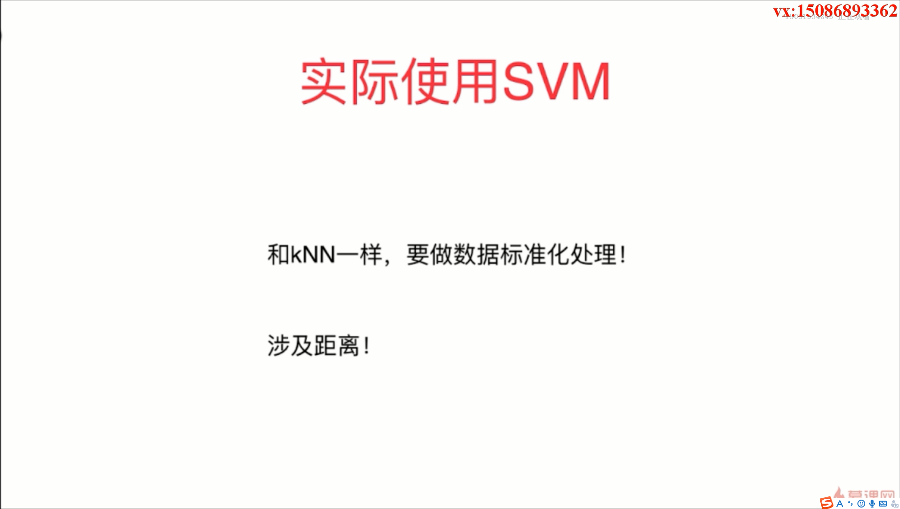
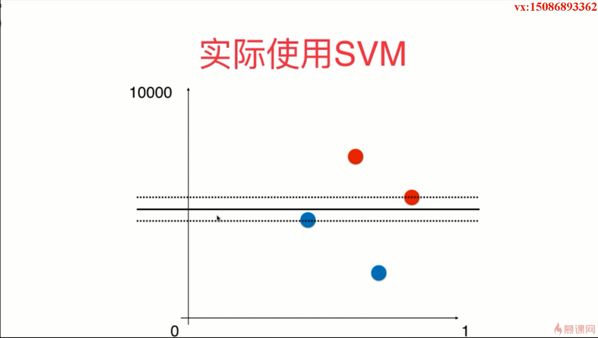
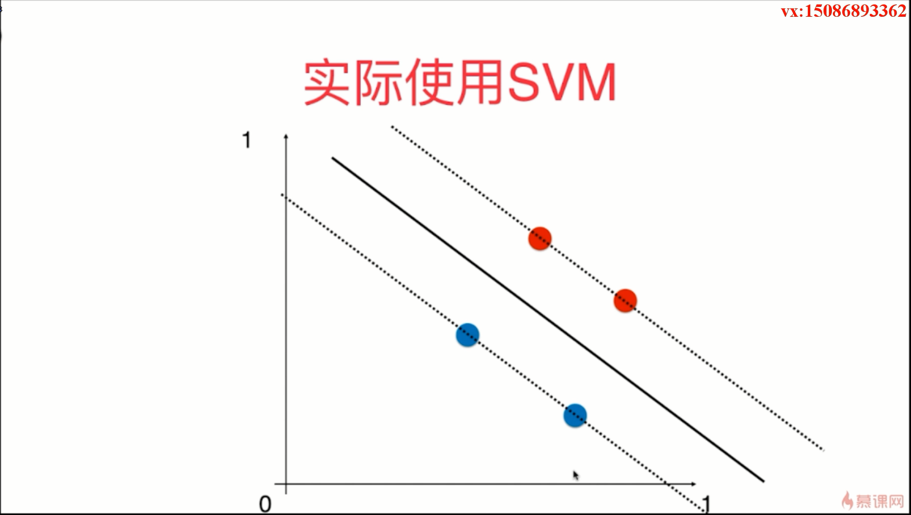

- LinearSVC是使用支持向量机的思想进行分类工作，c是 classifier的意思，也就是分类器的意思
- 如果数据点在不同的维度上面他们的量纲不同的话，就会使得我们对这个距离的估计是有问题的
- scikit-learn为我们封装的这个 SVM 算法是直接可以处理多分类的问题，如果是有多个类别的话，相应的就会有多条直线来分割我们的这个特征平面
- 如果数据集是极度偏斜的数据，还可以使用精准率和召回率和 F1分数
- 
- penalty使用的是 L2，也就是使用的是 L2范式，