- 核函数也就是 kernel function

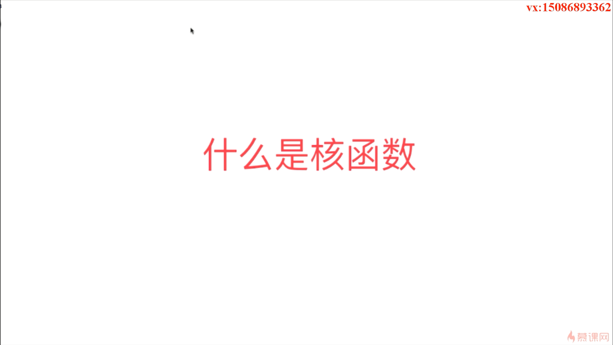

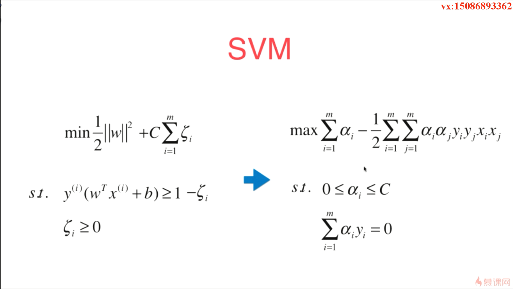

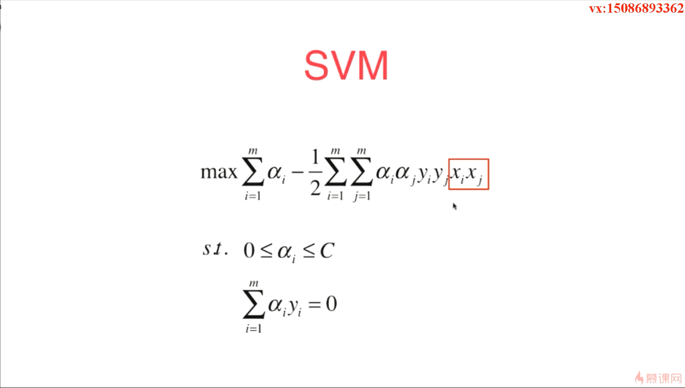

   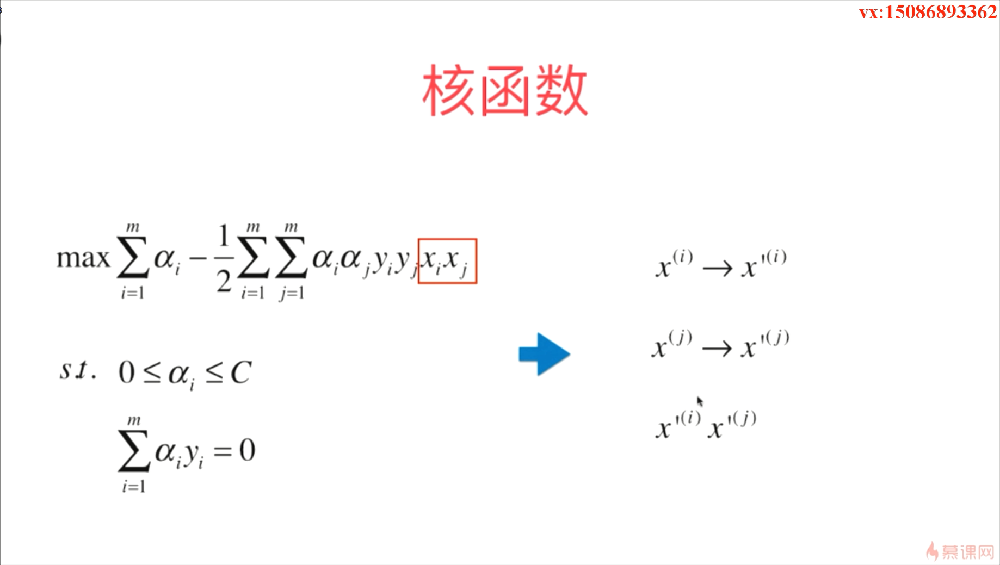

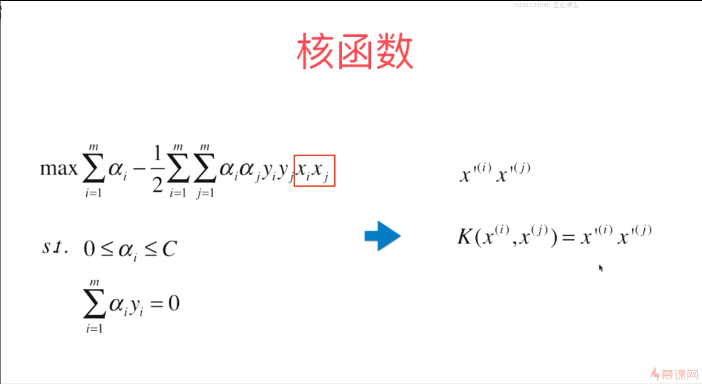

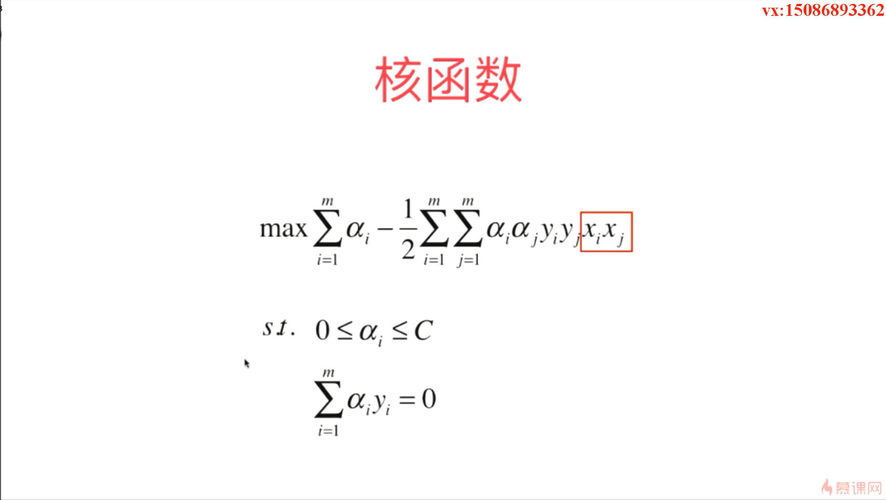

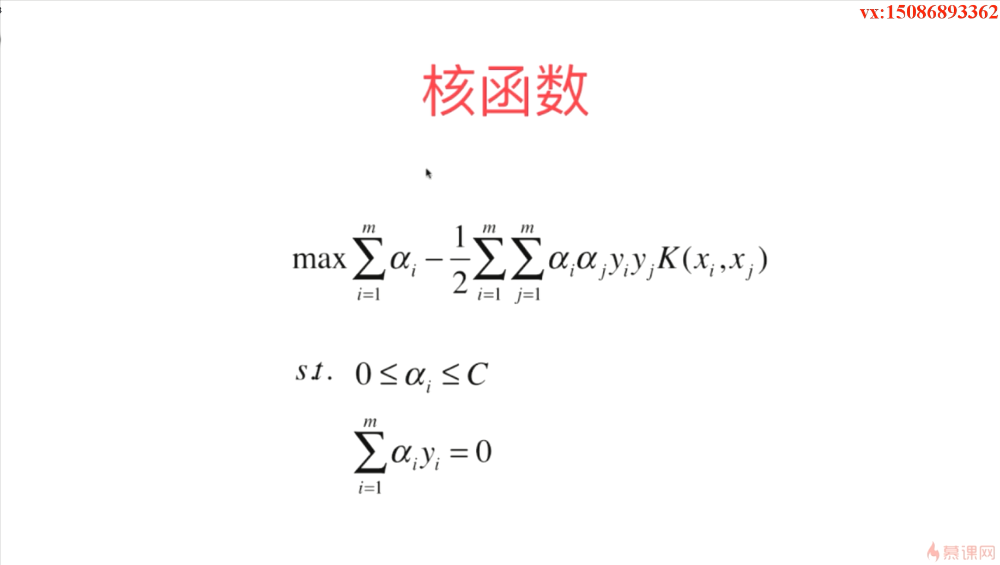

- Kernel Function 有时候也叫作 Kernel Trick，在这里 trick 是技巧的意思，其实是一个使用核函数的技巧
- 如果不使用核函数的话，其实完全可以达到同样的效果，但是在这里，它更像是一个数学的技巧
- 对于一些比较复杂的变形的话，使用核函数通常来说计算量会有所减小，另外一方面其实我们节省了存储的空间，因为我们对原来的样本进行变形，通常是将低维的数据转化为了高维的数据，那么我们存储这个高维的数据通常就会花费较多的存储空间，如果是使用核函数的话，我们完全不用管我们把原来的数据变成了什么样子，我们不需要存储变化后的结果就可以直接使用这种核函数的方式计算出两者的点乘结果
- 核函数本身并不是 SVM 算法特有的一种技巧，在传统的机器学习的算法中，核函数更多的被使用在 SVM 算法中

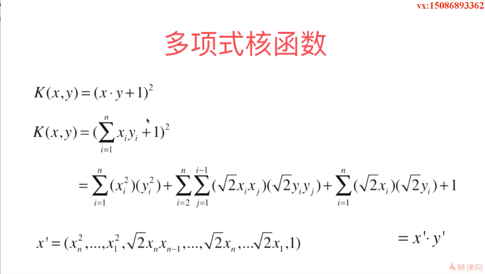

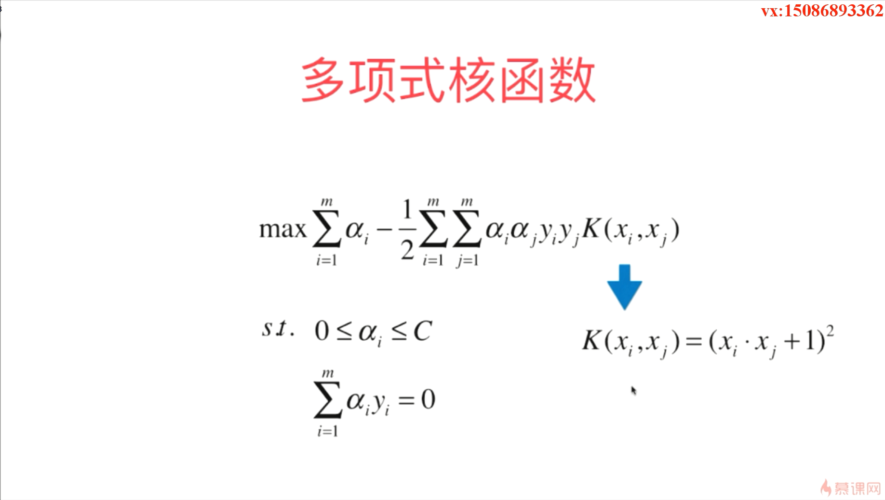

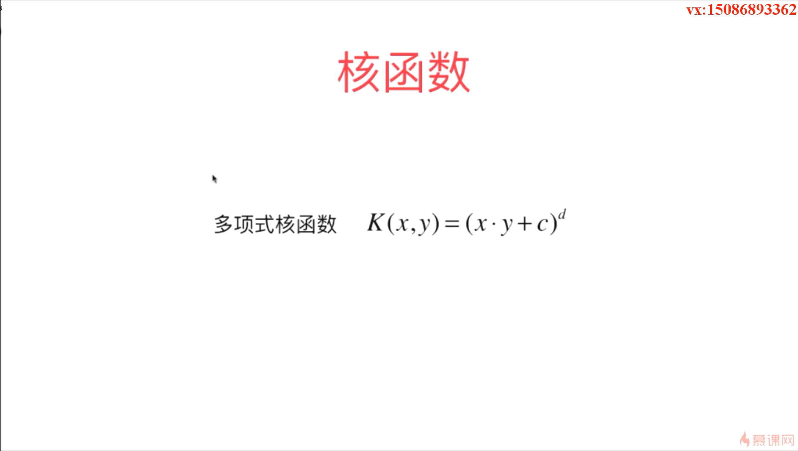

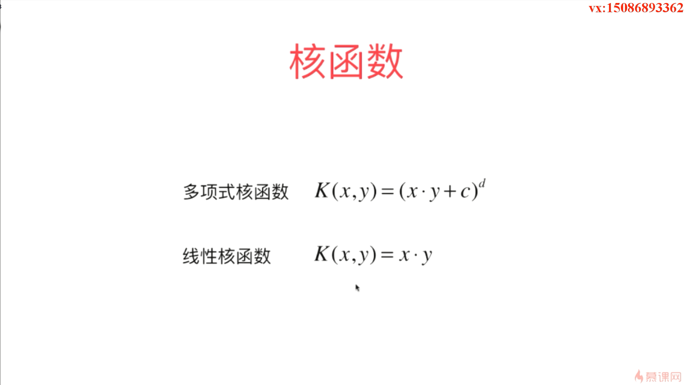

