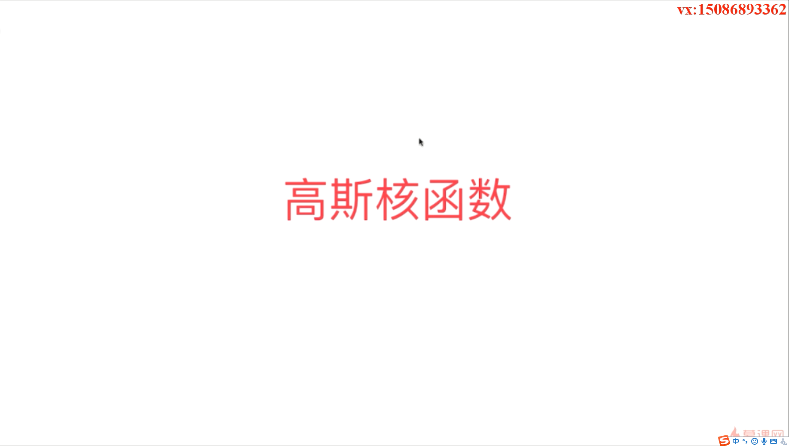
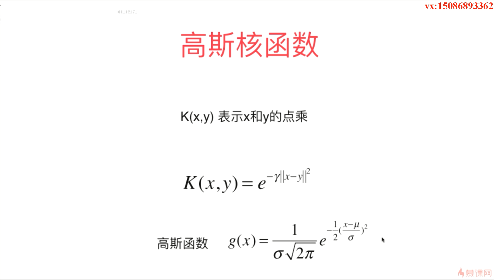
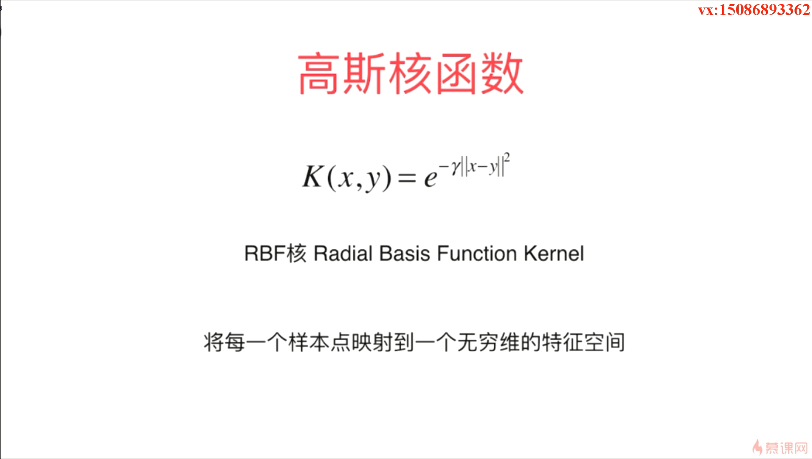
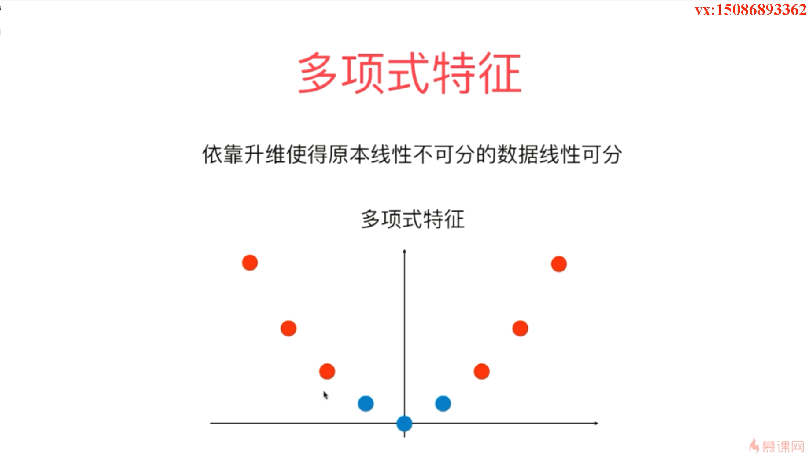
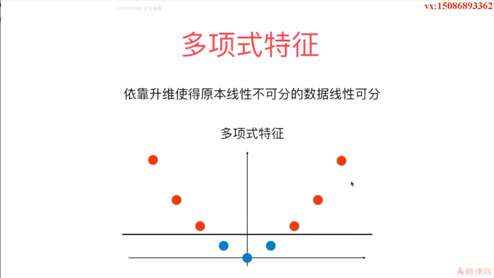
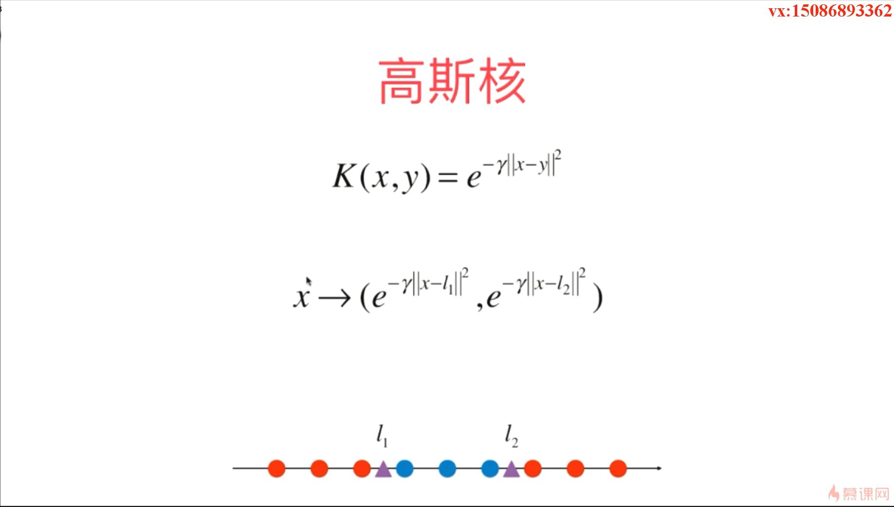
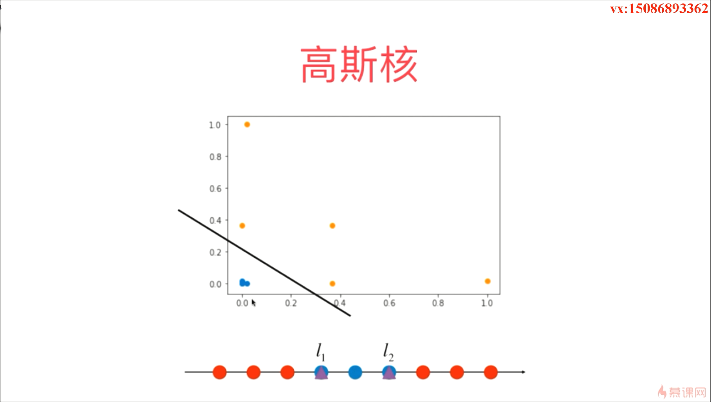

-  SVM 算法中使用最多的一种核函数是高斯核函数

- 高斯核函数也叫径向基函数  

- 如下图所示，我们没法画一根直线就把红色和蓝色分开

- 上面这样的数据很显然是线性不可分的，我们无法画出一根直线将红色和蓝色划分出来

- l 的意思其实是 landmark，在中文的意思其实就是地标

- SVM 使用高斯核函数的时候训练时间会比较长，如下图所示，如果 m < n 的话，使用 SVM 这种算法就非常划算了，最典型的一个应用领域其实就是自然语言处理 

