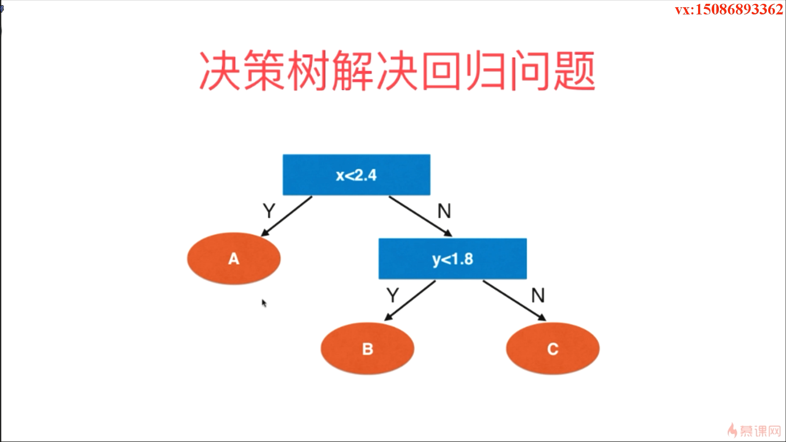
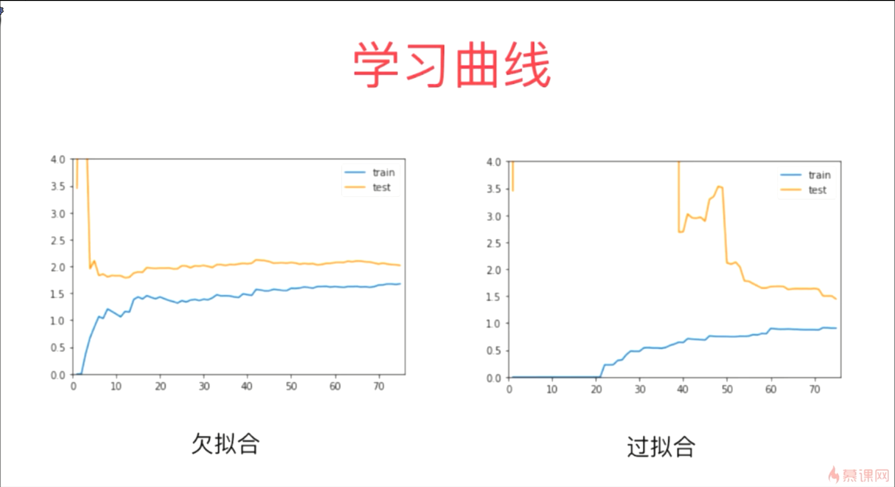
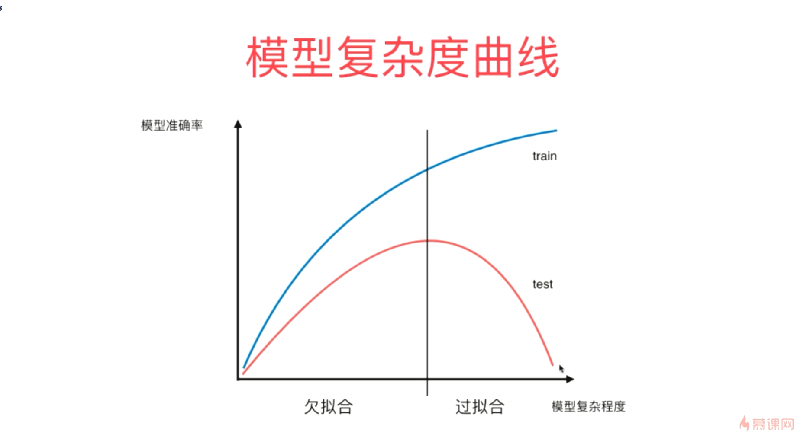

- 当我们使用CART将这棵决策树建立出来之后，相对应的在每一个叶子节点都包含了若干个样本数据，如果这些数据相应的输出值是类别的话，那么我们就可以在叶子节点中让这些样本数据进行投票；如果我们的数据的输出是一个具体的数的话，就用这个叶子节点中相应数据的输出值的平均值作为一个预测的结果
- Decision Tree Classifier 和 Decision Tree Regressor 相应的构造参数是完全一致的

- 对于决策树这种算法来说，它是非常容易产生过拟合的现象的

 

