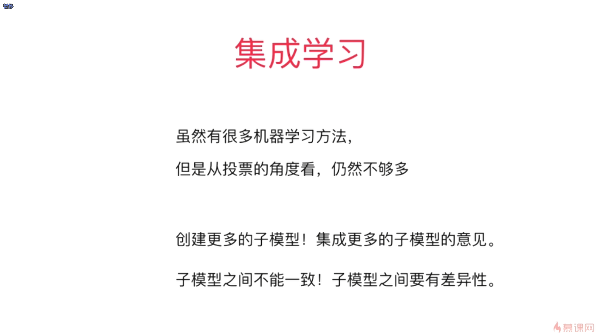
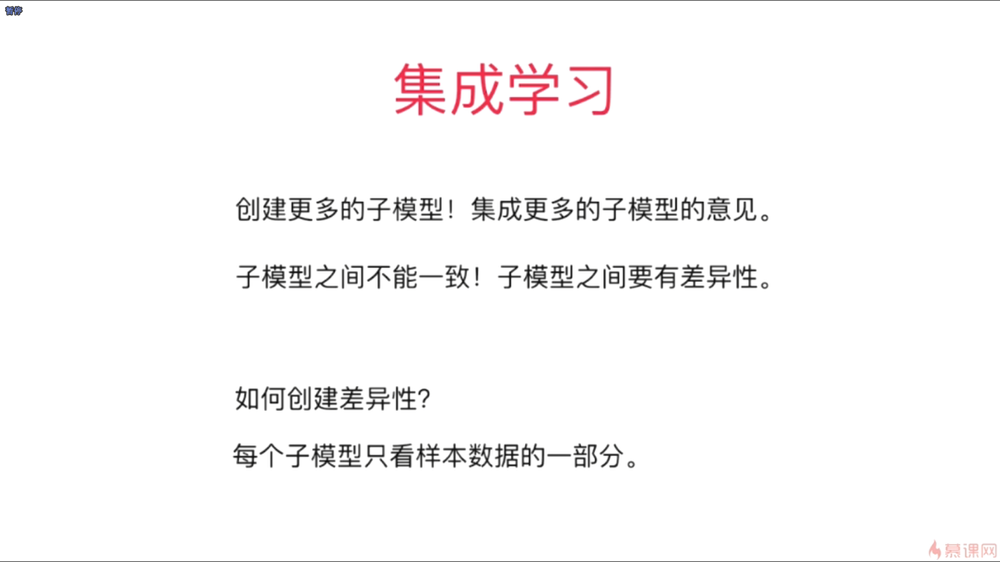
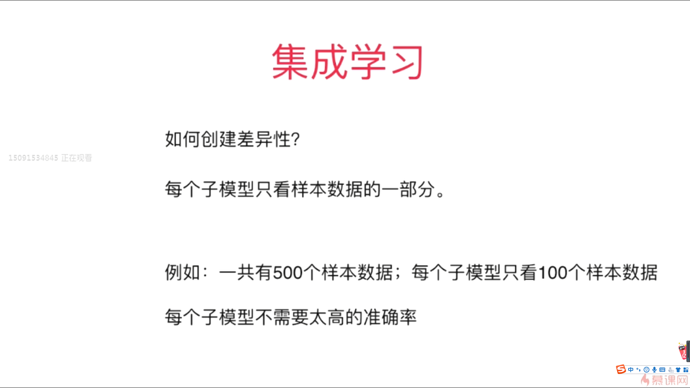
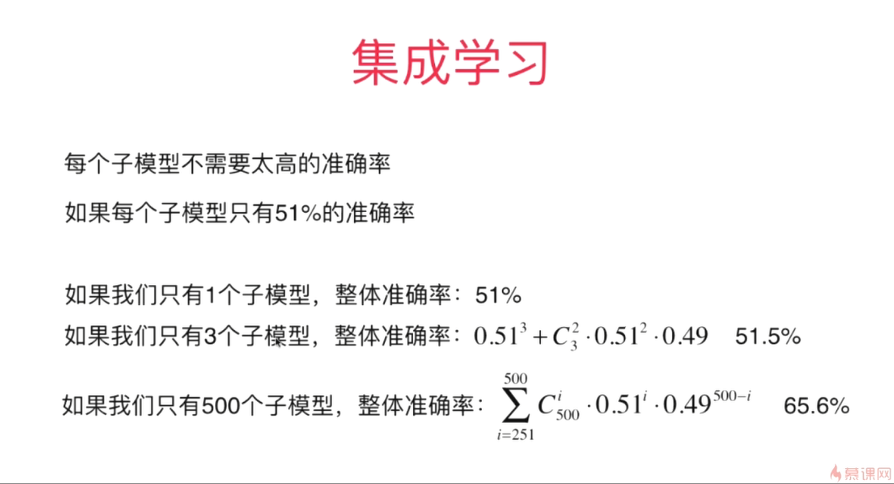
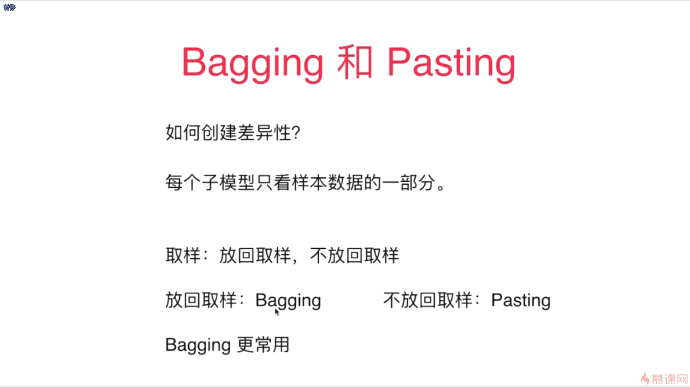
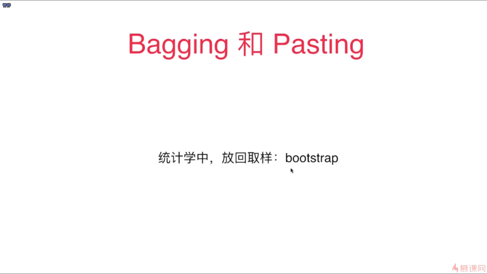

- 集成学习就是集成多个算法，让不同的算法对同一组数据进行分析，最终得到结果，进行一个投票

   

- 采用上图所示的方法，每一个子模型是可以采用相同的算法来进行训练的，这个是因为我们的每一个子模型所用到的训练数据并不一样，所以训练出来的模型是很显然具有差异性的

- 随着我们子模型对应数量的增加，我们的集成学习的整体的模型的准确率也是在不断地上升的
- 在集成学习中，我们的每一个子模型并不需要有太高的准确率，而整体合在一起就可以形成非常高的准确率

-  在一般的机器学习的算法比赛中，集成学习所使用的频率是非常高的，通常最后当我们使用集成学习的时候，都可以得到非常好的结果
-  Bagging没有那么强烈的依赖于随机

 

- 决策树这种非参数学习算法，更容易产生差异相对比较大的子模型
- 集成学习喜欢每一个集成的子模型要有区别，通常在集成学习中，我们要集成成百上千个子模型的话，通常我们的首选就是决策树模型
- 从理论上来说，我们的子模型的数量越多，我们的最终的集成学习的模型的准确率也就会越高

