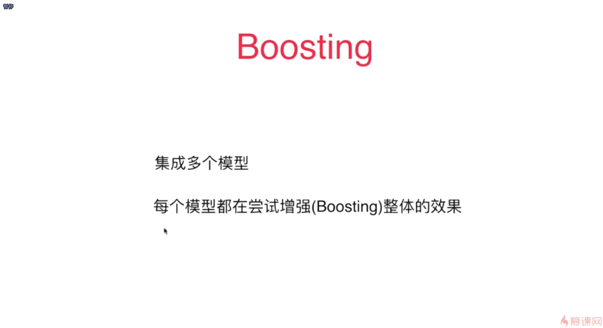
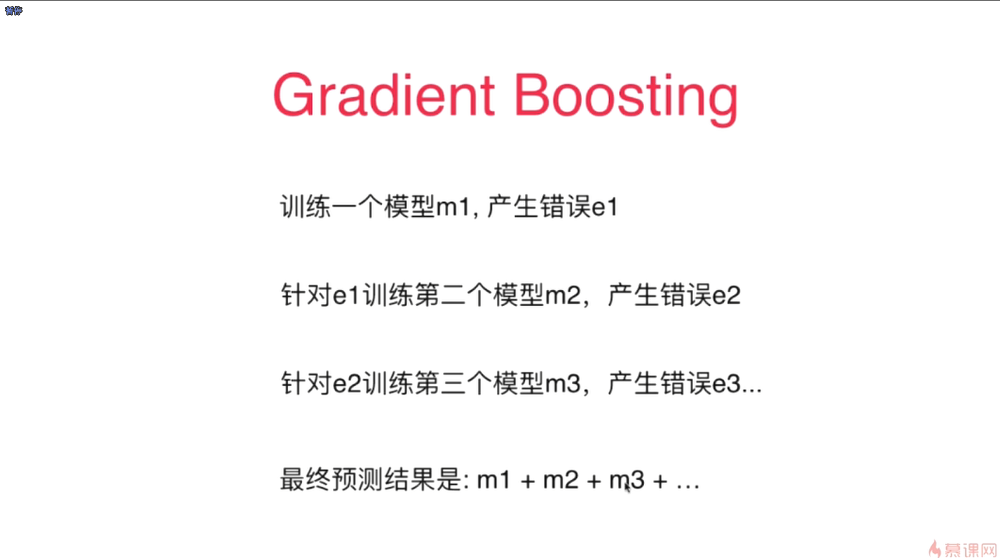
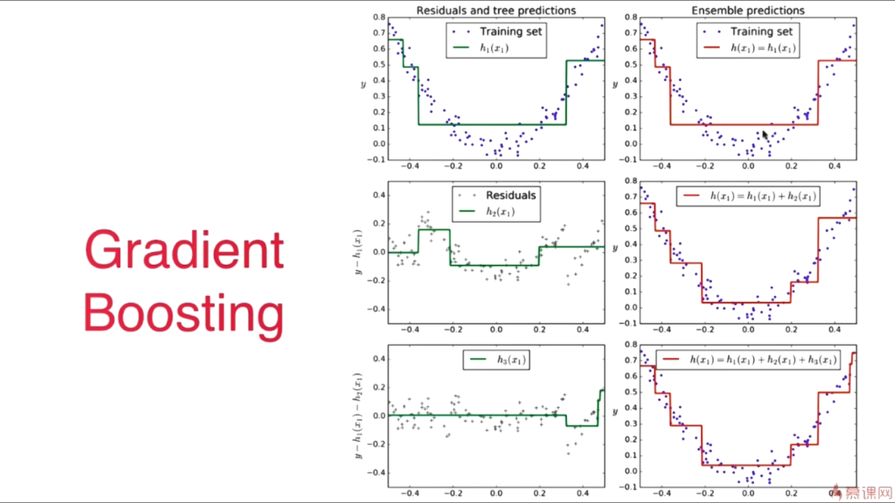

-  Boosting 中的模型彼此之间并不是一个独立的关系，而是一个相互增强的关系
- 让在上一个模型中没有被很好学习的点的权重增大一些，而在上一个模型中已经被学习的较好的点的权重减少一些
- 每一次生成的子模型都是想办法在弥补上一次生成的模型中没有被成功预测的那些样本点
- 对于每一个子模型都是基于的同一组样本点，只不过在这些样本点中，点和点之间的权重不一样
- 对于Boosting类的方法与之前的Bagging类的方法不一样，它每一次都是使用的所有的样本数据，也就是不再有 oob_score 这种特性了
- 模型m2就是为了预测出我们的模型m1犯的错误是什么。m2模型的样本输出值是m1所犯的那些错误

- Gradient Boosting 的 base_estimators就是决策树，这个与 Ada Boosting 是不一样的，Ada Boosting 的 base_estimator 是可以选择的