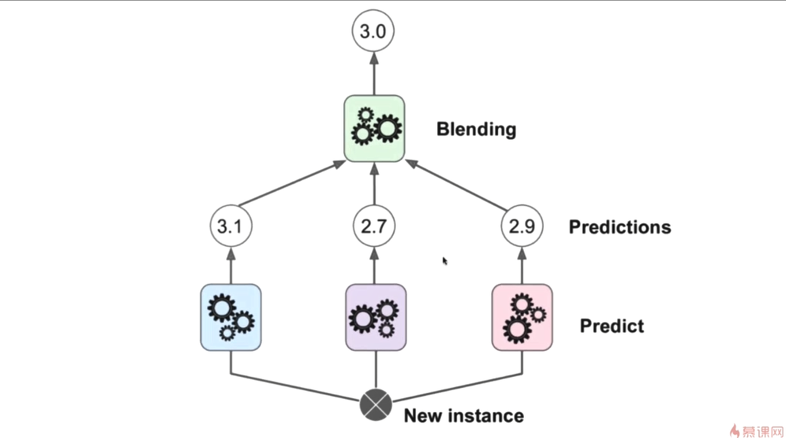
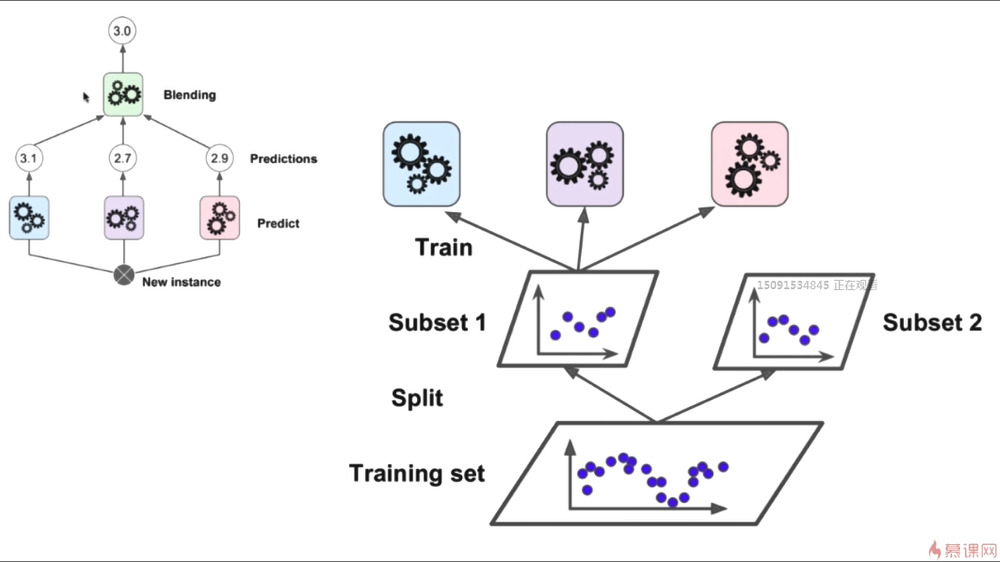
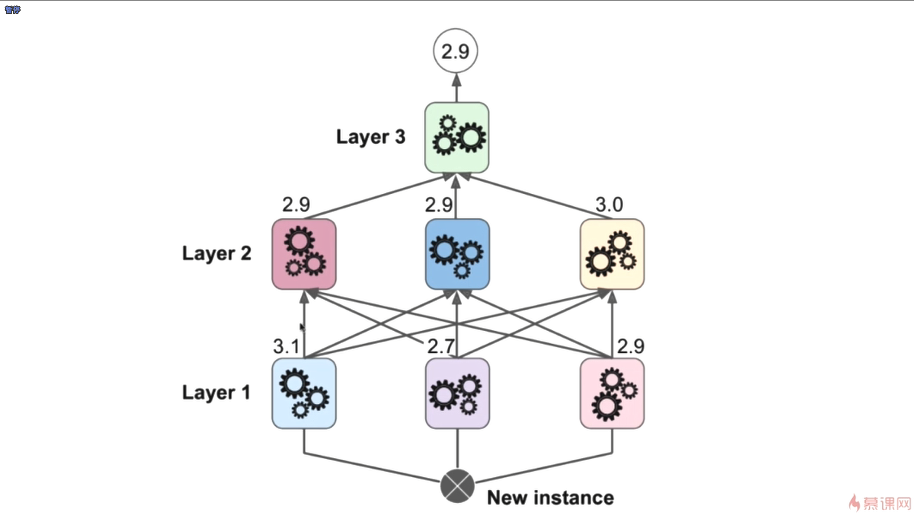

- Voting Classifier对于分类问题，可以采用少数服从多数，而对于回归问题，可以取其平均值

- 为什么逻辑回归解决的是一个分类问题，却叫作逻辑回归，其中的一部分原因就是我们的逻辑回归本质上计算的是我们的样本属于某一类别的概率是多少
- 如何训练出一个Stacking，我们首先需要做的是把我们的训练数据集分成两份，其中的一份用来训练下图中所示的3个模型，然后就可以把我们的第二份样本直接扔进我们已经训练好的3个模型之中，相应的我们已经训练好了的模型就会有相应的输出结果，这些新的输出结果和我们第2份数据集中的相应的真值的输出就构成了新的数据集，用这个新的数据集来训练我们的第 4 个模型
- Stacking这种模型相对来说会复杂很多，也正是因为这种复杂性，它是非常容易过拟合的
- 神经网络也正是因为这种灵活性，非常容易发生过拟合
- 对于神经网络来说，如果层数增多的话，就会成为深度学习的模型了
- 对于神经网络来说，每一个神经元相应的不是一个全新的算法，而只是计算一个函数的值而已
- 在深度学习中，很多话题的本质就是在探讨就是如何解决过拟合的问题
- Stacking的这种组建方式其实非常像神经网络

- 这一章其实介绍了非常多的集成学习的思路，包括 Voting、Bagging、Pasting、Random_Forest、Extra_Trees、Ada Boosting、Gradient Boosting、Stacking
- 很多时候，尤其是在一些算法竞赛中，我们使用这种集成学习的思路最终得到的效果都是非常好的