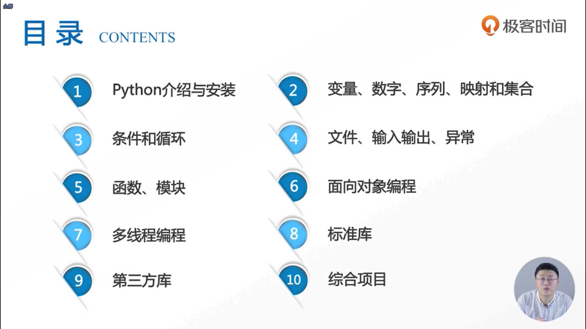

##### python被称作是一门非常神奇的脚本语言

编程其实是有不同的编程思想  ，面向对象编程更加接近于我们现实生活当中思考问题的方法 

 

python对于新手来说学习难度曲线非常缓慢，难度曲线缓慢意味着你在编程的过程中还可以不断地去积累、不断地去学习

常用的操作系统实际上是分为家用的和商用的，家用的常见的有Windows和Mac，但在服务器端我们主要使用的是Linux

Python有非常一个很丰富的类库，这是Python非常非常流行的一个原因

