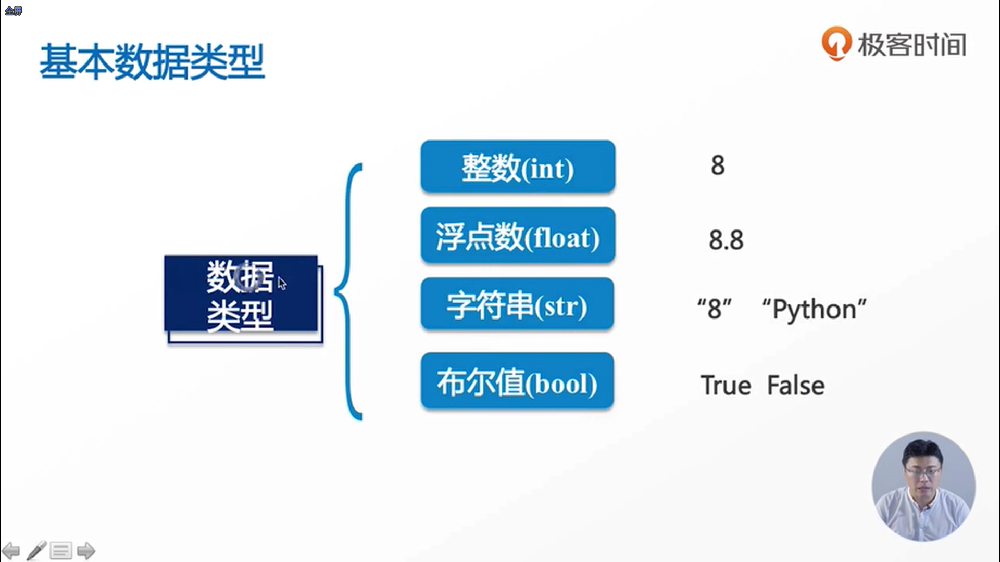

#### Python程序的书写规则
- 以#开头的称作Python的注释，注释就是说这一整行的内容不会被Python执行，注释可以写在开头，也可以写在所需代码的后面

- import表示导入一个模   

#### 基础数据类型

- 如果是有一串数字或者是一串字符，没有办法区分它们类型的话，在这里有一个工具叫做type()，以此来判断它是4种类型中的哪一种类型
- 基础数据类型之间的转换
  - 将字符串转化为整型类型，int('8')
  - 将整型转化为字符串类型，string(123)
  - 把数字转化为布尔值bool类型，bool(123)，只要数字不为0就是True，只要数字为0就为False