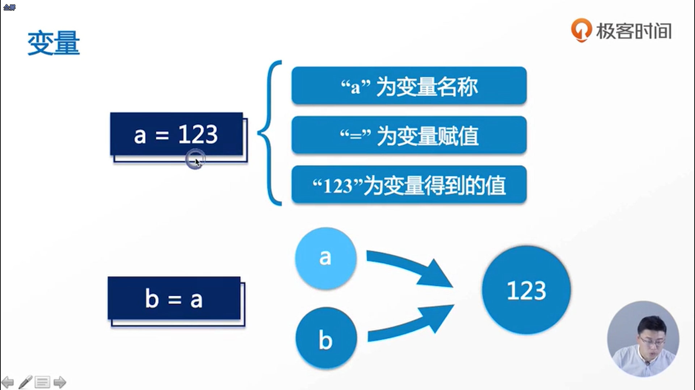

- 一个字节等于8个比特
- 如果需要对结果进行输出的话，可以使用print函数

- 代码中的“=”与数学中的“=”的意义是不一样的，代码中的“=”表示的是赋值，而数学中的“=”表示的是比较是否相等 
- 变量的命名问题
  - 有的命名是单独的一个字符，如a、b，这种命名方式一般是用于临时变量（就是使用完这个变量之后，这个变量就没有作用了）的命名方式的
  - 驼峰命名法：前面是小写的方式，后面是大写的方式
  - 下划线隔开的方式
  - 命名的规范，以字母或者是下划线开头，中间的话可以包含字母、数字以及下划线的，但在实际过程中很少使用下划线开头

