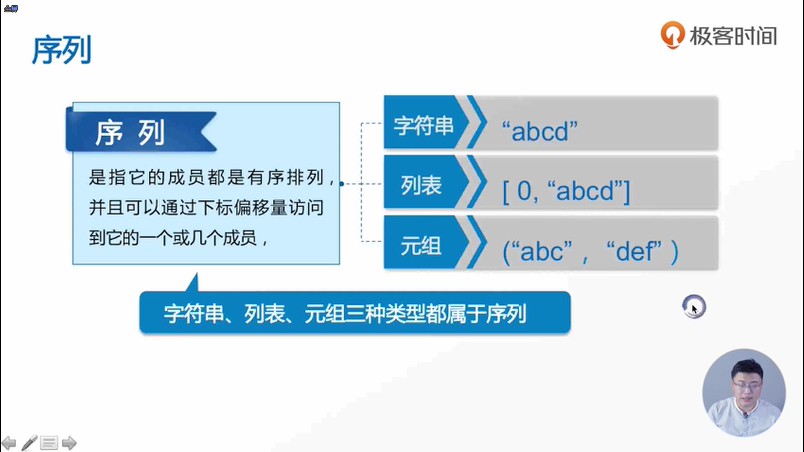

- 元组也是序列类型的一种，元组是使用小括号括起来的字符串
- 小写的u表示的是unicode
- 元组当中两个数字的比较是把两个数字进行叠加，如(1,20)在比较大小时，是当做120来进行比较大小的
- 列表是一个中括号，而元组是一个小括号，列表存储的内容是可变更的，而元组存储的内容是不可变更的
- 如果需要对输入的一串内容进行修改的话，我们建议把它声明为列表，因为列表有相应的增加和删减的功能
- len表示求长度，而list表示的是列出列表 