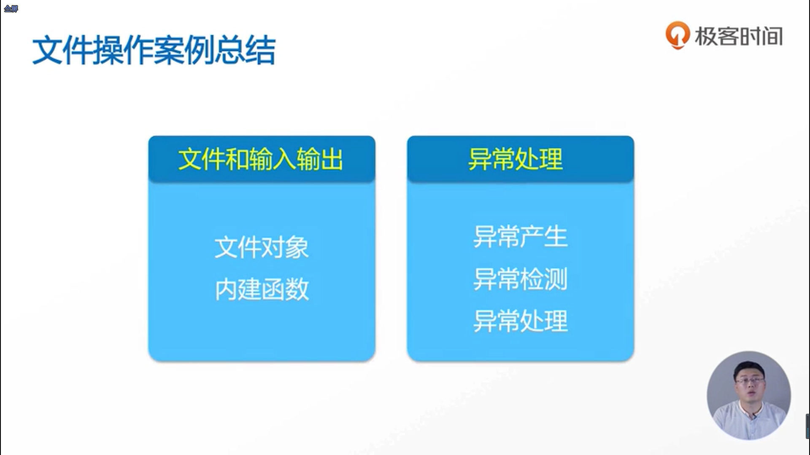

- NameError: name 'j' is not defined

- SyntaxError: invalid syntax

- IndexError: string index out of range

- KeyError: 'c'

- ValueError: invalid literal for int() with base 10: 'abc'

- AttributeError: 'int' object has no attribute 'append'（属性错误）

- except后面是只能接一个参数，所以我们可以将多个参数合并到一个元组中

- TypeError: unsupported operand type(s) for /: 'int' and 'str' 

