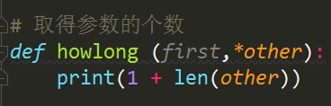

- 首先需要做一个自定义函数的创建工作，创建函数的时候是使用def+函数的名称，函数的名字一定以字母和下划线开头，后面包含字母、数字和下划线，接下来是关于函数的基本调用，有一些是自定义的函数，print是Python的自带函数，也称作是Python的内置函数，函数的返回值我们是使用return来进行返回的，使用函数的时候我们还可以为函数去传递相应的参数

- 想跳过第2个参数直接输入第3个参数的话，我们就必须使用'end='的这种方式，这种传递参数的方式叫做关键字传参数

- 使用关键字参数可以忽略顺序

- 参数在前面加一个*键，就表示这个参数是可选择的

  

