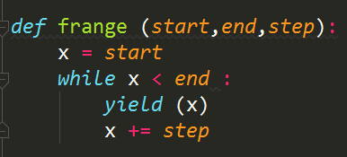

- 函数变量作用域的问题就是在函数的内部有一个变量，而在函数的外部也有一个变量，而且这两个变量是同名的
- 函数内部定义的变量只能作用于函数的缩进块，不会对函数外面进行影响
- 必须先定义，再接着进行赋值
- global关键字可以将一个变量修改为全局变量
- **迭代器是Python里面最具有威力的功能之一**

- 上图的代码是把所有的X的值都进行输出，迭代器是一次只输出一个值的

- 使用yield的函数叫做生成器，也是迭代器的一种

  