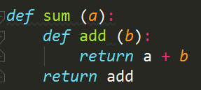
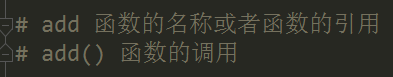

- 外部函数的变量如果被内部函数所引用的话，简言之就是内部函数引用外部函数的变量，那么这种形式就称作闭包

-  闭包的思想来源于函数的嵌套

- 如果在函数内部是使用的一个整型的变量的话，那么会出现这样一个问题，只要离开了函数，这个整型的变量就会失效
- 闭包是一种更加优雅的写法，使用闭包我们由原来传递闭包的方式改为了传递函数，使用闭包我们调用的参数会比普通函数要少                                                                                                                                                                                                                                                                                                                                                                                                                                                                                                                                                                                                                                                                                                                                                                                                                                                                                                                                                                                                                                                                                                                                                                                                                                                                                                                                                                                                                                                                                                                                                                                                                                                                                                                                                                                                                      