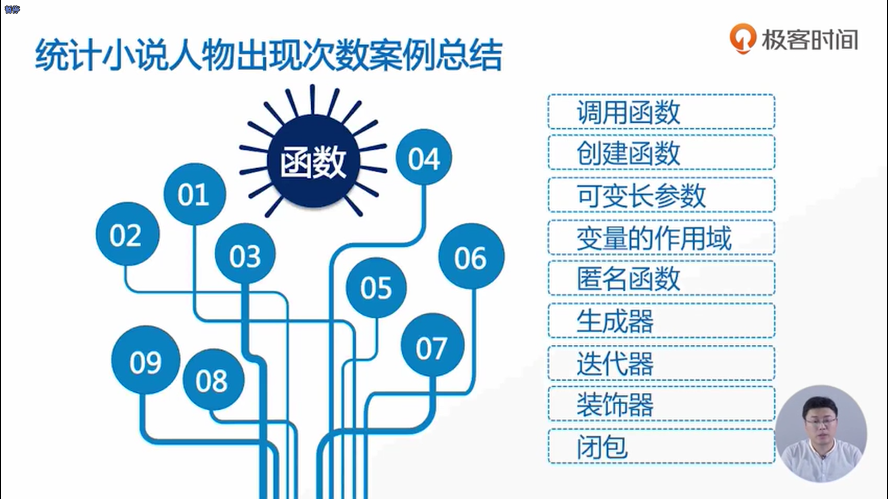

- 有一些函数我们希望增加一些额外的功能，但我们又不希望在原来的函数里面去增加新的代码
- time库中的sleep方法可以让函数在执行过程中可以停几秒，time这个函数是记录从1970年1月1日到现在所运行的时间的统计，通常单位为秒
- sleep函数是让我们的程序去运行多少秒
- 闭包和装饰器的写法是非常的类似的，闭包传进来的是变量，内部函数也是引用的变量；但装饰器传进来的是函数，在内部也是引用的函数

