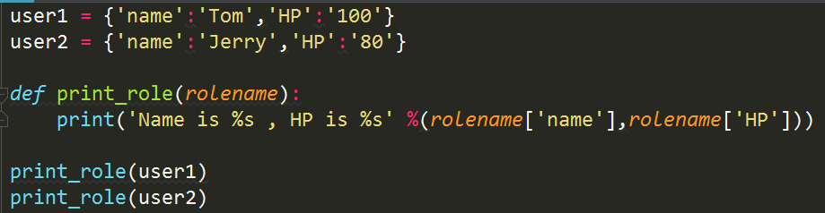
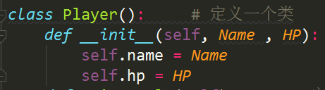

- pip 是python里面自带的用于安装软件包的包管理工具

  

- 上面这种写法叫做面向过程编程，面向过程编程有一个特点是我们要根据程序执行的顺序从上到下来编写我们的函数，在这种情况下如果我们的功能更复杂的话，我们的print_role函数就会编写得更长；如果功能更加的复杂的话，我们就需要把print_role函数进行一个拆分

- 在面向对象编程思想中，它认为我们应该把相似的内容进行一定的归纳

  

- init的前后都是具有两个下划线
- self表示这个类进行了实例化之后的这个实例本身
- 在一个类里面所有的函数或者是方法的第一个参数一定是self
- **class 表示定义一个类，类名我们要求首字母必须要是大写字母**
- 对比面向过程与面向对象我们可以发现，面向过程更加适合于机器运行，因为它是从头到尾的一个执行过程，而面向对象更符合我们人的思维习惯，我们是把相同的内容进行一些归纳和总结，self表示的是类的实例化的本身，__init__表示在类进行实例化之后会自动的执行的一个函数

