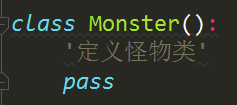

- 有一些类我们想把它先放在这，不想去编写它的功能的时候，定义好类的名字之后我们用单引号括起来，关于这个类的一些描述信息
- 定义好这个类之后我们希望它什么都不写，也不要进行一些报错，后面加一个pass这样的关键字即可

- 在类的属性下面加上两个下划线，那么这个类的属性就不会被实例给访问到
- 在加上两个下划线之后，实例就访问不到了，这个时候要修改类当中的属性的时候一定要通过我们定义的方法来改