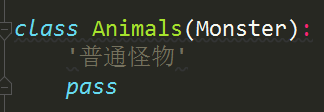

- Animals在继承Monster的所有属性
- 当父类和子类定义一个同名的方法时，子类的调用会覆盖父类的方法

- 父类和子类如果有同一个命名函数时，会有多种状态，叫做多态
- 封装、继承和多态是面向对象编程中很重要的几个特性
- 使用isinstance这个方法可以判断类之间的继承关系

- 在Python3里面所有的对象都继承了Object这个父类
- 类是用来描述具有相同的属性、方法的一个对象的集合
- 封装：我不想让你访问的属性你是访问不到的
- 继承：子类可以继承父类的一些方法
- 多态：父类定义的一些方法在子类中可以把它覆盖掉
- 类是没有办法直接进行引用的，我们需要把类先进行一个实例化，然后对实例才能进行相应的操作